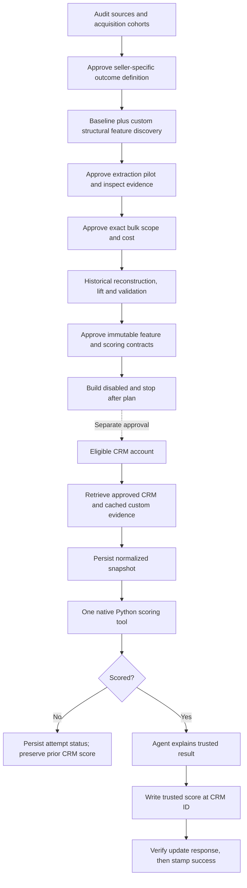

# Account scoring

Calibrate structural account fit from the seller's historical customer outcomes,
then apply one approved contract consistently. Python computes the score and tier;
an agent explains the applied rules and evidence. Readiness remains separate.

**State: to-be-approved.** The repository ships synthetic draft contracts, a disabled
play and offline evaluations. Nothing has been deployed or paid-tested. Native Python
is discoverable and its packaging is checked; service execution and customer mappings
are **not verified**. See [runtime evidence and limits](references/runtime.md).



Follow [SKILL.md](SKILL.md) for installation and [calibration](references/calibration.md) for the ten phases. The four
interview topics are sources/access, success/cohort, feature contract, and model/
operation. Propose decisions after inspection. Paid scope and deployment approvals
remain distinct checkpoints. Calibration-only work uses the same skill and stops
before activation; a supplied list qualified once goes to `score-leads`.

| Resource                        | Purpose                                                                                    |
| ------------------------------- | ------------------------------------------------------------------------------------------ |
| `infra/models/accounts.ts`      | HubSpot account extract; cached evidence, snapshot and attempt metadata                    |
| `infra/runtime/scorer.py`       | Single rule engine: input validation, bands, gates, interactions, nulls and outcome labels |
| `infra/runtime/calibration.py`  | Offline grouped splits, banded lift and validation using the same scorer                   |
| `infra/context/*.yaml`          | Synthetic drafts to replace with approved seller-specific contracts                        |
| `scripts/build.mjs`             | Embed Python/contracts, generate Markdown, archive approved versions                       |
| `infra/tools/compute-fit.ts`    | Native Python action with normalized snapshot and contract reference only                  |
| `infra/agents/scorer.ts`        | Evidence-grounded explanation, read-only context and compute tool                          |
| `infra/plays/score-accounts.ts` | Disabled orchestration and verified CRM writeback by record ID                             |
| `infra/segments/tiers.ts`       | Every configured tier, read from the CRM output                                            |

Default cohort: acquisition opportunities closed in the latest 24 months, churned
wins included and losses separated. Default historical anchor: opportunity creation,
then documented pre-close/close fallback. Weekly live sweep and three-month staleness
are examples to approve after costing; changed approved versions also require backfill.
There is no default customer outcome formula, champion gate or approved live model.

The source adapters implemented here read current CRM properties and custom feature
evidence from a cache the installer must populate. No cache-population or refresh
route ships in this template. Calibration determines which authorized enrichment/research routes
must fill or refresh that cache; those customer-specific routes require verification
and priced scope before implementation. Missing critical evidence stops the score.
The play does not make speculative provider calls or retrain itself. Discovery is an
agent-led calibration procedure; synthetic fixtures test scorer portability only.
The disabled play limits each sweep to 25 accounts and each unsuccessful scoring
cycle to three attempts per version. Apply an approved pilot ID filter before enabling
and review the full version-backfill scope and cost separately.

From this repository:

```sh
node account-scoring/scripts/build.mjs --check
python3 -m unittest discover -s account-scoring/evals -p 'test_*.py'
node --import tsx account-scoring/evals/contract.mjs
cargo-ai cdk check --dir account-scoring
cargo-ai cdk plan --dir account-scoring --json
```

[Calibration](references/calibration.md) covers seller research and evidence design;
[runtime](references/runtime.md) covers installed paths, pricing and operational
checks; [acceptance](evals/acceptance.md) separates offline evidence from live gates.
