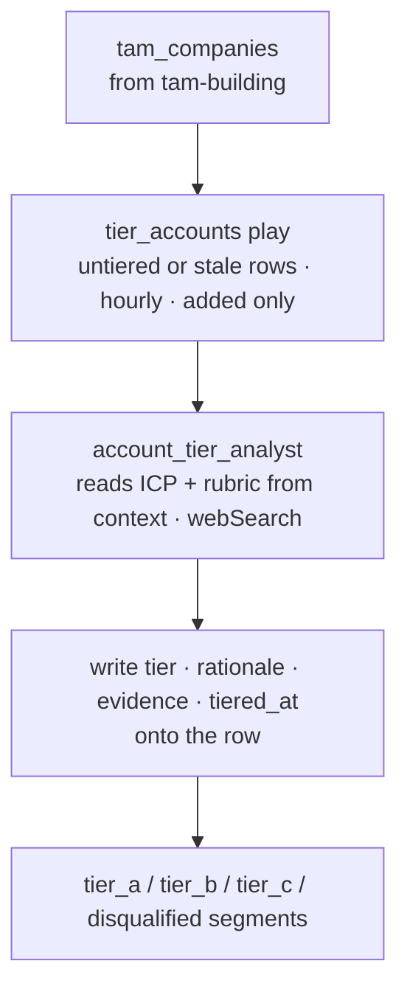

# Account scoring

Tier every company in your TAM A, B, C or disqualified, with the reason and the
evidence written on the row. An agent reads your ICP and tiering rubric from
the workspace context; a play writes its judgment back and keeps new companies
tiered as they land.

## What it does

- **Judges against your own rubric.** The ICP and `tiering-rubric.md` live in
  the context repo. Edit the rubric and the next tier changes, with no deploy.
- **Looks up only what the row does not hold.** Firmographics were settled by
  tam-building's filter. The agent searches once, to settle the doubt that
  would change the tier, and records the page.
- **Writes a reason a rep can argue with.** Every tier carries two sentences
  naming the rubric lines that decided it, the evidence URL, and a stamp.
- **Hands downstream work four segments.** `tier_a_accounts` is what contact
  sourcing and engagement run on; `disqualified_accounts` is what they
  suppress.
- **Needs no CRM.** It tiers `tam_companies` in Cargo. Writing the tier to a
  CRM as well is a variation.

## How it works


```mermaid
flowchart TD
    tam["tam_companies<br/>from tam-building"]
    play["tier_accounts play<br/>untiered or stale rows · hourly · added only"]
    agent["account_tier_analyst<br/>reads ICP + rubric from context · webSearch"]
    write["write tier · rationale · evidence · tiered_at<br/>onto the row"]
    segments["tier_a / tier_b / tier_c / disqualified segments"]

    tam --> play --> agent --> write --> segments
```

| File                                     | Resource           | Role                                                          |
| ---------------------------------------- | ------------------ | ------------------------------------------------------------- |
| `infra/models/tam-companies.ts`          | `defineModel`      | a copy of tam-building's model, plus the four tier columns    |
| `infra/agents/tier-analyst.ts`           | `defineAgent`      | the judgment: context and webSearch, no write access          |
| `infra/plays/tier-accounts.ts`           | `definePlay`       | the only write, and the eligibility filter on `tiered_at`     |
| `infra/segments/tiers.ts`                | `defineSegment` ×4 | one per tier the agent can emit                               |
| `infra/connectors/anthropic.ts`          | `defineConnector`  | the LLM, bound                                                |
| `infra/connectors/ai-ark.ts`             | `defineConnector`  | the model copy's source; dropped when tam-building is present |
| `infra/folders/index.ts`                 | `defineFolder` ×3  | models, agents and plays, named after the skill               |
| this skill's `context/tiering-rubric.md` | (not a resource)   | example rubric to copy into the project's `context/`          |

## Placeholders (edit before deploy)

1. **The rubric**: copy `context/tiering-rubric.md` into the project's
   `context/` beside the ICP, and rewrite every tier for your business.
2. **The model**: when tam-building is installed, move the four
   `additionalColumns` onto its `tam_companies` and delete this copy.
3. **`languageModel`** in `infra/agents/tier-analyst.ts`.

## Cost

One agent run per company, in LLM tokens plus any web searches, capped by
`maxSteps`. The pilot measures it on ten rows before the backfill is approved.
After that the play only tiers what arrives and what goes stale.

## Verification

```sh
node --import tsx evals/contract.mjs   # the graph boundaries, from the compiled registry
cargo-ai cdk types && cargo-ai cdk check && cargo-ai cdk plan
```

`evals/acceptance.md` is the line-by-line acceptance test.

## Composes into

`contact-sourcing` on tier A, `agentic-engagement`, `new-hire-detection`.
Works best after `tam-building`.
