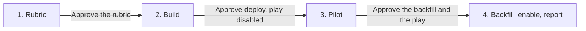

# Account scoring

**State: to-be-approved.** Deploy-verified against a live workspace: not yet. Treat `Done when`
below as the acceptance test and review `cargo-ai cdk plan` before deploying. Make no outcome claim
for this skill until it is approved.

## The outcome

Every company in your TAM tiered A, B, C or disqualified, with a two-sentence reason and the page
that decided it written on the row, so a rep can read why an account is tier A and argue with it.
New companies are tiered as they land. The tiers are four segments: tier A is what contact
sourcing and engagement run on, and disqualified is what everything else suppresses.

It runs on `tam_companies`, the model tam-building lands, and needs nothing else: no CRM, no
scoring code, no point weights.

**The judgment lives in the context repo, not in code.** The agent reads the ICP and
`tiering-rubric.md` from the workspace context on every call. Changing what tier A means is a
reviewed commit to that file, with no deploy, and the rep reading the tier can read the same file
the agent read.

**Firmographics are tam-building's job; the tier is about what no column holds.** Headcount band,
industry and country are already in the filter that sourced the row. What separates an A from a C
is whether the company runs the motion you sell into: an open role, a public stack, an
engineering post. So the agent judges on the sourced row first, and searches only to settle one
doubt that would change the tier.

**Two failure modes worth knowing before you start.** Writing a custom column with its
`custom__` read-side name drops the value while the node reports success, so the play runs
perfectly over a book with no tiers in it. And a play enabled without a backfill never tiers the
rows that were already there: `changeKinds: ["added"]` only enrols rows that arrive after it is on.

## Example

> Tier every company in our TAM against the ICP and the rubric in our context repo, and keep new ones tiered as they land.

Illustrative output, fictional records:

| Company (domain)              | tier         | tier_rationale                                                                                                                                | tier_evidence_url                         |
| ----------------------------- | ------------ | --------------------------------------------------------------------------------------------------------------------------------------------- | ----------------------------------------- |
| Northwind (northwind.example) | A            | Fits the firmographics: 240-person B2B software company in the US. Has a GTM engineer on staff, which the rubric ranks as the strongest sign. | https://northwind.example/careers/gtm-eng |
| Fabrikam (fabrikam.example)   | C            | Fits industry, size and country. No technical revenue role and no public automation practice was found, so nothing lifts it above C.          |                                           |
| Tailspin (tailspin.example)   | disqualified | Services-only consultancy with no software product, which the ICP lists as a disqualifier. The sourced industry label was misleading.         | https://tailspin.example/about            |

Every row also gets `tiered_at` and lands in `tier_a_accounts`, `tier_b_accounts`,
`tier_c_accounts` or `disqualified_accounts`. The report closes on the tier distribution and one
recommended next step.

## Guide the operator through every phase



Every substantive message starts with the current phase and ends with a `Next step` section giving
the operator one concrete decision, what it unlocks, and what stays blocked. During an in-progress
operation, say `No action needed` and name the next checkpoint. Never end with a generic offer to
help.

1. **Rubric.** Read the ICP and any tiering rubric from the workspace context. If there is no ICP,
   stop and send the operator to tam-building's first phase: tiering against an unwritten ICP is
   guessing. If there is no rubric, propose A, B, C and disqualified from the ICP's own language,
   using this skill's `context/tiering-rubric.md` as the shape, and have the operator correct it.
   End by asking the operator to approve the rubric. Nothing bills in this phase.
2. **Build.** Reconcile with tam-building, adapt, run the contract, types, check and plan, and show
   the plan: the tier columns added to `tam_companies`, the agent, the play **disabled**, and the
   four segments. End by asking to deploy with the play disabled. A deploy tiers nothing.
3. **Pilot.** Run ten rows through the workflow as a batch, with the play still disabled
   ([`references/run.md`](references/run.md#pilot)). Spot-check one A, one C and one disqualified
   against the rubric, quote the evaluator results, and give the observed cost per company and
   what the whole book would cost. End by asking to approve the backfill at that cost and to
   enable the play.
4. **Backfill, enable, report.** Backfill every untiered row, enable the play, and report the
   tier distribution, the disqualified share, the evaluator pass rate and actual credits, with a
   direct Cargo link to each segment. Recommend one next step.

## Put it in your project

This folder is a **worked example**: real CDK resources written for some other company. The job
is to end up with the code your company would have written, in your project, and an agent does the
adapting.

**Install the required authoring skill first.** If `cargo-cdk` is absent, run:

```sh
npx skills add getcargohq/cargo-skills --skill cargo-cdk
```

Then read `.agents/skills/cargo-cdk/SKILL.md` directly; no session reload is needed. Complete its
bootstrap and use its authoring, state, plan, and deployment rules throughout. Stop before any
template work if the skill cannot be installed or read.

1. **Install it: the CLI does the copy.** From inside the CDK project,
   `cargo-ai cdk add cookbook/account-scoring` writes this example to `infra/account-scoring/` and
   this procedure to `.claude/skills/account-scoring/`. No project yet?
   `cargo-ai cdk init <dir> --cookbook account-scoring && cd <dir> && npm install` does both.
   **If you are reading this from the project's `.claude/skills/`, the install already happened:
   start at step 2.**
2. **Reconcile it with tam-building.** This example carries a copy of `tam_companies` and its AI
   Ark connector so it deploys on its own. When `infra/tam-building/` exists, move the four
   `additionalColumns` from the copy onto tam-building's model, point the play and the segments
   at that export, and delete the copy and its connector: one slug declared twice collides at
   deploy. Reuse an existing Anthropic connector the same way. This skill declares no
   `defineContext`: that resource is a per-workspace singleton the project owns.
3. **Write or confirm the rubric.** Phase 1 above. It goes in the project's context repo beside
   the ICP, never into the agent's prompt.
4. **Adapt and deploy disabled.** Work the sections below in order: _What should not change_ is
   what you argue back about (say what breaks, then do it if they still want it); _What you can
   change_ is what you offer unprompted; _What you will be asked_ is the floor, and you derive
   before you ask. Record what you changed and why under a `## Decisions` section in your copy of
   this file. Then run `node --import tsx evals/contract.mjs` from this skill's folder, followed by
   `cargo-ai cdk types && cargo-ai cdk check && cargo-ai cdk plan` from the project root. Show the
   diff, and deploy only on a yes. Never run `cargo-ai cdk init --force` in a non-empty directory.
5. **Pilot, backfill, verify.** Follow [`references/run.md`](references/run.md), then walk _Done
   when_ line by line with evidence. Deployed cleanly and tiered nothing is the normal failure.

## What you will be asked

**Derive before you ask.** An input with a lookup is looked up, not asked.

| Input           | Kind    | How it is answered                                                                                                                                            | Why it matters                                                                                                          |
| --------------- | ------- | ------------------------------------------------------------------------------------------------------------------------------------------------------------- | ----------------------------------------------------------------------------------------------------------------------- |
| `icp`           | derived | Read from the workspace context (`cargo-ai context …`, or the project's context directory). None? Stop and run tam-building's first phase                     | The rubric decides against it. A tier that cannot name the ICP line it came from is a guess, and the evaluator fails it |
| `tier_rubric`   | asked   | An existing rubric in the context is shown and confirmed. Otherwise propose A / B / C / disqualified from the ICP's language and have the operator correct it | It is the one input that is genuinely a decision about the business: what "work it now" means here                      |
| `model`         | derived | `tam_companies` from tam-building. Another companies model works if it has an id, a name and a domain; map its columns in the workflow input                  | The workflow interpolates these columns into the prompt. A renamed one hands the agent an undefined                     |
| `languageModel` | derived | Whichever LLM connector the workspace already holds (`cargo-ai connection connector list`)                                                                    | Judgment quality and the cost per company both live here                                                                |
| `restale`       | derived | Six months by default. Ask only to change it                                                                                                                  | How often a tiered company is judged again. Shorter re-bills the whole book more often                                  |

Checked before moving on, not after the deploy:

- `icp`: it names at least one disqualifier, not only fit signals
- `tier_rubric`: every tier is decidable from the sourced row plus at most one search, and each
  tier names what evidence counts for it
- `model`: the column names in the workflow input match `cargo-ai storage column list` on the live
  model

## What you can change

The code is a worked example. These reshapes are expected, and the agent offers them rather than
waiting to be asked. Every one costs something; that is what makes it a variation and not the
default.

| Variation               | When it is right                                                                                               | How                                                                                                                                                                         | What it costs                                                                                                                  |
| ----------------------- | -------------------------------------------------------------------------------------------------------------- | --------------------------------------------------------------------------------------------------------------------------------------------------------------------------- | ------------------------------------------------------------------------------------------------------------------------------ |
| `crm-accounts`          | The accounts already live in a CRM and the tier should be visible where reps work                              | Point the play at a CRM companies model, and add a CRM update node after the custom-column write, mapping the same four values to CRM properties the operator created first | A CRM connector and four CRM properties to maintain. A property that does not exist makes the update succeed and write nothing |
| `numeric-score`         | A downstream router or report needs a 0 to 100 number, not four buckets                                        | Add `score` to the agent's output schema, a `score` custom column, and the mapping in the write; define what the number means in the rubric                                 | A number reads more precise than the judgment behind it. Keep the tier as the field people act on                              |
| `deterministic-tiering` | The rubric turns out to be thresholds on sourced columns (headcount, industry, country) with no judgment in it | Delete the agent and write the tier in the play from the columns, or push the thresholds into tam-building's filter                                                         | You lose the rationale and the evidence, and anything the sourced row does not hold can no longer move a tier                  |
| `tier-once`             | The market is stable and nobody reads a tier older than a quarter anyway                                       | Remove the `lowerThan` condition from the play's filter                                                                                                                     | A company that changed (hired the persona, got acquired) keeps its old tier until someone re-tiers it by hand                  |

## What should not change

However far you adapt, these hold. Ask for one anyway and the agent tells you what breaks, then does
it if you still want it, and records why under `## Decisions` in your copy of this file.

- **The rubric lives in the context repo.** (`context/tiering-rubric.md` in the project's knowledge
  layer.) Put it in the prompt and changing what tier A means becomes a deploy, the reason for the
  change stops being reviewable, and the rep reading the tier can no longer read the same file the
  agent read.
- **The agent judges and the play writes.** (`infra/agents/tier-analyst.ts`) The agent carries no
  model in `uses`. Give it one and it decides its own routing, at which point an untiered row could
  be a failed run, a skip, or a choice.
- **Custom columns are written with their bare slugs.** (`infra/plays/tier-accounts.ts`)
  `custom__tier` on the write becomes `custom.custom__tier`, the node reports "Record upserted",
  and the value is dropped.
- **Eligibility is the stamp, not the tier.** (`infra/plays/tier-accounts.ts`) Filter on `tiered_at`
  being null or stale. Filter on the tier and a failed run looks the same as a legitimate
  `disqualified`, so it is either retried forever or never.
- **A tier ships with its rationale, its evidence, and its stamp, on the same write.**
  (`infra/plays/tier-accounts.ts`) A tier nobody can audit is a number a rep will not trust, and a
  tier with no stamp is judged again on every tick.
- **`changeKinds: ["added"]` stays.** (`infra/plays/tier-accounts.ts`) Runs are created for rows
  entering the filter. Without it, the LLM bill scales with how often the cron fires.
- **Every tier the agent can emit has a segment.** (`infra/segments/tiers.ts`) A tier with no
  segment is a row that lands nowhere and quietly disappears from the book.

## Done when

- the ICP and the tiering rubric are in the workspace context, and the rubric was approved
- the pilot tiered ten rows, and one A, one C and one disqualified were checked against the rubric
  by hand
- every row in the model carries a tier the rubric defines, a rationale naming the deciding lines,
  and a `tiered_at` stamp, and no row carries one without the others
- the four segments resolve, and their counts sum to the tiered row count
- the agent's evaluator pass rate is at or above its threshold
- editing the rubric in the context repo changes the next tier with no deploy
- the report gave the tier distribution, actual credits against the pilot's estimate, and one
  recommended next step
- `node --import tsx evals/contract.mjs` passes against the adapted resources

## What it costs

**Tiering is one agent run per company**, billed as LLM tokens through the bound connector, plus
the web searches the agent decides to make. `maxSteps` is the per-company ceiling, and the rubric's
one-question-one-search rule is what keeps a normal row far below it. The pilot is how you learn
the real number: read actual credits for the ten rows, then multiply by the untiered row count
before approving the backfill.

After the backfill, the play only tiers what arrives (`changeKinds: ["added"]`) and what goes stale
after six months, so the steady-state cost follows how many companies tam-building lands, not how
often the cron fires.

## Composes into

`contact-sourcing` (the buyers at every tier A account), `agentic-engagement` (talk to the accounts
this ranked), `new-hire-detection` (watch tier A for the hires that move a C up). Works best after
`tam-building`, whose `tam_companies` it tiers.
