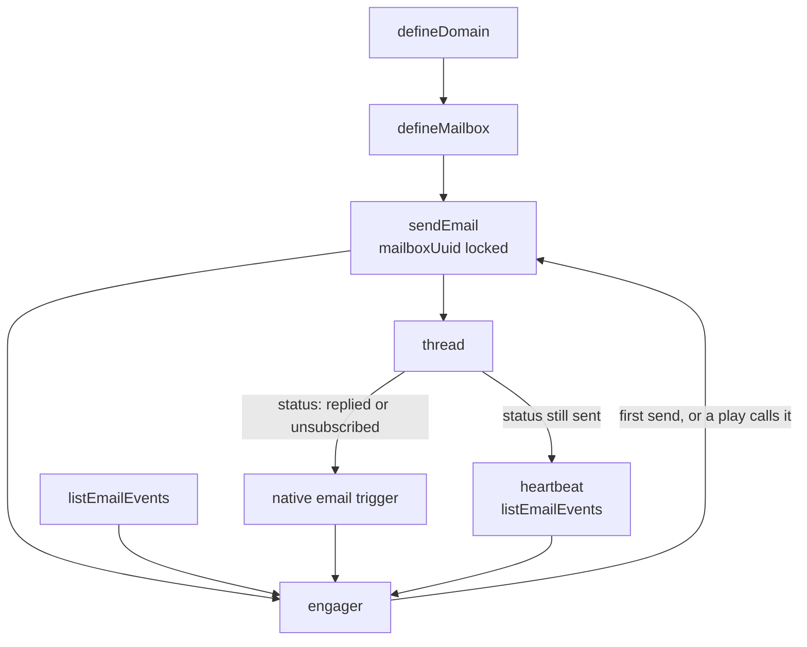

# Agentic engagement

An agent that holds email conversations with leads from a mailbox the workspace
owns. A sending domain, an inbox, native `sendEmail` and `listEmailEvents` on
the agent, a native email trigger on reply and unsubscribe, and a heartbeat that
checks thread status when nothing inbound happened — that is the loop.

## What it does

- **Owns the inbox.** `defineDomain` plus `defineMailbox` provision (or adopt)
  the From address the lead sees. The mailbox is a recurring monthly charge.
- **Sends through native `sendEmail`.** `mailboxUuid` is locked in the action's
  `config` so every send is from that inbox, and so the native trigger knows
  which chats to wake.
- **Reads thread status.** `listEmailEvents` is how a heartbeat (and any wake
  without a fresh event payload) sees `replied`, `unsubscribed`, `bounced`, or
  silence. Opens and clicks are tracking, not a reason to write.
- **Wakes on inbound status.** `agentNativeTrigger({ agentSlug: "email",
  config: { kinds: ["replied", "unsubscribed"] } })` continues the thread or
  stops it.
- **Checks silence.** A `heartbeat` re-wakes the same chat so the agent can
  list events on a thread that stayed at `sent`. At most one unanswered
  follow-up.
- **Stops.** Unsubscribe, "not interested", or a request for a human ends the
  loop. A second unanswered send is a sequence; this agent is not one.

## How it works

1. **First outbound.** A human chats with the engager, or a play calls it with
   a lead. The agent calls `sendEmail`. That send belongs to this agent, which
   is what the trigger later keys off.
2. **Inbound status.** IMAP picks up a reply; `List-Unsubscribe` records an
   opt-out. The native trigger wakes the same chat.
3. **Silence.** If the thread stays at `sent`, the heartbeat re-wakes the chat
   so the agent can call `listEmailEvents`. One follow-up, then stop.
4. **The agent sends at most once per wake**, passing `inReplyTo` and the full
   `references` chain so the thread stays a thread.

Adds 3 resource kinds plus the folders they file into.

| File | Resource | Role |
| ---- | -------- | ---- |
| `infra/domains/outreach.ts` | `defineDomain` | sending domain the mailbox lives on |
| `infra/mailboxes/rep.ts` | `defineMailbox` | the From inbox; monthly charge |
| `infra/agents/engager.ts` | `defineAgent` | conversation agent + native `sendEmail` / `listEmailEvents` + email trigger + heartbeat |
| `infra/agents/engager.prompt.ts` | (not a resource) | when to reply, how to thread, when to stop |
| `infra/connectors/openai.ts` | `defineConnector` | the LLM the engager talks through |
| `infra/folders/index.ts` | `defineFolder` | mailbox / agent folders named after the skill |

## Why `sendEmail` is not a tool

A tool whose body is one native call is ceremony, and this repo refuses those.
`sendEmail` is a native action the agent can call. The pin that used to live in
a wrapper now lives on the use: `config: { mailboxUuid: rep.uuid }`. Take that
pin out and the loop silently splits.

## Placeholders (edit before deploy)

1. **Sending domain** — `infra/domains/outreach.ts`: the domain the workspace
   owns. Keep `adopt: true` if it was bought in the UI; drop it only to
   register a new one.
2. **Mailbox identity** — `infra/mailboxes/rep.ts`: username, first name, last
   name of a real person. Type defaults to `google`.
3. **Language model** — `infra/agents/engager.ts`.

## What it does not do

It does not blast a list, start warm-up (that is a CLI call after deploy),
merge DNS, write to a CRM, or invent a first send from a reply trigger or a
heartbeat. First outbound is a chat or a play that calls this agent; this
skill is the loop after that.
