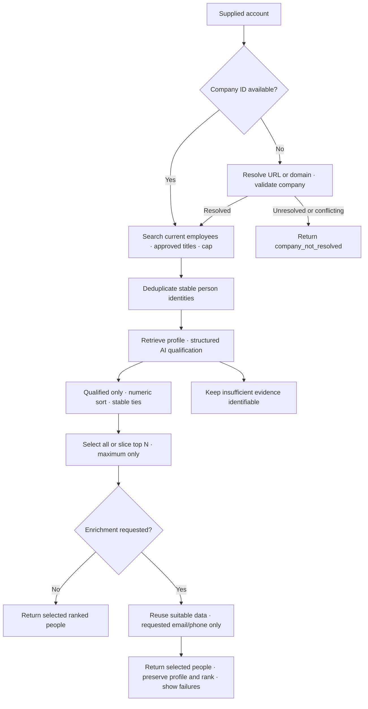

# Contact sourcing

**State: to-be-approved.** Offline contracts are checked; a fresh demo workspace
and two customer or partner implementations are still required for approval.

## The outcome

For each supplied account, an on-demand Cargo tool returns the most relevant
stakeholders found within an approved search limit, ranked by their fit for the
seller's product or use case. It returns all qualified people or up to N per
company, independently of optional verified work email and phone enrichment.

Relevance comes from responsibilities and current profile evidence. Buying role
informs that assessment; seniority alone does not move someone above a relevant
practitioner. Ranking never means outreach order, triangulation, or an allocation
of seats on a buying committee.

The installer builds only the chosen input and output paths. Seller research
happens during setup. Each run uses the saved, approved criteria; the tool is a
predictable workflow containing one structured qualification call per usable
profile, with no autonomous research agent.

## Put it in your project

If this file is already in the project's `.claude/skills/`, the copy happened:
start at step 2. Read the `cargo-cdk` skill before adapting resources. If absent,
install it with `npx skills add getcargohq/cargo-skills --skill cargo-cdk`, then
read its `SKILL.md` directly.

1. **Copy with the CLI.** In an existing project run
   `cargo-ai cdk add cookbook/contact-sourcing`. Without a project,
   `cargo-ai cdk init <dir> --cookbook contact-sourcing`, enter that directory,
   and install its dependencies. Never use `init --force` in a non-empty project.
2. **Inspect and derive.** Follow [audit.md](references/audit.md). Inspect the
   seller context, existing personas, authenticated connectors and reusable
   email/phone tools. Rewire the example's adopted connectors to compatible
   existing handles; remove duplicate declarations. No CRM is a valid setup.
3. **Research and approve people.** Crawl the seller's website, product pages
   and customer stories. Offer optional closed-won intelligence after checking
   connectivity. Present the persona table, human-readable Boolean and actual
   qualification prompt together. Apply corrections and save approved criteria
   in the consumer's existing context conventions.
4. **Configure and show.** Follow [configure.md](references/configure.md).
   Ask how many qualified people to return per company: all or up to N,
   independently of enrichment. If the optional CRM analysis already provides
   useful won-deal evidence, recommend N with a brief reason; otherwise ask
   directly. Do not add a separate audit. Recommend the input, requested fields,
   search limit and any relevance threshold from what was inspected. Explain each choice's effect and tradeoff next to
   that decision, ask only what remains unanswered, then build the chosen graph.
   Record choices under `## Decisions` in the consumer copy. A configuration
   approval already given in this session remains valid.
5. **Review before deployment.** Run the adapted contract, `cargo-ai cdk types`,
   `cargo-ai cdk check` and `cargo-ai cdk plan`. Show the actual graph and resource
   diff. Obtain criteria/configuration approval and explicit authorization for
   deployment in this consumer workspace before creating resources. Deploy
   within that authorization. Tools have no disabled-play switch: this tool
   has no trigger, schedule or implicit run. Provide its direct Cargo link.
6. **Calibrate on an approved sample.** Follow [run.md](references/run.md).
   Propose representative accounts, disclose cost by stage and ask approval of
   the sample and maximum cost. Run only that sample, show ranked people with
   evidence, collect corrections, update reusable criteria, and retest affected
   cases with additional cost approved where needed. Report actual cost,
   coverage and unresolved issues.
7. **Choose composition.** Only after calibration, ask whether to keep the
   on-demand tool or connect it to a play. A play needs an approved population,
   trigger, selection/enrichment owner and destination. Installation authorizes
   no CRM write, campaign, message, recurring schedule or full batch.

At every meaningful decision: explain the change, recommend from the inspected
situation, give the reason and alternative's tradeoff, ask for the operator's
choice, then build it and show what happened. Keep this short and local to the
choice. Derive available facts first; never ask twice for an answered decision.

## What you will be asked

Derive before asking. The staged approval checkpoints are separate from missing
configuration facts; bundle related choices without turning setup into a survey.

| Input                              | Kind                             | How it is answered                                                                                                                                                           | Why it matters                                                            |
| ---------------------------------- | -------------------------------- | ---------------------------------------------------------------------------------------------------------------------------------------------------------------------------- | ------------------------------------------------------------------------- |
| `existing_context_and_connections` | derived                          | Read seller context, personas, connectors and tool releases; inspect CRM connectivity without reading private deal contacts yet                                              | Prevents repeated research and duplicate resources; a CRM is optional     |
| `provider_contract_and_costs`      | derived                          | Read current action schemas, output paths, autocomplete values and cost metadata                                                                                             | Prevents guessed filters and hidden page or verification charges          |
| `seller_and_personas`              | asked if missing, then confirmed | Establish product/use case; offer optional customer intelligence; approve persona table, Boolean and prompt together                                                         | The tool ranks fit for this seller rather than generic seniority          |
| `company_input`                    | asked if missing                 | Choose ID, URL, domain, or necessary multiple-input support                                                                                                                  | An upstream ID skips paid resolution; extra identifiers must agree        |
| `output_and_scope`                 | asked if missing                 | Choose all or up to N qualified people per company, using useful existing won-deal evidence to recommend N; choose enrichment separately, plus search limit and restrictions | Output count applies even without enrichment; search coverage is separate |
| `sample_and_calibration`           | asked                            | Approve exact sample/max cost; assess relevance and missing people                                                                                                           | Static checks cannot prove provider coverage or qualification quality     |

## What you can change

Offer these when relevant, with the recommendation at the actual decision point.

| Variation               | When it is right                                                   | How                                                                                               | What it costs                                                                                      |
| ----------------------- | ------------------------------------------------------------------ | ------------------------------------------------------------------------------------------------- | -------------------------------------------------------------------------------------------------- |
| `input`                 | Upstream already supplies ID, or the operator has URL/domain       | Set `inputMode`; keep only necessary routes                                                       | URL/domain adds resolution; ID bypasses it                                                         |
| `output`                | The operator wants all relevant people or a bounded list           | `topN: null` returns all qualified; a positive N slices after sorting, with or without enrichment | N caps output and any selected lookup spend; profile/AI spend still follows the search limit       |
| `enrichment`            | The operator needs contact details with the ranked result          | Set `email`/`phone` independently of the all-or-N choice                                          | Adds only requested lookup/verification for selected people; a play can own this instead           |
| `search_and_criteria`   | Title ambiguity, geography or business-unit differences affect fit | Update approved personas, title filters, optional threshold and restrictions together             | Wider search raises profile/AI spend; narrower search can miss people                              |
| `model`                 | Calibration justifies another supported qualification model        | Change `qualificationModel`, retain the schema and score anchors                                  | Changes per-profile cost and judgment; rerun affected examples                                     |
| `customer_intelligence` | Deal evidence can refine website positioning                       | Read CRM/export contacts only after the operator chooses it                                       | Extra analysis and private-data handling; website-only setup is faster                             |
| `reachable_N`           | Operator explicitly needs N reachable contacts                     | Add a separate maximum attempt/cost budget and report original ranks                              | May enrich lower-ranked people and cost more; never the default                                    |
| `play`                  | Calibrated results should feed an existing process                 | Confirm population, trigger, ownership and destination before wiring                              | Repeated executions rebill each eligible account; destination actions need their own authorization |

## What should not change

- **Resolve before sourcing.** `infra/index.ts` gates every search on a valid,
  verified company ID. Missing or conflicting identity returns
  `company_not_resolved`; losing the gate permits an unscoped people search.
- **Titles find; evidence qualifies.** Wrong employers and responsibility
  mismatches are excluded; insufficient evidence stays identifiable outside
  the shortlist. An advisory seat does not prove primary employment.
- **One identity before repeated spend.** Deduplicate stable LinkedIn IDs and
  canonical URLs before profiles and qualification. Do not equate opaque Sales
  Navigator IDs with numeric LinkedIn IDs or deduplicate people by name.
- **Qualification precedes selection.** Profile retrieval supplies evidence;
  email/phone lookup supplies contact details later. Ranking by title alone
  or applying N before qualification changes which people can be returned.
- **Count is independent of enrichment.** Return all qualified or slice up to N
  after sorting, even without contact lookup. N is a maximum; fewer qualifying
  people means fewer results. Optional enrichment only touches selected people.
- **Sort numerically with stable ties.** The 0–10 scale has anchors. Selection
  uses an ordinary slice. An LLM does not order the array or assign outreach
  priority; enrichment completion order cannot change the saved ranks.
- **Preserve selected people.** Lookup failures retain profile, qualification
  and rank with explicit statuses. Do not backfill lower-ranked contacts or
  retrieve LinkedIn profiles again after selection.
- **Found is not verified.** Reuse only contact data meeting the approved
  requirements. A returned address without explicit verification stays unknown.
- **Keep installation bounded.** No CRM, model, play, agent or unused
  enrichment branch is required. Reuse audited tools and connectors.
- **Approval has separate scopes.** Criteria/deployment approval precedes
  resource creation; sample and maximum-cost approval precedes paid execution;
  a full batch, destination write or schedule requires its own scope.

## Done when

- Approved seller criteria retain source URLs, observed evidence, inferences,
  exclusions, persona IDs, provider filters and prompt version in consumer context.
- The operator's closed-won research choice is recorded; website-only setup works.
- The compiled graph contains only selected input/output paths and no implicit play.
- Live provider schemas and existing tool output mappings have been checked.
- Unresolved companies cannot source; stable identity deduplication precedes spend.
- Qualifications preserve profile evidence, current employment, uncertainty and a
  numeric fit score; the returned contacts have deterministic ranks.
- The operator chose all or up to N independently of enrichment; the sorted
  qualified ranking is sliced before any requested lookups, returning fewer when needed.
- Only selected people receive requested email/phone enrichment; verified data can be
  reused; failures remain visible without backfill or a repeated profile lookup.
- The adapted executable contracts, CDK type generation, check and plan pass.
- The operator approved deployment, then the exact paid sample and maximum cost.
- The sample shows coverage, ranked evidence and actual stage costs; corrections
  update reusable criteria and affected examples are retested as authorized.
- The final handoff identifies unperformed live checks and any pending approval
  evidence; repository approval still requires a fresh demo plus two implementations.

## What it costs

Read current `salesNavigator`, `linkedin`, `openAi` and selected enrichment tool
and verification metadata immediately before a preview. Record lookup time,
CLI version, action slugs, units, cache assumptions and model settings.

Separate company resolution, people sourcing, profile retrieval, AI qualification,
email lookup/verification and phone lookup. Sales Navigator pages contain 25
records: the compiled provider limit is `ceil(searchLimit / 25) * 25`, while
profile/qualification work is capped at `searchLimit`. Recommend a page multiple
when it suits the account and explain any paid excess. Reaching the cap means
limited coverage, even if every retrieved person is qualified.

Use the formula and approval procedure in [run.md](references/run.md). Do not
invent fixed prices, free-cache guarantees or a universal relevance threshold.

## Composes into

- `tam-building` supplies accounts and can pass already-resolved company IDs.
- `crm-enrichment` supplies reusable company identity/profile components when present.
- A play can slice `contacts` and own enrichment itself, or consume an enriched
  shortlist directly; it owns any approved destination write.
- `find-stakeholders` remains the one-off choice for people at named accounts today.
