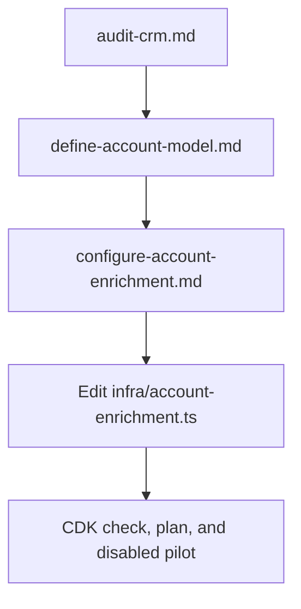

# Cookbook: account enrichment

**State: to-be-approved.** This is a worked CDK example, not a deployed integration. Review
`cargo-ai cdk plan` and deploy only after explicit operator approval.

This file routes the agent through the cookbook. Load the matching internal file and keep the
contracts below in context.

| Job                                    | File                                                                                     |
| -------------------------------------- | ---------------------------------------------------------------------------------------- |
| Audit CRM identity and enrichment gaps | [references/audit-crm.md](references/audit-crm.md)                                       |
| Define CRM and global Account models   | [references/define-account-model.md](references/define-account-model.md)                 |
| Approve the enrichment field contract  | [references/configure-account-enrichment.md](references/configure-account-enrichment.md) |
| Adapt and verify the disabled play     | [references/run-account-enrichment.md](references/run-account-enrichment.md)             |



## The outcome

One play enriches a managed segment of Cargo's native unified Account object with the reusable
`account_enrichment` tool. The tool resolves the selected CRM record from the Account `ids` map,
enriches by LinkedIn URL or domain, fills approved blank CRM properties, and writes freshness
fields.

## Put it in your project

Install this skill on its own with:

```bash
npx skills add getcargohq/gtm-skills/cookbook-account-enrichment
```

1. Inspect the existing CDK project, authenticated CRM connector, CRM Account model, global
   Account model, and live property schema. Create a blank consumer shell with
   `cargo-ai cdk init --template blank` only when no CDK project exists.
2. Produce the audit and cost preview. Fetch the current action costs with
   `cargo-ai connection integration get linkedin`; a completed audit records the lookup time and
   has matching JSON, Markdown, and chat counts without making a paid call or CRM write.
3. Copy `infra/account-enrichment.ts` into the consumer project. Reuse existing connector and
   model resources when present. Replace the checked HubSpot example with the selected CRM's live
   connector, extractor, Account `ids` source key, record-write action, fill-blank guard, and
   property names. The native model's `additionalColumns` list is authoritative: merge the two
   cookbook columns into the complete existing list instead of replacing unrelated columns.
4. Keep the reusable `account_enrichment` tool and `enrich_accounts` play in that same file. The
   tool must use the CRM's native blank-only update flag. If none exists, it must read the CRM
   record immediately before writeback and preserve populated values explicitly.
5. Run `cargo-ai cdk types`, `cargo-ai cdk check`, and `cargo-ai cdk plan` in the consumer project.
   The plan is complete when the play uses the native unified Account model, resolves CRM IDs from
   `ids`, removes no unrelated Account columns, has no standalone segment, remains disabled, and
   limits the pilot to 15 rows.
6. Show the operator the exact target count, identifier routes, credit estimate, and mappings.
   Deploy or enable only after explicit approval.

## Contract rules

- Maintain one global Account unification. Reuse it when it already exists.
- Preserve every existing Account additional column. The `additionalColumns` list is authoritative,
  so the plan must show no unrelated removals.
- Run the play on the native unified Account model. Resolve the selected CRM record ID from its
  `ids` map and send only that source ID to CRM actions. Never send the canonical Account ID.
- Keep one agent-edited CDK file. Do not preserve one repository copy per CRM.
- Attempt LinkedIn URL first, then domain fallback. A row without either identifier makes no paid
  call.
- Replace every field placeholder before a paid call. The template exits safely while any remains.
- Default selected business fields to fill-blanks. Use a CRM-native conditional update when
  available. Otherwise reread the live CRM row and preserve existing values, including numeric
  zero.
- Write `last_enriched_at` and `enrichment_status` only after the provider succeeds.
- Define the managed segment as approved rows whose `last_enriched_at` is null or older than six
  months. Evaluate it daily and create runs only for rows added to the segment.
- Keep the first play disabled, limited to 15 rows, and configured with `noConcurrency`.
- Keep credentials, deployment commands, and customer data out of this repository.

## What you will be asked

Derive everything available from the workspace before asking.

| Input                             | Kind     | How it is answered                                                        | Why it matters                                                        |
| --------------------------------- | -------- | ------------------------------------------------------------------------- | --------------------------------------------------------------------- |
| `crm_connector_and_account_model` | derived  | Inspect authenticated connectors and existing CDK resources               | Reusing them prevents duplicate connectors and Account models         |
| `property_candidates`             | derived  | Read live names, types, fill counts, and semantics                        | The most-filled compatible property should remain authoritative       |
| `approved_destinations`           | operator | Review the recommended primary property for each provider field           | CRM writes need explicit, type-compatible destinations                |
| `target_population`               | operator | Review counts by identifier route, percentage, and current action credits | The operator controls scope and spend before any paid call            |
| `daily_schedule_activation`       | operator | Approve only after the disabled pilot passes                              | A checked schedule must remain disabled until its evidence is trusted |

Refreshing populated business fields is outside the base template. If requested, present the
exact replacements, obtain field-level approval, and add a consumer-specific optimistic
comparison against a fresh CRM read.

## What you can change

| Variation                   | When it is right                                           | How                                                                        | What it costs                                                      |
| --------------------------- | ---------------------------------------------------------- | -------------------------------------------------------------------------- | ------------------------------------------------------------------ |
| `crm`                       | The consumer uses Salesforce or Attio instead of HubSpot   | Replace connector, extractor, row columns, and CRM action payloads         | Live generated types must be rechecked for the selected CRM        |
| `selected_fields`           | The operator approves a different firmographic contract    | Change the result schema, destinations, and both provider mappings         | Each added field expands mapping and type-review surface           |
| `eligibility`               | Only a governed subset should be enriched                  | Intersect approved lifecycle, tier, ownership, or gap filters              | Narrower scope reduces coverage and paid calls                     |
| `existing_project_models`   | The consumer already declares the connector or models      | Replace example declarations with imports from the consumer project        | Incorrect reuse can create collisions or split Account identity    |
| `crm_source_key`            | The CRM model uses another dataset or model slug           | Replace the audited `<dataset_slug>__<model_slug>` key and recheck lookups | A wrong key prevents CRM writeback and segment eligibility         |
| `approved_refresh_behavior` | Populated fields must be refreshed after explicit approval | Add previewed fields plus an optimistic comparison against a fresh read    | Refresh can overwrite CRM-authoritative values if guards are wrong |

## What should not change

- Keep one agent-edited CDK template rather than parallel CRM variants.
- Keep the play on the native unified Account model and resolve CRM writeback IDs from `ids`.
- Keep one paid route per row, LinkedIn URL first and domain second.
- Keep a verified fill-blank guard, placeholder guards, and the disabled 15-row pilot.
- Keep the play filter as the managed backing segment.
- Keep daily evaluation, the null-or-six-month freshness rule, and `changeKinds: ["added"]`.

## Done when

- the audit contracts and chat summary agree on every count
- the CRM model feeds the one native Account unification
- `account_enrichment` uses the actual CRM write shape and fill-blank semantics generated in the
  consumer project
- selected provider fields and CRM destinations agree in meaning and type
- the play targets the native unified Account model, resolves the CRM source ID, is disabled, and
  limits the pilot to 15
- LinkedIn and domain route counts are mutually exclusive and reproduce the credit estimate

## What it costs

Immediately before every preview, run `cargo-ai connection integration get linkedin`. Read the
applicable current entries from `integration.actions.enrichCompany.credits.costs` and
`integration.actions.enrichCompanyFromDomain.credits.costs`. Record the CLI version, lookup time,
action slugs, and selected unit costs. Then preview
`linkedin_url_path * linkedin_url_unit_credits + domain_path * domain_unit_credits`.

This play runs on eligible native Account rows and updates the one CRM source selected by
`crmSourceKey`. Report the segment count and any unmapped CRM records separately. Account
deduplication follows enrichment because the new matching keys improve duplicate detection.

## Composes into

- Feed the unified Account into scoring, segmentation, and people enrichment.
- Enable the preconfigured daily freshness schedule after the pilot is approved.
