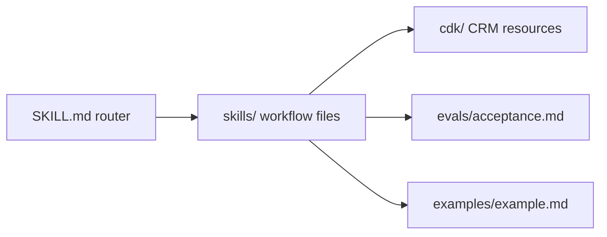

# Account deduplication cookbook

This repository-only cookbook audits duplicate Account identity, classifies candidate clusters,
and emits proposal-only deduplication results. It assumes the consumer already has a global
Account model and an audit importer for CRM records.

The cookbook has this layout:

| Folder                | Holds                                           |
| --------------------- | ----------------------------------------------- |
| `README.md`           | Cookbook overview and usage guidance            |
| `SKILL.md`            | Thin repository-discovery router                |
| `skills/`             | Audit, prerequisite, and proposal instructions  |
| `cdk/context/`        | Shared deterministic candidate contract         |
| `cdk/agents/`         | Shared structured review agent                  |
| `cdk/plays/<crm>/`    | CRM-derived candidate models and proposal plays |
| `evals/acceptance.md` | Acceptance criteria                             |
| `examples/example.md` | Worked adaptation example                       |

Repository discovery requires a root `SKILL.md`. Copy the shared `context` and `agents` resources
plus one CRM's `plays` folder into a consumer CDK project after confirming that its existing global
Account model and audit importer satisfy the prerequisite. Do not create a second Account model in
this cookbook.

Do not declare a standalone segment. The deduplication play owns its managed backing segment. This
cookbook does not run Cargo, access a customer CRM, or merge records.
