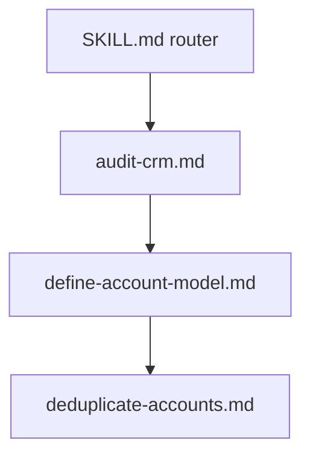

# Account deduplication

**State: to-be-approved.** This is a worked CDK example, not a deployed integration. Review
`cargo-ai cdk plan` and deploy only after explicit operator approval.

This `SKILL.md` is a thin router required for Cargo repository discovery. Load the matching
internal file and keep this page in context for the workflow and contract rules below.

| Job                                                   | File                                                             |
| ----------------------------------------------------- | ---------------------------------------------------------------- |
| Audit duplicate identity and clusters                 | [skills/audit-crm.md](skills/audit-crm.md)                       |
| Verify the existing global Account and audit importer | [skills/define-account-model.md](skills/define-account-model.md) |
| Classify candidates and emit proposals                | [skills/deduplicate-accounts.md](skills/deduplicate-accounts.md) |

## The outcome

Duplicate clusters emitted as non-destructive merge proposals from the existing global Account
foundation. This cookbook never merges CRM records.

## Put it in your project

1. Inspect the existing CDK project, CRM connector, global Account model, and audit importer. If no
   CDK project exists, create the consumer shell with `cargo-ai cdk init --template blank`. Do not
   deploy from this folder.
2. Copy the shared `cdk/context/` and `cdk/agents/` resources, then choose one CRM variant from
   `cdk/plays/`. Confirm the existing Account model and audit importer are compatible first.
3. Follow the internal files in order: audit, prerequisite verification, and proposals. Acceptance
   checks are in [evals/acceptance.md](evals/acceptance.md), with a worked adaptation in
   [examples/example.md](examples/example.md).
4. Run `npm run check:templates` in this repository. In the consumer project, run
   `cargo-ai cdk check` and `cargo-ai cdk plan`. The play owns its managed backing segment. Do not
   add a standalone segment. Deploy only after explicit approval.
5. Verify with a disabled, `noConcurrency` pilot limited to 15 clusters.

## Contract rules

- Use the existing global Account model and audit importer. Do not create a second identity
  surface.
- Preserve protected IDs and the deterministic survivor rules. Re-read the live CRM cluster before
  any consumer merge and reject stale, conflicting, or protected-ID cases.
- Keep this workflow proposal-only. No merge action belongs in this repository.
- The only future automatic class is an exact LinkedIn company ID shared by every record in a
  candidate cluster, with no conflicts. LinkedIn URLs, handles, and domains remain review-only.
- AI domain review may inform a proposal, but never authorizes an automatic merge.
- Document the exact CRM merge contracts for HubSpot, Salesforce, and Attio, including Attio
  replacement-ID chaining, without encoding merge calls.
- Keep the play disabled, use `noConcurrency`, and limit the pilot to 15 clusters.

## What you will be asked

Derive duplicate counts, normalized identifiers, association counts, activity counts, and field
coverage from the consumer workspace before asking for policy decisions.

| Input                         | Kind     | How                                                            | Why                                                      |
| ----------------------------- | -------- | -------------------------------------------------------------- | -------------------------------------------------------- |
| `Duplicate distribution`      | derived  | Run the audit contract against the live CRM source records.    | Establishes cluster size, match classes, and risk.       |
| `Protected business IDs`      | operator | Present detected billing, customer, and external-system IDs.   | Conflicts must block a merge proposal.                   |
| `Survivor policy overrides`   | operator | Show the default ranking and any lifecycle or tier exceptions. | Makes the winner deterministic and auditable.            |
| `Review owner and recurrence` | operator | Name the ambiguous queue owner and ask after the pilot.        | Review-only classes and recurring audits need ownership. |

## What you can change

| Variation                    | When                                                   | How                                                                                  | Cost                                                    |
| ---------------------------- | ------------------------------------------------------ | ------------------------------------------------------------------------------------ | ------------------------------------------------------- |
| `Adapt candidate evidence`   | The selected CRM exposes different association fields. | Map audited fields into the same class, conflict, and survivor contract.             | No provider-credit change.                              |
| `Extend survivor precedence` | A protected lifecycle, tier, or billing rule must win. | Insert the rule deterministically and record its exact position.                     | No provider-credit change.                              |
| `Add structured AI review`   | Ambiguous domain evidence needs a review aid.          | Wire the supplied agent into the importer, never into merge authorization.           | Current language-model usage, priced before activation. |
| `Implement consumer merging` | Live rereads and protected-ID guards are proven.       | Add exact current CRM payloads only in the consumer project after explicit approval. | Integration-specific runtime and operational risk.      |

## What should not change

- Company name alone is never a duplicate key.
- LinkedIn URL, handle, domain, parent, subsidiary, and AI-reviewed matches remain review-only.
- AI never authorizes a merge.
- The shipped play remains proposal-only, disabled, limited to 15, and set to `noConcurrency`.
- The play owns its managed backing segment. Do not add a standalone segment.

## Done when

- the dedup audit matches its JSON and Markdown contracts
- the existing global Account model and audit importer are verified
- candidate clusters include the required evidence and survivor decision
- the deduplication play is disabled, uses `noConcurrency`, and is limited to 15 clusters
- the selected CRM folders contain no credentials, deployment command, merge action, or customer
  data

## What it costs

The shipped proposal play invokes no paid enrichment action, no review agent, and no CRM merge.
Its provider-credit cost is zero per proposal. If the consumer wires the optional structured
review agent or a live audit source, price those actions from their current schemas before use.

## Composes into

- Run after `account-enrichment` has maximized LinkedIn ID, LinkedIn URL, and domain coverage.
- Feed reviewed survivors into people enrichment and contact deduplication.
- Add a consumer-only merge workflow later, after live reread and protected-ID gates are proven.
