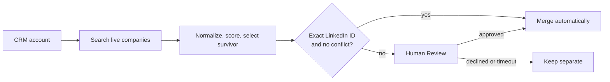
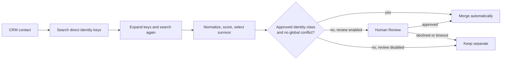

# CRM deduplication

This pipeline has two independent paths. Deploy account deduplication, contact deduplication, or
both. Each path has its own CRM model, identity audit, matching and survivor policies, disabled
play, cost preview, pilot approval, and acceptance checklist. Both paths search the live CRM before
each merge decision and avoid candidate or staging models.

## Path 1: Account deduplication

The account path searches companies by LinkedIn company ID, LinkedIn company page, and non-generic
domain. Only an exact shared LinkedIn company ID without identity, protected-ID, or
parent-subsidiary conflict can merge automatically. Every other candidate reaches Human Review.



### Account resources

| Resource               | Kind  | Purpose                                                  |
| ---------------------- | ----- | -------------------------------------------------------- |
| `crm_accounts`         | Model | Direct CRM company extract                               |
| `deduplicate_accounts` | Play  | Search, score, review, and merge duplicate companies     |
| Account scripts        | Code  | Normalize company identity, cluster, rank, and summarize |

Company name is excluded from candidate generation and scoring. The deterministic survivor policy
protects business IDs and prefers customer and commercial history.

## Path 2: Contact deduplication

The contact path searches people by LinkedIn person ID, normalized LinkedIn URL, exact email, and
exact stored phone. It expands direct matches with a second live search so high-confidence identity
chains form one cluster. The second search and in-cluster comparison use normalized phone values
derived from records already retrieved.



### Contact resources

| Resource               | Kind  | Purpose                                                      |
| ---------------------- | ----- | ------------------------------------------------------------ |
| `crm_contacts`         | Model | Direct CRM contact extract                                   |
| `deduplicate_contacts` | Play  | Search, score, review, and merge duplicate contacts           |
| Contact scripts        | Code  | Normalize person identity, expand clusters, rank, and review  |

Exact LinkedIn person ID, conflict-free LinkedIn URL, conflict-free non-generic email, and
conflict-free transitive chains are the automatic classes. A LinkedIn conflict, generic or shared
email, or phone-only match always leaves the automatic path. The native merge is the final CRM
write. Normalization and enrichment belong in a separate workflow.

## Install and adapt

This folder is a worked HubSpot example. Salesforce and Attio require adapting the connector,
extracts, record IDs, search and merge actions, and property slugs together. Keep one CRM shape
across selected paths.

This pipeline requires the `cargo-cdk` authoring skill:

```sh
npx skills add getcargohq/cargo-skills --skill cargo-cdk
```

From a Cargo CDK project:

```sh
cargo-ai cdk add cookbook/crm-deduplication
```

Before planning or deploying:

1. Reconcile the default CRM connector and any active Slack review connector with compatible project
   resources.
2. Choose the account path, contact path, or both. Remove unselected model and play files, then update
   the contract's exact resource inventory, connector assertions, and object-specific assertions.
3. Audit and approve each selected path independently.
4. Resolve each selected path's object-specific policy inputs, identity fields, survivor policy,
   and active review destination.
5. Typecheck, inspect the compiled graph, and deploy only approved plays disabled.
6. Request separate approval for each exact 15-row maximum merge-capable pilot.

Nothing in this folder deploys, runs, or touches customer data by itself.

## Verify

```sh
npm run typecheck
node scripts/check-pipelines.mjs
node --import tsx crm-deduplication/evals/contract.mjs
```

Use the selected sections in [the audit contract](references/audit.md),
[configuration guide](references/configure.md), [runbook](references/run.md), and
[two-path acceptance checklist](evals/acceptance.md).

## File map

| Path                                        | Purpose                                                     |
| ------------------------------------------- | ----------------------------------------------------------- |
| `SKILL.md`                                  | Route selection, approvals, invariants, and completion      |
| `infra/connectors/`                         | Shared uncached CRM and Slack connectors                    |
| `infra/folders/`                            | Shared skill-owned model and play folders                   |
| `infra/models/crm-accounts.ts`              | Account path CRM extract                                    |
| `infra/plays/deduplicate-accounts.ts`       | Account path workflow and trigger                           |
| `infra/scripts/{accounts,cluster,policy,survivor,evidence}.ts` | Account evidence and survivor policy           |
| `infra/models/crm-contacts.ts`              | Contact path CRM extract                                    |
| `infra/plays/deduplicate-contacts.ts`       | Contact path workflow and trigger                           |
| `infra/scripts/contact-*.ts` and `contacts.ts` | Contact search, evidence, normalization, and survivor logic |
| `references/`                               | Object-specific audit, configuration, and run instructions |
| `evals/acceptance.md`                       | Independent acceptance checklists for both paths            |
| `evals/contract.mjs`                        | Executable graph and safety contract                        |
