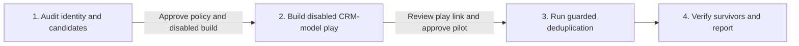

# CRM deduplication

**State: to-be-approved.** Deploy-verified against a live workspace: not yet. Treat `Done when`
below as the acceptance test and review `cargo-ai cdk plan` before deploying. Make no outcome claim
for this skill until it is approved.

## The outcome

CRM accounts stay duplicate-free. One disabled play runs directly on the CRM-backed account model,
searches the live CRM for companies sharing approved identity keys, scores the evidence, selects a
deterministic survivor, and either merges or pauses for manual validation. It does not create a
candidate or staging model.

Exact shared LinkedIn company ID with no identity, protected-ID, or parent-subsidiary conflict is
the only automatic class. Every other candidate reaches Cargo's native Human Review node. Approval
merges; decline or timeout keeps the records separate. Company name alone never creates or scores a
candidate.

The checked example in `infra/index.ts` is HubSpot: `fetchRecords` for companies, `findRecords` for
live candidate search, and `mergeRecords` for automatic or approved merges. Salesforce and Attio
adapt that one file by replacing the connector, extractor, record-ID field, search action, merge
action, and property slugs. Keep one CRM shape in the file.

When matching-key coverage is weak, recommend `crm-enrichment` before building this play. That is a
recommendation, not a dependency: `crm-deduplication` installs and operates independently.

## Guide the operator through every phase



Every substantive message starts with the current phase and ends with a `Next step` section. Give
the operator one concrete decision or action, say what follows approval, and name what remains
blocked. During in-progress work, say `No action needed` and name the next checkpoint.

1. **Audit identity and candidates.** Follow [`references/audit.md`](references/audit.md). Present
   identifier coverage, candidate classes, conflicts, protected IDs, 60/25/15 evidence score,
   deterministic survivor precedence, and proposed Slack review destination. If coverage is weak,
   recommend `crm-enrichment`. Ask the operator to approve the complete deduplication policy and
   authorize deployment of disabled resources. No CRM write or review request occurs in this phase.
2. **Build disabled CRM-model play.** Follow
   [`references/configure.md`](references/configure.md). Reconcile compatible CRM resources already
   in the project, adapt the checked file, run its executable contract, type, check, and plan. Deploy
   only under the operator's disabled-build authorization. Send the direct Cargo play link and the
   exact 15-row maximum pilot population. Ask for separate approval of the merge-capable pilot.
3. **Run guarded deduplication.** Refresh the live audit, action schemas, costs, and population. Run
   only the approved rows. Automatic merge is limited to the exact shared LinkedIn ID class without
   conflicts. Every other candidate pauses for Human Review.
4. **Verify survivors and report.** Follow [`references/run.md`](references/run.md). Re-read every
   survivor and absorbed child ID in the CRM. Report each search, score, automatic merge, approved
   merge, decline, timeout, exclusion, stale source, and failure.

## Put it in your project

This folder is a **worked example**: real CDK resources written for another company. The job is to
end with the code this company would have written in its project.

**Install the required authoring skill first.** If `cargo-cdk` is absent, run:

```sh
npx skills add getcargohq/cargo-skills --skill cargo-cdk
```

Read `.agents/skills/cargo-cdk/SKILL.md` directly after installation. Complete its bootstrap and use
its authoring, state, plan, and deployment rules throughout this pipeline.

1. **Look first.** `grep -l '@cargo-ai/cdk' package.json` checks for a CDK project;
   `ls */models/*.ts */connectors/*.ts */infra/*.ts` shows declared resources. If there is no
   project, run `cargo-ai cdk init <dir> --template blank && cd <dir> && npm install`.
2. **Copy this folder as a sibling**, then reconcile. Rewire the example to an existing compatible
   CRM connector and account extract, and remove the duplicate declarations. The play must remain
   on the CRM-backed account model. Append environment requirements to `.env.example`; preserve
   existing content.
3. **Audit and approve policy.** Read live CRM schemas and records. Derive every input that a lookup
   can answer. Present the candidate and policy evidence from `references/audit.md`. Stop for
   approval of matching keys, protected fields, survivor precedence, automatic class, review
   destination, and disabled deployment.
4. **Adapt and deploy disabled.** Record adaptations under `## Decisions` in the copied skill. Run
   `node --import tsx evals/contract.mjs`, then `cargo-ai cdk types && cargo-ai cdk check && cargo-ai
   cdk plan`. Inspect the compiled graph and plan. Deploy with `isEnabled: false` only under the
   approved gate. Never run `cargo-ai cdk init --force` in a non-empty directory.
5. **Hand off for pilot approval.** Send the direct play link, exact population, current action
   costs, and approved policy. Stop for explicit approval of the merge-capable pilot.
6. **Run and report.** Execute only the approved population. Monitor terminal outcomes and complete
   the CRM verification in `references/run.md`. Walk `Done when` line by line.

## What you will be asked

**Derive before you ask.** An input with a lookup is looked up, not asked.

| Input                    | Kind    | How it is answered                                                                             | Why it matters                                                   |
| ------------------------ | ------- | ---------------------------------------------------------------------------------------------- | ---------------------------------------------------------------- |
| `crm`                    | derived | Inspect authenticated connectors, generated action types, and existing CDK resources          | The play must search and merge in the authoritative CRM          |
| `deduplication_evidence` | derived | Normalize live CRM identifiers, classify candidate clusters, conflicts, and survivor evidence | Policy approval must be grounded in current records              |
| `current_action_costs`   | derived | Read live CRM and Slack integration metadata immediately before each preview                   | The pilot handoff must disclose current cost                     |
| `approved_policy`        | asked   | Review matching keys, protected fields, survivor precedence, score, and automatic class        | It controls every candidate and automatic merge                  |
| `manual_review`          | asked   | Select the Slack connector, channel, owner, and timeout                                        | Uncertain clusters need an accountable decision path             |
| `approved_build`         | asked   | Authorize deployment of the adapted resources with the play disabled                           | Repository review does not authorize workspace mutation          |
| `approved_pilot`         | asked   | Review the live play link and approve the exact merge-capable population                       | A disabled play can still mutate CRM records when manually run   |

Checked before moving on:

- `crm`: the selected model is backed by the authoritative CRM connector and exposes its record ID
- `approved_policy`: candidate keys, score, conflict gates, and survivor precedence are recorded
- `manual_review`: Slack connector and channel resolve; approval, decline, and timeout paths compile
- `approved_build`: the plan contains only the two connectors, CRM model, and disabled dedup play
- `approved_pilot`: the exact population, current costs, and merge-capable policy are approved

## What you can change

The code is a worked example. Offer these adaptations when the audit supports them.

| Variation              | When it is right                                                | How                                                                                                      | What it costs                                                         |
| ---------------------- | --------------------------------------------------------------- | -------------------------------------------------------------------------------------------------------- | --------------------------------------------------------------------- |
| `crm`                  | The consumer uses Salesforce or Attio                           | Replace the checked HubSpot connector, extractor, record ID, search action, merge action, and properties | Generated types and merge semantics must be revalidated               |
| `matching_keys`        | The CRM has an approved durable identity beyond the defaults    | Add the normalized key to search, score, evidence, conflicts, and contract tests                         | Wider matching can create new false-positive classes                  |
| `survivor_precedence`  | Protected lifecycle, billing, tier, or customer policy must win | Update both survivor implementations and record the exact order                                          | A policy change can select a different survivor for every cluster     |
| `structured_ai_review` | Ambiguous evidence needs a review aid                           | Add priced structured evidence before Human Review only                                                  | Adds current model cost and a non-deterministic review surface        |

## What should not change

- **Run on the authoritative CRM model.** (`infra/index.ts`) The play uses the CRM-backed account
  extract and CRM record ID. A native account or candidate model introduces another identity system
  and can target the wrong record.
- **Search live CRM rows before scoring.** (`infra/index.ts`) `findRecords` refreshes candidate
  membership for every run. Audit snapshots can become stale before a merge.
- **Search, score, select, then decide.** (`infra/index.ts`) Deterministic preparation retains the
  fresh source exactly once. Native Scoring evaluates the evidence before deterministic survivor
  selection and the automatic gate.
- **Keep the automatic class narrow.** (`infra/index.ts`) Exact shared LinkedIn company ID, score at
  least 60, and no identity, protected-ID, or parent-subsidiary conflict are all required. Every
  other candidate reaches Human Review.
- **Merge only on automatic or approved paths.** (`infra/index.ts`) Human approval reaches the
  reviewed merge. Decline and timeout end without a CRM write.
- **Stop stale queued rows.** (`infra/index.ts`) A source missing from the fresh search ends before
  scoring or emitting merge IDs.
- **Keep one CRM shape in the file.** Adapt HubSpot in place for Salesforce or Attio. Parallel CRM
  branches drift from the generated types actually connected.
- **Keep the pilot disabled, serial, and limited.** (`infra/index.ts`) The play remains disabled,
  `noConcurrency`, and limited to 15 CRM rows until the verified pilot is approved for expansion.
- **Keep the repository inert.** It contains no credential, deploy command, customer data, or live
  merge result.

## Done when

- the audit JSON, Markdown, and chat summary agree on identifier coverage, candidates, and conflicts
- the operator approved matching keys, protected fields, survivor precedence, automatic class, and
  manual-review destination
- the isolated plan contains one CRM connector, one Slack connector, one CRM account model, and one
  disabled deduplication play, with no staging model
- the play runs directly on the CRM model and matches the audited CRM record ID
- its compiled workflow contains CRM `findRecords`, deterministic preparation, native Scoring,
  deterministic survivor selection, the guarded Branch, native Human Review, and CRM merge actions
  only on automatic or approved paths
- `node --import tsx evals/contract.mjs` passes against the adapted graph
- generated consumer types confirm the selected search, merge, and Human Review payloads
- the Slack review connector and channel resolve; approval, decline, and timeout reach their intended
  paths
- the play is disabled, `noConcurrency`, and limited to 15 CRM rows
- the operator separately approved the disabled deployment and exact merge-capable pilot
- the final report verifies every survivor and absorbed ID and accounts for every terminal outcome

## What it costs

Immediately before each preview, run `cargo-ai connection integration get <crm>` and
`cargo-ai connection integration get slack`. Read the current cost metadata for the selected search,
merge, and Human Review actions. Record the CLI version, lookup time, action slugs, and applicable
costs. If structured AI evidence is added, price it separately.

The repository does not hard-code action prices. Human approval authorizes only the exact cluster
shown in that review message. Enabling the recurring schedule is the last approval after the pilot
passes, not an initial input.

## Composes into

- `crm-enrichment` when matching-key coverage is too weak for reliable duplicate candidates
- `account-scoring` after duplicate records have been consolidated into authoritative survivors
