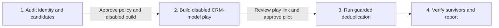

# CRM deduplication

**State: to-be-approved.** Deploy-verified against a live workspace: not yet. Treat `Done when`
below as the acceptance test and review `cargo-ai cdk plan` before deploying. Make no outcome claim
for this skill until it is approved.

## The outcome

CRM accounts and contacts stay duplicate-free. Two disabled plays run directly on CRM-backed models:
`deduplicate_accounts` on `crm_accounts` and `deduplicate_contacts` on `crm_contacts`. Each play
searches the live CRM for records sharing approved identity keys, scores the evidence, selects a
deterministic survivor, and either merges or pauses for manual validation. Neither play creates a
candidate or staging model.

For accounts, exact shared LinkedIn company ID with no identity, protected-ID, or
parent-subsidiary conflict is the only automatic class. Every other account candidate reaches
Cargo's native Human Review node. Company name alone never creates or scores a candidate.

For contacts, the high-confidence classes are same LinkedIn person ID, same normalized LinkedIn URL
with no conflicting person IDs, or same exact non-generic email with no conflicting LinkedIn
identity. Phone-only matches, generic or shared email, and conflicting LinkedIn identity are
low-confidence. Low-confidence groups are sent to Human Review when the operator enables it;
otherwise they are left untouched. A low-confidence contact group is never automatically merged.

The checked example in `infra/index.ts` is HubSpot: `fetchRecords` for companies and contacts,
`findRecords` for live candidate search, `mergeRecords` for automatic or approved merges, and
`updateRecords` to write back approved contact identity values after a guarded contact merge.
Salesforce and Attio adapt that one file by replacing the connector, extractors, record-ID fields,
search action, merge action, update action, and property slugs. Keep one CRM shape in the file.

**Raw-search asymmetry trap.** The audit compares normalized keys, but CRM `findRecords` searches
stored raw values. A live blind test found that `linkedin.com/in/x`, `www.` variants, and trailing
slashes can miss each other at runtime unless the play searches deterministic URL variants. The
checked contact graph prepares all four LinkedIn URL forms before `findRecords`. Phone formatting
cannot be exhaustively searched the same way; when phone-only duplicate coverage matters, offer a
priced, operator-gated `crm-enrichment` write-policy extension that normalizes phone values and
LinkedIn URLs in the CRM, then reruns those rows.

When matching-key coverage is weak, recommend `crm-enrichment` before building this play. That is a
recommendation, not a dependency: `crm-deduplication` installs and operates independently.

## Guide the operator through every phase



Every substantive message starts with the current phase and ends with a `Next step` section. Give
the operator one concrete decision or action, say what follows approval, and name what remains
blocked. During in-progress work, say `No action needed` and name the next checkpoint.

1. **Audit identity and candidates.** Follow [`references/audit.md`](references/audit.md). Present
   account and contact identifier coverage, candidate classes, conflicts, protected IDs, generic
   email rule, raw-search asymmetry, evidence score, deterministic survivor precedence, and proposed
   dedicated Slack review destination. If account coverage is weak or phone-only contact duplicates
   require stored normalization, recommend `crm-enrichment`. Ask the operator to approve the
   complete deduplication policy and authorize deployment of disabled resources. No CRM write or
   review request occurs in this phase.
2. **Build disabled CRM-model play.** Follow
   [`references/configure.md`](references/configure.md). Reconcile compatible CRM resources already
   in the project, adapt the checked file, run its executable contract, type, check, and plan. Deploy
   only under the operator's disabled-build authorization. Send the direct Cargo play links and the
   exact 15-row maximum pilot population for each selected play. Ask for separate approval of the
   merge-capable pilot.
3. **Run guarded deduplication.** Refresh the live audit, action schemas, costs, and population. Run
   only the approved rows. Account automatic merge is limited to the exact shared LinkedIn company
   ID class without conflicts. Contact automatic merge is limited to the three approved
   high-confidence classes. Low-confidence contacts are reviewed only when manual review is enabled;
   otherwise they are untouched.
4. **Verify survivors and report.** Follow [`references/run.md`](references/run.md). Re-read every
   survivor and absorbed child ID in the CRM. Report each search, score, automatic merge, approved
   merge, post-merge contact write-back, decline, timeout, exclusion, stale source, and failure.

## Put it in your project

This folder is a **worked example**: real CDK resources written for another company. The job is to
end with the code this company would have written in its project.

**Install the required authoring skill first.** If `cargo-cdk` is absent, run:

```sh
npx skills add getcargohq/cargo-skills --skill cargo-cdk
```

Read `.agents/skills/cargo-cdk/SKILL.md` directly after installation. Complete its bootstrap and use
its authoring, state, plan, and deployment rules throughout this pipeline.

1. **Look first.** `grep -l '@cargo-ai/cdk' package.json` checks for a CDK project;
   `ls */models/*.ts */connectors/*.ts */infra/*.ts` shows declared resources. If there is no
   project, run `cargo-ai cdk init <dir> --template blank && cd <dir> && npm install`.
2. **Copy this folder as a sibling**, then reconcile. Rewire the example to an existing compatible
   CRM connector, account extract, and contact extract, and remove duplicate declarations. The
   plays must remain on the CRM-backed account and contact models. Append environment requirements
   to `.env.example`; preserve existing content.
3. **Audit and approve policy.** Read live CRM schemas and records. Derive every input that a lookup
   can answer. Present the candidate and policy evidence from `references/audit.md`. Stop for
   approval of matching keys, protected fields, survivor precedence, automatic class, review
   destination, and disabled deployment.
4. **Adapt and deploy disabled.** Record adaptations under `## Decisions` in the copied skill. Run
   `node --import tsx evals/contract.mjs`, then `cargo-ai cdk types && cargo-ai cdk check && cargo-ai
   cdk plan`. Inspect the compiled graph and plan. Deploy with `isEnabled: false` only under the
   approved gate. Never run `cargo-ai cdk init --force` in a non-empty directory.
5. **Hand off for pilot approval.** Send the direct play links, exact population, current action
   costs, and approved policy. Stop for explicit approval of the merge-capable pilot.
6. **Run and report.** Execute only the approved population. Monitor terminal outcomes and complete
   the CRM verification in `references/run.md`. Walk `Done when` line by line.

## What you will be asked

**Derive before you ask.** An input with a lookup is looked up, not asked.

| Input                    | Kind    | How it is answered                                                                             | Why it matters                                                   |
| ------------------------ | ------- | ---------------------------------------------------------------------------------------------- | ---------------------------------------------------------------- |
| `crm`                    | derived | Inspect authenticated connectors, generated action types, and existing CDK resources                 | Each play must search and merge in the authoritative CRM                    |
| `deduplication_evidence` | derived | Normalize live account and contact identifiers, candidate clusters, conflicts, and survivor evidence | Policy approval must be grounded in current records                         |
| `current_action_costs`   | derived | Read live CRM and Slack integration metadata immediately before each preview                          | The pilot handoff must disclose current cost                                |
| `approved_policy`        | asked   | Review matching keys, protected fields, generic-email rule, survivor precedence, and automatic class  | It controls every candidate and automatic merge                             |
| `manual_review`          | asked   | Choose whether low-confidence contacts go to review, then select Slack connector, dedicated review channel, and owner | Low-confidence contact groups are either reviewed or untouched, never merged |
| `approved_build`         | asked   | Authorize deployment of the adapted resources with selected plays disabled                            | Repository review does not authorize workspace mutation                     |
| `approved_pilot`         | asked   | Review live play links and approve the exact merge-capable population                                 | A disabled play can still mutate CRM records when manually run              |

Checked before moving on:

- `crm`: selected account and contact models are backed by the authoritative CRM connector and
  expose CRM record IDs
- `approved_policy`: candidate keys, score, conflict gates, and survivor precedence are recorded
- `manual_review`: Slack connector and channel resolve when review is enabled; approval, decline,
  timeout, and no-review paths compile
- `approved_build`: the plan contains only the two connectors, CRM models, and disabled dedup plays
- `approved_pilot`: the exact population, current costs, and merge-capable policy are approved

## What you can change

The code is a worked example. Offer these adaptations when the audit supports them.

| Variation              | When it is right                                                | How                                                                                                      | What it costs                                                         |
| ---------------------- | --------------------------------------------------------------- | -------------------------------------------------------------------------------------------------------- | --------------------------------------------------------------------- |
| `crm`                  | The consumer uses Salesforce or Attio                           | Replace the checked HubSpot connector, extractor, record ID, search action, merge action, and properties | Generated types and merge semantics must be revalidated               |
| `matching_keys`        | The CRM has an approved durable identity beyond the defaults    | Add the normalized key to search, score, evidence, conflicts, write-back if relevant, and contract tests | Wider matching can create new false-positive classes                  |
| `survivor_precedence`  | Protected lifecycle, billing, tier, or customer policy must win | Update both survivor implementations and record the exact order                                          | A policy change can select a different survivor for every cluster     |
| `normalized_crm_keys`  | Phone or LinkedIn URL formatting causes runtime search misses   | Use `crm-enrichment` write policy to normalize stored phones and LinkedIn URLs before rerunning dedup     | Adds CRM writes and any current enrichment/provider costs             |
| `structured_ai_review` | Ambiguous evidence needs a review aid                           | Add a priced LLM summary to the Human Review card only, never to survivor selection or merge gating       | Adds current model cost and a non-deterministic review surface        |

## What should not change

- **Run on the authoritative CRM models.** (`infra/index.ts`) The plays use the CRM-backed account
  and contact extracts and CRM record IDs. A native account/contact or candidate model introduces
  another identity system and can target the wrong record.
- **Search live CRM rows before scoring.** (`infra/index.ts`) `findRecords` refreshes candidate
  membership for every run. Audit snapshots can become stale before a merge.
- **Make runtime search match audit normalization where possible.** (`infra/index.ts`) The contact
  play prepares LinkedIn URL variants before live search. Removing that step makes normalized audit
  matches disappear at runtime as `no_duplicates`.
- **Search, score, select, then decide.** (`infra/index.ts`) Deterministic preparation retains the
  fresh source exactly once. Native Scoring evaluates the evidence before deterministic survivor
  selection and the automatic gate.
- **Keep automatic classes narrow.** (`infra/index.ts`) Account automatic merge requires exact
  shared LinkedIn company ID, score at least 60, and no identity, protected-ID, or
  parent-subsidiary conflict. Contact automatic merge requires one of the three high-confidence
  people classes, including transitive pairwise chains across those classes, and its conflict guard.
  Every low-confidence candidate is reviewed or untouched.
- **Keep AI out of merge authority.** (`infra/index.ts`) Optional AI evidence can summarize the
  review card only. Deterministic policy plus Human Review decides irreversible merges.
- **Merge only on automatic or approved paths.** (`infra/index.ts`) Human approval reaches the
  reviewed merge. Decline, timeout, and review-disabled low-confidence contact groups end without a
  CRM write.
- **Write contact enrichment only after a guarded merge.** (`infra/index.ts`) Post-merge contact
  write-back updates only email, phone, LinkedIn URL, LinkedIn person ID, job title, and primary
  associated company ID, and only with non-empty validated values prepared before the merge.
- **Stop stale queued rows.** (`infra/index.ts`) A source missing from the fresh search ends before
  scoring or emitting merge IDs.
- **Keep one CRM shape in the file.** Adapt HubSpot in place for Salesforce or Attio. Parallel CRM
  branches drift from the generated types actually connected.
- **Keep the pilot disabled, serial, and limited.** (`infra/index.ts`) The play remains disabled,
  `noConcurrency`, and limited to 15 CRM rows until the verified pilot is approved for expansion.
- **Keep the repository inert.** It contains no credential, deploy command, customer data, or live
  merge result.

## Done when

- the audit JSON, Markdown, and chat summary agree on identifier coverage, candidates, and conflicts
- the operator approved matching keys, protected fields, survivor precedence, automatic class, and
  manual-review destination
- the isolated plan contains one CRM connector, one Slack connector, the selected CRM models, and
  disabled deduplication plays, with no staging model
- each play runs directly on its CRM model and matches the audited CRM record ID
- each compiled workflow contains CRM `findRecords`, deterministic preparation, native Scoring,
  deterministic survivor selection, the guarded Branch, native Human Review when enabled, and CRM
  merge actions only on automatic or approved paths
- contact write-back runs only after automatic or approved merges, targets the canonical contact,
  and is limited to non-empty approved people fields
- contact search prepares LinkedIn URL variants before `findRecords`, and contact classification
  handles transitive high-confidence chains
- Human Review cards show one formatted line per contact and do not render raw JSON evidence
- `node --import tsx evals/contract.mjs` passes against the adapted graph
- generated consumer types confirm the selected search, merge, and Human Review payloads
- the Slack review connector resolves, the Cargo app is added to the dedicated review channel, and
  approval, decline, and timeout reach their intended paths
- each selected play is disabled, `noConcurrency`, and limited to 15 CRM rows
- the operator separately approved the disabled deployment and exact merge-capable pilot
- the final report verifies every survivor and absorbed ID and accounts for every terminal outcome

## What it costs

Immediately before each preview, run `cargo-ai connection integration get <crm>` and
`cargo-ai connection integration get slack`. Read the current cost metadata for the selected search,
merge, and Human Review actions. Record the CLI version, lookup time, action slugs, and applicable
costs. If structured AI evidence is added, price it separately.

The repository does not hard-code action prices. Human approval authorizes only the exact cluster
shown in that review message. For contacts, enabling or disabling low-confidence review is decided
at the policy gate; enabling the recurring schedule is still the last approval after the pilot
passes, not an initial input.

## Composes into

- `crm-enrichment` when account matching-key coverage is too weak for reliable duplicate candidates
- `account-scoring` after duplicate records have been consolidated into authoritative survivors
