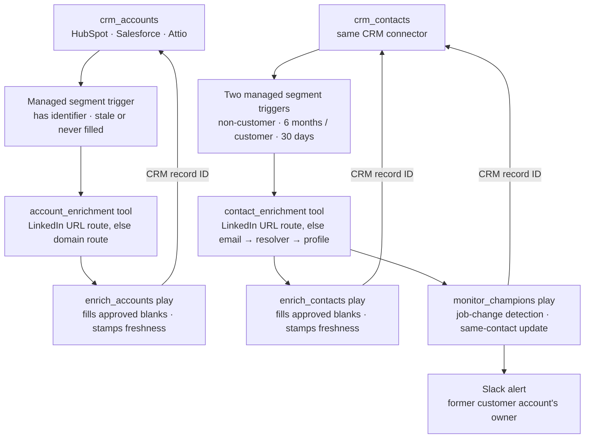

# CRM enrichment

Keep CRM accounts and contacts filled and refresh them when they go stale. New
records get approved blanks written from LinkedIn; a record whose last
successful fill is older than its window comes back; customer champions are
watched for job changes.

## What it does

- **Fills approved account blanks** from LinkedIn: name, domain, website,
  LinkedIn page, employee count, and LinkedIn company ID as a durable matching
  key.
- **Fills approved contact blanks** from LinkedIn: profile URL, LinkedIn person
  ID as a durable matching key, and job title — resolving the profile from a
  work email when the URL is missing.
- **Monitors customer champions** every 30 days: compares the live LinkedIn
  company against the CRM company, and on a job change updates the same
  contact, preserves the former company relationship, and alerts the former
  account's owner in Slack.
- **Re-enrolls stale records** — six months for accounts and non-customer
  contacts, 30 days for customer contacts — so the data stays current without
  manual refreshes.
- **Never overwrites** a populated value by default. The CRM stays
  authoritative; the champion play's confirmed job-change branch is the one
  recorded exception (company, title, employment status).
- **Separates enrichment from writeback.** The tools return provider data; the
  plays own every CRM read and write.

## How it works

1. **Audit.** The agent joins live LinkedIn fields to live CRM properties,
   flags duplicates and transformations — for contacts, also the
   customer-status mapping and operational-field reuse — and waits for approval
   of the field contract.
2. **Build disabled.** It adapts `infra/index.ts`, deploys with every play
   disabled, and shows Cargo links, target population, and estimated credits.
3. **Run.** After cost approval, enrichment runs and the agent reports fill
   rates, outcomes — including job changes — failures, and actual credits.

## Architecture

| Resource             | Type      | Role                                                             |
| -------------------- | --------- | ---------------------------------------------------------------- |
| `crm_accounts`       | Model     | CRM account extract; the account play reads and writes here      |
| `crm_contacts`       | Model     | CRM contact extract; both contact plays read and write here      |
| `account_enrichment` | Tool      | Normalizes company identifiers, returns provider data            |
| `contact_enrichment` | Tool      | Normalizes person identifiers, resolves email → profile          |
| `enrich_accounts`    | Play      | Fills account blanks, owns writeback and freshness               |
| `enrich_contacts`    | Play      | Fills non-customer contact blanks, owns writeback and freshness  |
| `monitor_champions`  | Play      | Watches customer contacts, handles job changes, alerts the owner |
| `slack`              | Connector | Carries the champion job-change alert                            |

Tools and plays share one workflow contract per path, so mappings cannot
drift. Each play's filter is its segment; there is no standalone segment. The
customer-status split between the two contact plays is what expresses the two
refresh cadences.

## Placeholders (edit before deploy)

1. **CRM connector and record ID** (`infra/index.ts`): the example is HubSpot
   (`hs_object_id`); Salesforce uses `Id`, Attio its record id. The wrong field
   targets nothing while the run still looks successful.
2. **Field mappings** (`infra/index.ts`): every destination must be a live
   property on the connected CRM.
3. **Freshness fields**: `cargo_last_enriched_at` and `cargo_enrichment_status`
   must exist on each enriched CRM object; `primary_employment_status`
   (Active/Left) on the contact object.
4. **Matching keys**: propose `linkedin_company_id` and `linkedin_person_id`
   if no equivalent properties exist.
5. **Provider result paths** (`infra/index.ts` `enrichContactData`): the person
   enrichment and resolver output paths marked `PLACEHOLDER` must be re-read
   from the live action schemas before deploy.
6. **Champion alert channel** (`infra/index.ts`): the Slack channel id, and the
   live `postMessage` input field names once `cargo-ai cdk types` has run.
7. **Customer-status mapping** (`infra/index.ts` play filters): the checked
   example filters `lifecyclestage = customer` via HubSpot's native
   company-to-contact lifecycle sync; confirm how this CRM marks customers.

## Cost

The audit makes no paid call: it reads schemas and counts eligibility, so the
cost preview lands before any approval.

Account enrichment is one LinkedIn call per eligible row, priced by route:
`enrichCompany` for a LinkedIn URL, `enrichCompanyFromDomain` as the fallback.
Contact enrichment is `enrichProfile` for a LinkedIn URL; a row with only an
email pays `reverseEmailLookup` and, only when it resolves, `enrichProfile` —
the one full paid chain. Run `cargo-ai connection integration get linkedin`
and `cargo-ai connection integration get FullEnrich` for current unit prices.
A row with no identifier never calls; CRM reads and the Slack alert are not
credit-billed.

After a successful fill the record leaves its segment for the length of its
window — six months for accounts and non-customer contacts, 30 days for
customer contacts — so the daily schedules only pay for new rows and records
coming back due.

## Done when

- Audit JSON, Markdown, and chat summary agree on every count
- The plan shows the tools and every play disabled, one Tool node first in
  each play, and CRM actions only in plays
- Every destination is a live property on the connected CRM
- Rows with no identifier exit before a paid call; unresolved emails exit
  before the person enrichment
- Every write matches the audited CRM record ID
- Route counts are mutually exclusive and reproduce the credit estimate
- A verified job change updates the same contact, preserves the former
  relationship, and alerts the former account's owner
- The post-run report shows fill rates, outcomes, failures, and actual credits

## Composes into

`account-scoring` (a filled book is what the scorer can cite),
`find-stakeholders` (the buyers at every filled account),
`tam-building` (the universe these records join),
`track-job-changes` (the one-off spot check of the champion signal),
`monitor-buying-signals` (where a champion alert becomes a sequence).
