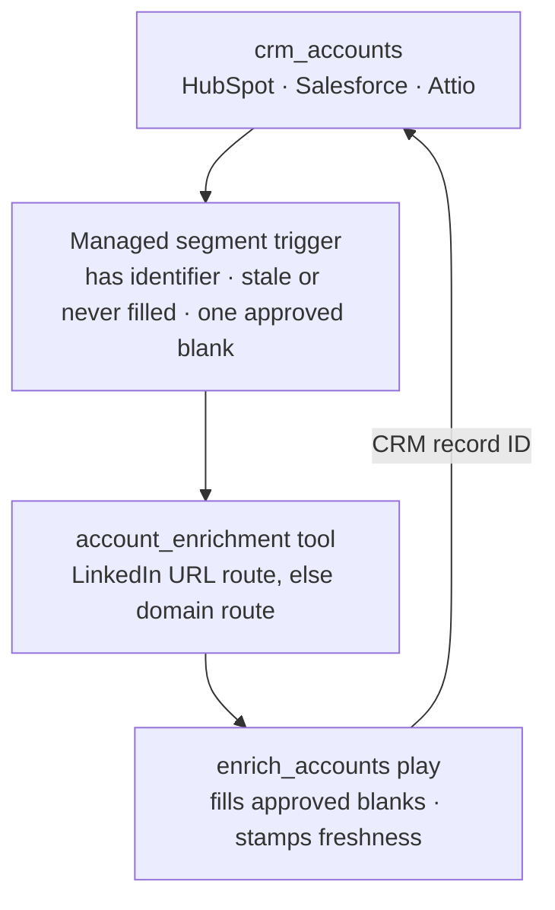

# CRM enrichment

Keep CRM accounts filled and refresh them when they go stale. New records get
approved blanks written from LinkedIn; a record whose last successful fill is
older than six months comes back.

## What it does

- **Fills approved blanks** from LinkedIn — name, domain, website, LinkedIn
  page, employee count, and LinkedIn company ID as a durable matching key.
- **Re-enrolls stale records** after six months, so firmographics stay current
  without manual refreshes.
- **Never overwrites** a populated value. The CRM stays authoritative.
- **Stamps freshness only after a real fill.** An already-filled row exits
  before any paid call.
- **Separates enrichment from writeback.** The tool returns provider data; the
  play owns the CRM write.

## How it works

1. **Audit.** The agent joins live LinkedIn fields to live CRM properties, flags
   duplicates and transformations, and waits for approval of the field contract.
2. **Build disabled.** It adapts `infra/index.ts`, deploys with the play
   disabled, and shows Cargo links, target population, and estimated credits.
3. **Run.** After cost approval, enrichment runs and the agent reports fill
   rates, outcomes, failures, and actual credits.

## Architecture

| Resource             | Type  | Role                                                |
| -------------------- | ----- | --------------------------------------------------- |
| `crm_accounts`       | Model | CRM account extract; the play reads and writes here |
| `account_enrichment` | Tool  | Normalizes identifiers, returns provider data       |
| `enrich_accounts`    | Play  | Fills blanks, owns writeback and freshness          |

Tool and play share one workflow contract, so mappings cannot drift. The play's
filter is its segment; there is no standalone segment.

## Placeholders (edit before deploy)

1. **CRM connector and record ID** (`infra/index.ts`) — the example is HubSpot
   (`hs_object_id`); Salesforce uses `Id`, Attio its record id. The wrong field
   targets nothing while the run still looks successful.
2. **Field mappings** (`infra/index.ts`) — every destination must be a live
   property on the connected CRM.
3. **Freshness fields** — `cargo_last_enriched_at` and
   `cargo_enrichment_status` must exist on the CRM object.
4. **`linkedin_company_id`** — propose it if no equivalent property exists.

## Cost

The audit makes no paid call: it reads schemas and counts eligibility, so the
cost preview lands before any approval.

Enrichment is one LinkedIn call per eligible row, priced by route —
`enrichCompany` for a LinkedIn URL, `enrichCompanyFromDomain` as the fallback.
Run `cargo-ai connection integration get linkedin` for current unit prices. A
row with no identifier never calls; an already-filled row exits as
`skipped_already_filled`.

After a successful fill the record leaves the segment for six months, so the
daily schedule only pays for new rows and records coming back due.

## Done when

- Audit JSON, Markdown, and chat summary agree on every count
- The plan shows the `account_enrichment` tool and a disabled `enrich_accounts`
- Every destination is a live property on the connected CRM
- Rows with no identifier or no blanks exit before a paid call
- The write matches the audited CRM record ID
- LinkedIn and domain route counts are mutually exclusive and reproduce the
  credit estimate
- The post-run report shows fill rates, outcomes, failures, and actual credits

## Composes into

`account-scoring` (a filled book is what the scorer can cite),
`find-stakeholders` (the buyers at every filled account),
`tam-building` (the universe these records join).
