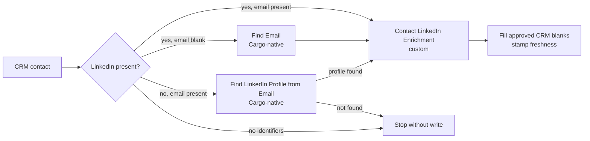

# CRM enrichment

This pipeline keeps approved CRM account and contact fields filled, then re-enrolls successfully
written records when they become stale. It never overwrites a business value that already exists.

The contact path is one play with three gated tool resources:

1. Cargo-native Find Email
2. Cargo-native Find LinkedIn Profile from Email
3. Custom Contact LinkedIn Enrichment



The account path remains `enrich_accounts` calling `account_enrichment`. The contact path is only
`enrich_contacts`; it has no customer split, alerting, relationship mutation, or movement logic.

## Resources

| Resource                         | Kind              | Purpose                                                       |
| -------------------------------- | ----------------- | ------------------------------------------------------------- |
| `crm_accounts`                   | Model             | CRM company extract                                           |
| `crm_contacts`                   | Model             | CRM contact extract                                           |
| `account_enrichment`             | Custom tool       | LinkedIn-first company enrichment with domain fallback        |
| Find Email                       | Cargo-native tool | Resolve an email for a known LinkedIn profile                 |
| Find LinkedIn Profile from Email | Cargo-native tool | Resolve a LinkedIn profile for a known email                  |
| `contact_linkedin_enrichment`    | Custom tool       | Enrich a known LinkedIn profile without CRM access            |
| `enrich_accounts`                | Play              | Fill approved company blanks                                  |
| `enrich_contacts`                | Play              | Gate the three contact tools and fill approved contact blanks |

Explicit workflow branches compile the custom contact tool into three mutually exclusive call
nodes. They are three routes to one custom resource, not three custom tools.

## Install and adapt

From a Cargo CDK project:

```sh
cargo-ai cdk add cookbook/crm-enrichment
```

Before planning or deploying:

1. Reconcile the default CRM and LinkedIn connectors with resources already in the project.
2. Audit live CRM properties and provider outputs.
3. Instantiate the Cargo-native Find Email and Find LinkedIn Profile from Email tools.
4. Replace both `REPLACE-WITH-...-TOOL-UUID` placeholders in
   `infra/plays/enrich-contacts.ts`.
5. Confirm the native tool contracts. The example expects `email` and `linkedin_url` outputs.
6. Apply the operator-approved field mappings and eligibility filters.
7. Typecheck, inspect the compiled graph, and deploy the plays disabled.

The example targets HubSpot. Salesforce and Attio require adapting the connector, extracts,
record ID fields, write action, and blank-only guard. Keep one CRM shape in the adapted file.

## Contact route behavior

| Starting state     | Native lookup                    | Custom enrichment          | CRM write                  |
| ------------------ | -------------------------------- | -------------------------- | -------------------------- |
| Email and LinkedIn | None                             | Yes                        | Yes                        |
| LinkedIn only      | Find Email                       | Yes                        | Yes                        |
| Email only         | Find LinkedIn Profile from Email | Only if a profile resolves | Only if a profile resolves |
| Neither            | None                             | No                         | No                         |

Successful writes fill only blank `email`, `linkedin_person_id`, `linkedin_profile_url`, and
`jobtitle` values, then stamp `cargo_last_enriched_at` and
`cargo_enrichment_status=succeeded`.

## Verify

```sh
npm run typecheck
node scripts/check-pipelines.mjs
node --import tsx crm-enrichment/evals/contract.mjs
```

Then run a one-record write probe before any paid batch. See [the audit contract](references/audit.md),
[configuration guide](references/configure.md), [runbook](references/run.md), and
[acceptance checklist](evals/acceptance.md).
