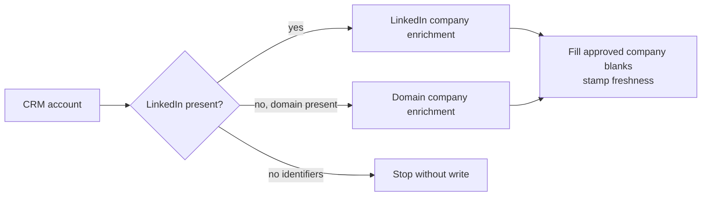
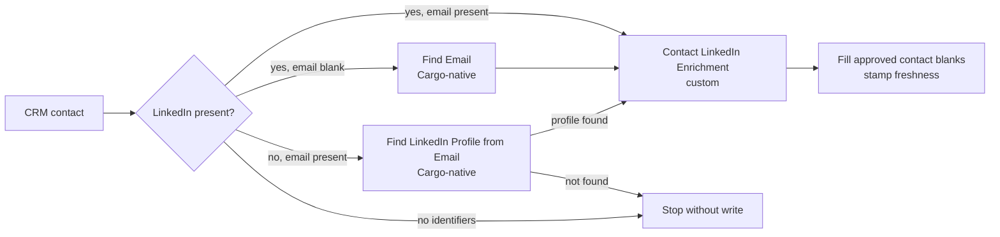

# CRM enrichment

This pipeline has two independent paths. Deploy the account path, the contact path, or both. Each
path has its own model, tool contract, play, field approval, cost preview, pilot, and acceptance
checklist. Both paths fill approved CRM blanks and stamp freshness only after a successful write.

## Path 1: Account enrichment

The account path keeps approved company identity and firmographic fields filled. It uses LinkedIn
company identity first and falls back to the company domain. A row takes only one provider route.



### Account resources

| Resource             | Kind        | Purpose                                                |
| -------------------- | ----------- | ------------------------------------------------------ |
| `crm_accounts`       | Model       | Direct CRM company extract                             |
| `account_enrichment` | Custom tool | Select one company enrichment route without CRM access |
| `enrich_accounts`    | Play        | Fill approved company blanks and stamp freshness       |

The starting HubSpot mapping covers `linkedin_company_id`, `name`, `domain`, `website`,
`linkedin_company_page`, and `numberofemployees`. Every business-field write is blank-only. The
play runs directly on the CRM extract and matches the CRM record ID.

## Path 2: Contact enrichment

The contact path is one play with three gated tool resources:

1. Cargo-native Find Email
2. Cargo-native Find LinkedIn Profile from Email
3. Custom Contact LinkedIn Enrichment



### Contact resources

| Resource                         | Kind              | Purpose                                                       |
| -------------------------------- | ----------------- | ------------------------------------------------------------- |
| `crm_contacts`                   | Model             | Direct CRM contact extract                                    |
| Find Email                       | Cargo-native tool | Resolve an email for a known LinkedIn profile                 |
| Find LinkedIn Profile from Email | Cargo-native tool | Resolve a LinkedIn profile for a known email                  |
| `contact_linkedin_enrichment`    | Custom tool       | Enrich a known LinkedIn profile without CRM access            |
| `enrich_contacts`                | Play              | Gate the three contact tools and fill approved contact blanks |

### Contact route behavior

| Starting state     | Native lookup                    | Custom enrichment          | CRM write                  |
| ------------------ | -------------------------------- | -------------------------- | -------------------------- |
| Email and LinkedIn | None                             | Yes                        | Yes                        |
| LinkedIn only      | Find Email                       | Yes                        | Yes                        |
| Email only         | Find LinkedIn Profile from Email | Only if a profile resolves | Only if a profile resolves |
| Neither            | None                             | No                         | No                         |

Explicit branches compile the custom tool into three mutually exclusive call nodes. They all target
the same `contact_linkedin_enrichment` resource. Successful writes fill only blank `email`,
`linkedin_person_id`, `linkedin_profile_url`, and `jobtitle` values, then stamp
`cargo_last_enriched_at` and `cargo_enrichment_status=succeeded`.

This path contains no customer split, movement detection, relationship mutation, note creation, or
alerting.

## Install and adapt

From a Cargo CDK project:

```sh
cargo-ai cdk add cookbook/crm-enrichment
```

Shared setup:

1. Reconcile the default CRM and LinkedIn connectors with resources already in the project.
2. Choose the account path, contact path, or both. Audit and approve each selected path separately.
3. Confirm the CRM extract, record ID, destinations, blank-only behavior, and provider schemas for
   each selected path.
4. Typecheck, inspect the compiled graphs, and deploy the selected plays disabled.

Contact-only setup:

1. Instantiate Cargo-native Find Email and Find LinkedIn Profile from Email.
2. Replace both `REPLACE-WITH-...-TOOL-UUID` values in `infra/plays/enrich-contacts.ts`.
3. Confirm the native tool contracts. The example expects `email` and `linkedin_url` outputs.

The checked example targets HubSpot. Salesforce and Attio require adapting the connector, extracts,
record ID fields, write action, and blank-only guard. Keep one CRM shape across both selected paths.

## Verify

```sh
npm run typecheck
node scripts/check-pipelines.mjs
node --import tsx crm-enrichment/evals/contract.mjs
```

Run a one-record write probe for each selected path before any paid batch. See
[the audit contract](references/audit.md), [configuration guide](references/configure.md),
[runbook](references/run.md), and [two-path acceptance checklist](evals/acceptance.md).
