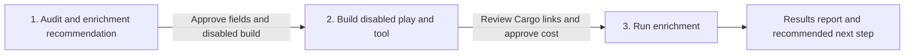

# CRM enrichment

**State: to-be-approved.** Deploy-verified against a live workspace: not yet. Treat `Done when`
below as the acceptance test and review `cargo-ai cdk plan` before deploying. Make no outcome claim
for this skill until it is approved.

## The outcome

CRM accounts and contacts stay filled. New records get approved blanks written from LinkedIn; a
record whose successful fill is older than its refresh window comes back. Every play runs directly
on its CRM extract — `crm_accounts` for companies, `crm_contacts` for people — and writes back
with that row's CRM record id. It does not overwrite a value that is already there.

The account path is one play: `enrich_accounts` fills approved firmographics and re-enrolls a
record after six months. The people path is two plays on the same extract, split by the audited
customer status, which both filters read from the RELATED account through the
`contact_primary_company` relationship — contact-side lifecycle is unreliable and is never
written. `enrich_contacts` fills approved person attributes for non-customer contacts on
the six-month window. `monitor_champions` watches contacts whose primary company is a customer on
a 30-day window and compares their live LinkedIn profile against the CRM company: deterministic
guards first (LinkedIn company identity, then domain), and when the guards cannot confirm the
company, an AI verdict over the complete profile — dates and concurrent positions included —
decides whether the PRIMARY employment changed. On a confirmed move it finds or creates the new
company, updates the same contact, preserves the former company relationship, writes one JOB
CHANGE note on the contact and both companies, and alerts the former
account's owner in Slack. Job changes among customer contacts are time-sensitive warm pipeline;
standard contact data is not — that is why the cadences differ and why the split lives in the two
play filters rather than a standalone segment.

The checked example in `infra/index.ts` is HubSpot (`hs_object_id`, companies and contacts
objects, `updateRecords` + `skipIfExist`). Salesforce and Attio are the same file adapted:
swap the connector, extractor, record-id field, write action, and fill-blank guard. Do not add
a second CRM branch.

**Three failure modes worth knowing before you start.** If the matching record-id field is wrong,
the run looks successful and every write targets nothing. If a field's approved write policy is
lost, a refresh overwrites CRM-authoritative data or preserves the stale value it was meant to
replace. If a job change is allowed to create a contact, one person becomes two records and the
relationship history splits — the champion play updates the resolved existing contact, never
creates one.

The starting recommendation is identity and size for accounts, identity and role for contacts. On
HubSpot the account fields are `linkedin_company_id`, `name`, `domain`, `website`,
`linkedin_company_page`, and `numberofemployees`; the contact fields are `linkedin_person_id`,
`linkedin_profile_url`, and `jobtitle`. The provider's company and person IDs are recommended as
durable matching keys. Reuse the best compatible CRM property when one exists; otherwise propose
the string property (`linkedin_company_id`, `linkedin_person_id`) and wait for approval to create
it. Do not prepend `cargo_` to proposed CRM properties: provider-derived business properties keep
neutral names, and so does `primary_employment_status` (Active/Left), which describes the person
rather than Cargo's bookkeeping. Before counting
the target population or editing CDK, the agent derives the other LinkedIn fields that can map to
live CRM properties and presents them with their type and transformation costs. The operator
approves the field contract. That approved contract, not the repository default, controls the
mappings, per-field write policies, and final cost preview. The audit JSON contract lives in
[`references/audit.md`](references/audit.md); provider field paths and the selection gate in
[`references/configure.md`](references/configure.md).

The people path adds one derived audit input the account path does not have: the customer-status
mapping. The audit identifies which live company property and value this CRM uses to mean
"customer" (HubSpot example: the primary associated company's `Lifecycle stage = Customer`;
Salesforce: `Contact.AccountId → Account.<customer status field>`), always through the contact's
primary company relationship — declared in CDK as the `contact_primary_company` dataset
relationship, never an arbitrary associated company and never the contact's own lifecycle field.
The operator confirms that mapping
before either contact play is built, because it decides which contacts each play owns.

Two silent-failure traps live in the same family as the `conjonction` spelling. Blank HubSpot
values surface as NULL in the Cargo extract, so a filter condition that tests only `isEmpty`
matches nothing — every blank test pairs `isNull` with `isEmpty`, and the shipped filters do.
And CRM properties created by hand must match the template verbatim: internal names are frozen
at creation, enum option values are case-sensitive, and date properties must be date-and-time
(see [`references/configure.md`](references/configure.md)).

Present exactly one row per provider property in the field-selection table. Never combine fields
into a grouped row: each property names the actual provider used, its own type, provider-route
availability, CRM destination, fill rate, transformation, recommendation, and operator decision.
Derive the provider name from the live connector and action instead of hard-coding it. The checked
example uses LinkedIn.

The duplicate-property audit is about genuine customer-managed duplicates. Do not present CRM
system properties, HubSpot `hs_*` fields, or generic native properties as duplicates merely because
they could hold similar data. If no customer-managed duplicate group exists, say
`No duplicate properties detected`.

## Guide the operator through every phase



Every substantive message starts with the current phase and ends with a `Next step` section. Give
the operator one concrete decision or action, say what the agent will do after approval, and name
what remains blocked. During an in-progress operation, say `No action needed` and name the next
checkpoint. Never end with a generic offer to help.

1. **Audit and enrichment recommendation.** Present the CRM gaps, duplicate-property result, and
   one-row-per-property recommendation — for the people path, also the confirmed customer-status
   mapping and the operational-field reuse decisions. End by asking the operator to approve the
   complete field contract and authorize building and deploying the resulting Cargo resources in a
   disabled state. No paid call or CRM write occurs in this phase.
2. **Disabled plays and tools.** After that approval, walk the operator through the manual
   prerequisites first — creating the approved CRM properties in the CRM UI (the connector has no
   create-property action; see [`references/configure.md`](references/configure.md) for the exact
   names and types), instantiating the "Find LinkedIn URL from email" template tool, and adding
   the Cargo app to the alert channel — then adapt, type, check, plan, and deploy the reusable
   tools and the play or plays for the audited path, every play still disabled. The enrichment
   tool
   normalizes identifiers and
   returns provider data without CRM access. Each play calls the tool, applies the approved write
   policy, and pushes results to the CRM. Inspect the compiled graph before deployment: the tool
   starts with an identifier Branch (`contact_enrichment` continues into the resolver fallback),
   and every play starts with one Tool node targeting its tool
   (`account_enrichment` for `enrich_accounts`; `contact_enrichment` for `enrich_contacts` and
   `monitor_champions`) before any CRM action. Send a direct Cargo UI link for each resource. Show the exact
   eligible population, mutually exclusive provider routes, unit prices, and total estimated
   credits. End by asking the operator to review those links and approve the enrichment run at that
   stated maximum cost. Do not run or enable anything without that second approval.
3. **Enrichment and report.** Before any paid batch, probe write-capability on one record — a
   failed write re-bills the provider on retry — and before the champion play, walk the
   company-identifier coverage gate ([`references/run.md`](references/run.md)). Then run only the
   approved population, monitor completion, and report the
   before-and-after fill rate for every approved property, processed and outcome counts — for the
   champion play, job-change outcomes and where each alert went — failures,
   actual credits against estimate, and direct Cargo links. End with a recommended next action:
   remediate failures, approve recurring daily coverage, or move to deduplication.

## Put it in your project

This folder is a **worked example**: real CDK resources written for some other company. The job
is to end up with the code your company would have written, in your project, and an agent does the
adapting.

**Install the required authoring skill first.** If `cargo-cdk` is absent, run:

```sh
npx skills add getcargohq/cargo-skills --skill cargo-cdk
```

Then read `.agents/skills/cargo-cdk/SKILL.md` directly; no session reload is needed. Complete its
bootstrap and use its authoring, state, plan, and deployment rules throughout this pipeline. Stop
before audit or template work if the skill cannot be installed or read.

1. **Install it — the CLI does the copy.** From inside the CDK project,
   `cargo-ai cdk add cookbook/crm-enrichment` writes this example to `infra/crm-enrichment/` and
   this procedure to `.claude/skills/crm-enrichment/`. No project yet?
   `cargo-ai cdk init <dir> --cookbook crm-enrichment && cd <dir> && npm install` does both; this
   folder never ships a shell. **If you are reading this from the project's `.claude/skills/`, the
   install already happened — start at step 2.** On a CLI too old to have `add`, copy this folder
   in as a sibling of what is there by hand; everything below is unchanged.
2. **Reconcile it with what is already declared.** For every model or connector this example
   carries that the project already has (a HubSpot connector, an account or contact extract, a
   Slack connector), rewire the
   imports to the existing one and drop the copy. Two resources with one slug is a collision at
   deploy. Each play must keep running on its CRM extract (`crm_accounts` and `crm_contacts` in
   the example).
   Append this folder's `.env` needs to the project's `.env.example`; never overwrite it.
3. **Audit and recommend.** Pick the path the operator asked for — accounts, contacts, or both;
   audit only what was asked. Re-read the live provider output and CRM property schemas. Follow the
   field-selection gate in [`references/configure.md`](references/configure.md): present the CRM
   gaps, duplicate-property result, starting recommendation, optional fields, transformations, and
   unsupported fields with reasons — for contacts, also the customer-status mapping for
   confirmation and the operational-field reuse decisions. Stop for approval of the complete field
   contract and explicit
   authorization to deploy the resulting resources disabled. Do not calculate the final target,
   edit CDK, deploy, make a paid call, or write to the CRM while approval is pending.
4. **Adapt and deploy disabled.** After approval, work the sections below in order: _What should not
   change_ is what you argue back
   about (say what breaks, then do it if they still want it); _What you can change_ is what you
   offer unprompted (nobody asks for a variant they do not know exists); _What you will be asked_
   is the floor, and you derive before you ask. If you are asking more than about four questions
   you have skipped lookups. Record what you changed and why under a `## Decisions` section in
   your copy of this file. From the copied skill folder, run
   `node --import tsx evals/contract.mjs`, then run
   `cargo-ai cdk types && cargo-ai cdk check && cargo-ai cdk plan`. Show the diff, and deploy under
   the phase-one authorization with `isEnabled: false`. Never run `cargo-ai cdk init --force` in a
   non-empty directory.
5. **Hand off for cost approval.** Resolve the workspace, play, and tool UUIDs. Send clickable Cargo
   UI links using the patterns in [`references/run.md`](references/run.md), then show the final
   target and exact estimated credits. Stop for explicit approval of that run and maximum cost.
6. **Run and report.** Execute only after the second approval. Monitor the approved scope and return
   the result report from [`references/run.md`](references/run.md). Walk _Done when_ line by line.
   Deployed cleanly and produced nothing is the normal failure.

## What you will be asked

**Derive before you ask.** An input with a lookup is looked up, not asked. Only the ones marked
_asked_ genuinely live in the operator's head.

| Input                      | Kind               | How it is answered                                                                                                                                                                    | Why it matters                                                                            |
| -------------------------- | ------------------ | ------------------------------------------------------------------------------------------------------------------------------------------------------------------------------------- | ----------------------------------------------------------------------------------------- |
| `crm`                      | derived            | Inspect authenticated connectors and existing CDK resources                                                                                                                           | Reusing them prevents a second CRM connector and a second extract                         |
| `field_candidates`         | derived            | Join live provider paths and types (LinkedIn company fields for accounts, LinkedIn person fields for contacts) to live CRM properties and fill rates                                  | The operator should choose from evidence, not recall provider fields                      |
| `customer_status_mapping`  | derived, confirmed | Detect the live account property and value that mean "customer", read through the `contact_primary_company` relationship, then present it for confirmation                            | It decides which contacts `enrich_contacts` and `monitor_champions` each own              |
| `approved_field_contract`  | asked              | Review the recommended base fields, optional candidates, transformations, destinations, operational-field reuse, and exclusions                                                       | It defines every write mapping and authorizes the disabled build                          |
| `target_population`        | derived            | Count eligible rows by mutually exclusive route after field approval                                                                                                                  | It makes the cost estimate reproducible                                                   |
| `champion_coverage_policy` | asked              | See the count of customer companies lacking domain, website, and LinkedIn page, then choose: fill them, approve a priced name→domain resolution step, or run only matchable champions | Without it the champion play marks every unmatchable champion Left and fires false alerts |
| `champion_alert_channel`   | asked              | Name the Slack channel for champion job-change alerts, with the Cargo app already added to it (Slack → channel → Add apps → Cargo)                                                    | A channel without the app fails at send time, not build time, after the paid call         |
| `approved_run`             | asked              | Review the disabled Cargo links, target, and exact maximum credits                                                                                                                    | It is the explicit gate before any enrichment call                                        |

Checked before moving on, not after the deploy:

- `crm`: one authenticated CRM connector, and each play model is that connector's own extract
  (`crm_accounts` for companies, `crm_contacts` for contacts)
- `customer_status_mapping`: the detected property, value, and primary-relationship path are
  confirmed by the operator before either contact play is planned
- `approved_field_contract`: every selected provider path has a live destination, compatible type
  or explicit transformation, fill-blank policy, and recorded operator approval
- `target_population`: eligibility uses identifier, freshness, and approved governance filters;
  route counts are mutually exclusive and reproduce the credit estimate
- `approved_run`: direct Cargo UI links resolve, every play is disabled, and the operator approved
  the stated population and maximum cost

The first operator question comes after the field candidates are derived. Do not ask whether they
want "more fields" without showing the choices. Present a concise field-contract table and ask
which recommended and optional rows to include. Do not treat silence as approval of the defaults.

Refreshing populated business fields is outside the base template. If requested, that is
`approved_refresh_behavior` below, not a silent default.

## What you can change

The code is a worked example. These reshapes are expected, and the agent offers them rather than
waiting to be asked. Every one costs something; that is what makes it a variation and not the default.

| Variation                   | When it is right                                                                               | How                                                                                                                                                                                                                                                                                                                                                                                                                                                                                         | What it costs                                                                                                 |
| --------------------------- | ---------------------------------------------------------------------------------------------- | ------------------------------------------------------------------------------------------------------------------------------------------------------------------------------------------------------------------------------------------------------------------------------------------------------------------------------------------------------------------------------------------------------------------------------------------------------------------------------------------- | ------------------------------------------------------------------------------------------------------------- |
| `crm`                       | The consumer uses Salesforce or Attio instead of HubSpot                                       | Keep one CRM shape in `infra/index.ts`. The file is the HubSpot example. **Salesforce:** generated Account and Contact updates matching `Id`; there is no `skipIfExist` — read the record first and omit any field that is already populated, including numeric zero. **Attio:** generated record updates matching the record id; same read-then-omit guard. Do not copy HubSpot's flag. Re-derive the customer-status mapping and the association-preservation behavior on the target CRM. | Live generated types must be rechecked; a guessed flag writes or no-ops silently                              |
| `selected_fields`           | The approved contract differs from the starting recommendation                                 | Present every live candidate at the field-selection gate. After approval, change the result schema, destinations, per-field write policy, and the provider mappings in `infra/index.ts`. Industry requires an approved array-to-enum transformation when the CRM destination is a single enum.                                                                                                                                                                                              | Each added field expands mapping and type review                                                              |
| `additional_person_fields`  | The operator wants work emails or phones on contacts, not just identity and role               | Add the approved provider route to `contact_enrichment` (an email finder, an email validator, a phone lookup) and its destinations to the field contract. Phone lookups usually justify a narrower sub-segment, such as active pipeline, rather than every contact.                                                                                                                                                                                                                         | Every added route is a paid call per row at live unit prices; phone lookups cost multiples of an email lookup |
| `eligibility`               | Only a governed subset should be enriched                                                      | Intersect the play filter with approved lifecycle, tier, ownership, or gap conditions (`infra/index.ts` `enrichAccounts`, `enrichContacts`, `monitorChampions`)                                                                                                                                                                                                                                                                                                                             | Narrower scope reduces coverage and paid calls                                                                |
| `refresh_cadences`          | The six-month or 30-day windows do not fit the book                                            | Change the freshness filter values in the play triggers, keeping the champion window shorter than the standard one                                                                                                                                                                                                                                                                                                                                                                          | A faster cadence re-bills the same rows more often; a slower champion window ages the job-change signal       |
| `approved_refresh_behavior` | Populated fields must be refreshed after explicit approval                                     | Drop `skipIfExist` / the read-then-omit guard on the approved fields only — for `enrich_contacts`, also remove the blank-destination filter group — preview the replacements, and compare against a fresh CRM read (`infra/index.ts`)                                                                                                                                                                                                                                                       | Refresh can overwrite CRM-authoritative values if the preview and the write disagree                          |
| `champion_deferral`         | The operator does not want the champion play creating companies or writing notes automatically | At the policy gate, replace the find-or-create branch with the alert-only behavior: stamp the `partial` outcome, keep the association, and let the Slack alert ask the owner to create the company so the next cycle finishes the move                                                                                                                                                                                                                                                      | Every deferred move waits a full cycle on a human; the warm-pipeline signal ages while it waits               |
| `champion_sequencing`       | The operator wants a detected job change to trigger outreach                                   | Hand the alert off to a play built on `track-job-changes` or `monitor-buying-signals`; the champion play stops at the note and the Slack alert by design                                                                                                                                                                                                                                                                                                                                    | A sequence on a false positive burns the relationship; keep the verdict thresholds conservative first         |

## What should not change

However far you adapt, these hold. Ask for one anyway and the agent tells you what breaks, then does
it if you still want it, and records why under `## Decisions` in your copy of this file.

- **Every play runs on its CRM extract and matches the CRM record id.** (`infra/index.ts`) HubSpot's example uses `hs_object_id` on `crm_accounts` and `crm_contacts` alike. Sending a Cargo row id, or a native `accounts`/`contacts` id, to a CRM action targets the wrong identifier system; the run looks successful and nothing lands.
- **The tools enrich; the plays orchestrate and write.** (`infra/index.ts`) `account_enrichment` and `contact_enrichment` accept provider identifiers, normalize them, and return provider data without a CRM connector or write. Each `defineWorkflow` body first branches around rows with no identifier, then routes each eligible row to exactly one provider route. Every play starts with one Tool node targeting its tool, applies the approved per-field policy, and owns every CRM read and write. A tool that writes to the CRM is not reusable; a play that repeats the provider action bypasses the reviewed tool. Run `node --import tsx evals/contract.mjs` after every adaptation to enforce these compiled graphs.
- **One CRM shape in the file.** (`infra/index.ts`) The checked example is HubSpot. Adapt that one file for Salesforce or Attio. Parallel HubSpot/Salesforce/Attio branches drift from the generated types of the CRM that is actually connected.
- **At most one paid route per row, LinkedIn URL first.** (`infra/index.ts` `enrichCrmAccount`, `enrichContactData`) A row without an identifier makes no paid call. A handle that is already an `http` URL is used as-is; otherwise it is prefixed (`https://www.linkedin.com/company/<handle>` for accounts, `https://www.linkedin.com/in/<handle>` for contacts). A contact without a LinkedIn URL takes the email-resolver route — Cargo's "Find LinkedIn URL from email" template tool, the one full paid chain — and an email the resolver cannot map ends without a person-enrichment call. Collapsing the routes double-bills rows or enriches the wrong person.
- **Destinations are live properties on the connected CRM.** (`infra/index.ts`) The HubSpot example writes `linkedin_company_id`, `name`, `domain`, `website`, `linkedin_company_page`, and `numberofemployees` on companies; `linkedin_person_id`, `linkedin_profile_url`, `jobtitle`, `associatedcompanyid`, and `primary_employment_status` on contacts; and the stamps `cargo_last_enriched_at` and `cargo_enrichment_status` on both. Provider-derived business properties keep neutral names; Cargo-owned operational stamps use the `cargo_` prefix. Leaving another CRM's names in the file can write provider data into the wrong property.
- **Fill approved blanks only.** (`infra/index.ts` `skipIfExist` or the Salesforce/Attio read-then-omit guard) A stale snapshot overwrites authoritative CRM data, including numeric zero. The champion play's job-change branch is the one recorded exception: on a confirmed move it refreshes the company association, title, and employment status, because preserving them would preserve the wrong employer.
- **Eligibility and freshness live in the play triggers.** (`infra/index.ts` `enrichAccounts`, `enrichContacts`, `monitorChampions`) Require an identifier and the path's freshness window in the managed segment. The row workflow starts with the reusable tool call instead of repeating trigger conditions as branches. A standalone `defineSegment` or duplicate workflow gate drifts from the play.
- **The customer-status split is the two contact filters, read through the relationship.** (`infra/index.ts` `contactPrimaryCompany`) `enrich_contacts` owns non-customer contacts on the six-month window; `monitor_champions` owns customer-company contacts on the 30-day window — both reading the RELATED account's customer property through `contact_primary_company`, never the contact's own lifecycle field, which portals do not reliably sync. Widening either filter enrolls the same contact in both plays and bills it twice per cycle; narrowing both drops contacts into a gap nobody refreshes; filtering on the contact's own lifecycle hands the champion play an empty or wrong segment.
- **One person is one contact.** (`infra/index.ts` `monitorCrmChampion`) A job change updates the resolved existing contact — found by LinkedIn person identity, else the triggering row — finds or creates the new company, moves the primary company, and preserves the former relationship. The play never creates, merges, or deletes a contact, and a new employer or work email is never a new identity. Breaking this splits one person across duplicate records and the champion history with them.
- **Deterministic guards first, AI verdict second, email never.** (`infra/index.ts` `monitorCrmChampion`, `championVerdictWorkflow`) The same-company guards compare LinkedIn company identity first and domain second; only when they cannot confirm does the verdict tool read the complete profile — dates and concurrent positions included — and decide whether the PRIMARY employment changed. A bare current-company comparison flips champions with side positions (communities, advisory seats) between runs; a work email or an email-domain mismatch alone is never identity or proof of a move. Inlining the verdict prompt into branch conditions bills it per condition and makes `includes()` test the prompt text instead of the answer.
- **Every blank filter condition pairs `isNull` with `isEmpty`.** (`infra/index.ts` play filters) Blank HubSpot values surface as NULL in the Cargo extract, and `isEmpty` alone matches nothing — the play deploys green and enrolls zero rows, silently.
- **Every play deploys disabled and `noConcurrency` first.** (`infra/index.ts`) Removing those expands an unapproved pilot.
- **No credentials, deploy commands, or customer data in this repository.**

## Done when

- the audit JSON, Markdown, and chat summary agree on every count
- the audit records an operator-approved field contract with provider paths, live CRM destinations,
  types, transformations, write policies, and reasons for every exclusion
- on the people path, the audit records the confirmed customer-status mapping (property, value,
  primary relationship) and an operational-field decision — reuse or approved creation — for
  `cargo_last_enriched_at`, `cargo_enrichment_status`, and `primary_employment_status`
- the CDK plan contains one CRM model per audited object (`crm_accounts`, `crm_contacts`), the
  `contact_primary_company` relationship — adopted, not duplicated, when the workspace already
  declares it — and no native `accounts` or `contacts` unification
- the agent installed and read the `cargo-cdk` skill before auditing or adapting the template
- the CDK plan contains the reusable tools (`account_enrichment`, `contact_enrichment`,
  `champion_verdict`) and the
  disabled plays for the audited path; every play contains one Tool node targeting its enrichment
  tool before
  any CRM action, the verdict runs only behind the deterministic guards, and only plays contain
  CRM actions
- `node --import tsx evals/contract.mjs` passes against the adapted compiled graphs; each tool
  begins with an identifier Branch and contains no CRM action, the contact tool's email route ends
  unresolved rows before the person enrichment, every blank condition pairs `isNull` with
  `isEmpty`, the Slack payload is `channelId` + `format: "markdown"` + `body`, and no play
  contains a provider action
- the approved CRM properties were created in the CRM UI with verbatim internal names,
  case-sensitive enum options, and date-and-time date properties; the "Find LinkedIn URL from
  email" template tool is instantiated and its UUID and output path are wired in
- generated consumer types confirm the selected provider fields, CRM destinations, write and read
  actions, the Slack alert payload, and fill-blank semantics — including the resolver output path
  and association type ids this repository marks `PLACEHOLDER`
- every destination is a live property on the connected CRM
- the one-record write probe passed — and its stamps were reset — before any paid batch
- the champion coverage gate ran: the operator saw the count of customer companies lacking
  identifiers and chose fill, priced resolution, or matchable-only before the champion play
- each managed segment excludes records without an identifier; the approved per-field write policy
  decides fill blank versus refresh
- each play targets its extract and the write matches the audited CRM record id
- `enrich_accounts` uses the null-or-six-month freshness rule with no destination fill-state
  filter; `enrich_contacts` uses null-or-six-month freshness on the non-customer side with the
  blank-destination group intact; `monitor_champions` uses null-or-30-day freshness on the
  customer side with the primary-company link required; all three evaluate daily with
  `changeKinds: ["added"]`
- the first plan shows `isEnabled: false` and `runCreationRule: noConcurrency` on every play
- route counts are mutually exclusive and reproduce the credit estimate — LinkedIn URL and domain
  for accounts; LinkedIn URL and email-resolver chain for contacts
- on a verified job change, the champion play found or created the new company, updated the
  resolved existing contact, moved the
  primary company, preserved the former relationship with an explicit association, refreshed the
  title, wrote one JOB CHANGE note associated to the contact and both companies, and posted the
  structured alert to the approved channel — and created no contact
- the phase-two handoff contains working Cargo UI links for every disabled play and tool, plus the
  exact target and estimated credits
- the operator explicitly approved the run after reviewing the links and cost
- the post-run report shows before-and-after fill rates, every outcome count — including
  job-change outcomes on the people path — failures, actual credits against estimate, and one
  recommended next step

## What it costs

Immediately before every preview, fetch live prices for the path being run. Accounts:
`cargo-ai connection integration get linkedin`, reading
`integration.actions.enrichCompany.credits.costs` and
`integration.actions.enrichCompanyFromDomain.credits.costs`. Contacts: the same LinkedIn lookup
for `integration.actions.enrichProfile.credits.costs`, plus the live per-row quote of the
instantiated "Find LinkedIn URL from email" template tool, whose internal waterfall prices its
own rungs. Record the CLI version, lookup time,
action slugs, and selected unit costs. Then preview
`linkedin_url_path * linkedin_url_unit_credits + domain_path * domain_unit_credits` for accounts
and
`linkedin_url_path * person_enrich_unit_credits + email_path * (resolver_tool_unit_credits + person_enrich_unit_credits)`
for contacts — the email route pays the resolver and, only when it resolves, the person
enrichment. The champion verdict is an AI step billed by the engine on rows the deterministic
guards cannot confirm; include it in the champion preview. A coverage-gate name→domain
resolution step is quoted live the same way before it is approved. CRM reads, the note, and the
Slack alert are not credit-billed. A failed CRM write re-bills the provider on retry — that is
what the one-record write probe exists to prevent.

Each play runs on its eligible extract rows and updates that same CRM record. Eligibility means
the row has an identifier and passes freshness, customer-status, and governance filters. The
approved per-field write policy decides whether populated stale values
are preserved or refreshed. Recompute the target and credit preview after approval, then report the
segment count.
Deduplication follows enrichment because the new matching keys improve duplicate detection —
contact deduplication is the natural next step once `linkedin_person_id` coverage is healthy.

Do not enable the daily schedules until the disabled pilots have passed. Enabling is not an
input; it is the last yes after _Done when_.

## Composes into

`account-scoring` (a filled book is what the scorer can cite), `find-stakeholders` (the buyers at
every filled account), `tam-building` (the universe these records join), `track-job-changes` (the
one-off spot check of the signal the champion play watches continuously), `monitor-buying-signals`
(where a champion alert becomes a triggered sequence — the champion play stops at the note and the
Slack alert by design).
