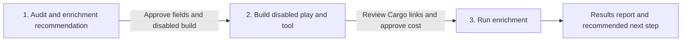

# CRM enrichment

**State: to-be-approved.** Deploy-verified against a live workspace: not yet. Treat `Done when`
below as the acceptance test and review `cargo-ai cdk plan` before deploying. Make no outcome claim
for this skill until it is approved.

## The outcome

CRM accounts stay filled. New records get approved blanks written from LinkedIn; a record whose
successful fill is older than six months comes back. The play runs on `crm_accounts` — the CRM
account extract — and writes back with that row's CRM record id. It does not overwrite a value
that is already there.

The checked example in `infra/index.ts` is HubSpot (`hs_object_id`, companies
object, `updateRecords` + `skipIfExist`). Salesforce and Attio are the same file adapted:
swap the connector, extractor, record-id field, write action, and fill-blank guard. Do not add
a second CRM branch.

**Two failure modes worth knowing before you start.** If the matching record-id field is wrong,
the run looks successful and every write targets nothing. If a field's approved write policy is
lost, a refresh overwrites CRM-authoritative data or preserves the stale value it was meant to
replace.

The starting recommendation is identity and size. On HubSpot that is
`linkedin_company_id`, `name`, `domain`, `website`, `linkedin_company_page`, and
`numberofemployees`. LinkedIn company ID is the provider's `company_id` and is recommended as a
durable matching key. Reuse the best compatible CRM property when one exists; otherwise propose
the string property `linkedin_company_id` and wait for approval to create it. Do not prepend
`cargo_` to proposed CRM properties. Before counting
the target population or editing CDK, the agent derives the other LinkedIn fields that can map to
live CRM properties and presents them with their type and transformation costs. The operator
approves the field contract. That approved contract, not the repository default, controls the
mappings, per-field write policies, and final cost preview. The audit JSON contract lives in
[`references/audit.md`](references/audit.md); provider field paths and the selection gate in
[`references/configure.md`](references/configure.md).

Present exactly one row per provider property in the field-selection table. Never combine fields
into a grouped row: each property names the actual provider used, its own type, provider-route
availability, CRM destination, fill rate, transformation, recommendation, and operator decision.
Derive the provider name from the live connector and action instead of hard-coding it. The checked
example uses LinkedIn.

The duplicate-property audit is about genuine customer-managed duplicates. Do not present CRM
system properties, HubSpot `hs_*` fields, or generic native properties as duplicates merely because
they could hold similar data. If no customer-managed duplicate group exists, say
`No duplicate properties detected`.

## Guide the operator through every phase



Every substantive message starts with the current phase and ends with a `Next step` section. Give
the operator one concrete decision or action, say what the agent will do after approval, and name
what remains blocked. During an in-progress operation, say `No action needed` and name the next
checkpoint. Never end with a generic offer to help.

1. **Audit and enrichment recommendation.** Present the CRM gaps, duplicate-property result, and
   one-row-per-property recommendation. End by asking the operator to approve the complete field
   contract and authorize building and deploying the resulting Cargo resources in a disabled state.
   No paid call or CRM write occurs in this phase.
2. **Disabled play and tool.** After that approval, adapt, type, check, plan, and deploy the reusable
   enrichment tool and the play with the play still disabled. The tool normalizes identifiers and
   returns provider data without CRM access. The play calls the tool, applies the approved write
   policy, and pushes results to the CRM. Inspect the compiled graph before deployment: the tool
   starts with an identifier Branch, and the play starts with one Tool node targeting
   `account_enrichment`, followed by the only CRM update. Send a direct Cargo UI link for each resource. Show the exact
   eligible population, mutually exclusive provider routes, unit prices, and total estimated
   credits. End by asking the operator to review those links and approve the enrichment run at that
   stated maximum cost. Do not run or enable anything without that second approval.
3. **Enrichment and report.** Run only the approved population, monitor completion, and report the
   before-and-after fill rate for every approved property, processed and outcome counts, failures,
   actual credits against estimate, and direct Cargo links. End with a recommended next action:
   remediate failures, approve recurring daily coverage, or install `crm-dedup` for account
   deduplication.

## Put it in your project

This folder is a **worked example**: real CDK resources written for some other company. The job
is to end up with the code your company would have written, in your project, and an agent does the
adapting.

**Install the required authoring skill first.** If `cargo-cdk` is absent, run:

```sh
npx skills add getcargohq/cargo-skills --skill cargo-cdk
```

Then read `.agents/skills/cargo-cdk/SKILL.md` directly; no session reload is needed. Complete its
bootstrap and use its authoring, state, plan, and deployment rules throughout this pipeline. Stop
before audit or template work if the skill cannot be installed or read.

1. **Look first.** `grep -l '@cargo-ai/cdk' package.json` says whether a CDK project already
   lives here; `ls */models/*.ts */connectors/*.ts */infra/*.ts` says what it already declares. If
   there is no project: `cargo-ai cdk init <dir> --template blank && cd <dir> && npm install`. That
   is the whole shell; this folder never ships one.
2. **Copy this folder in as a sibling of what is there**, then reconcile: for every model or
   connector this example carries that the project already has (a HubSpot connector, an account
   extract), rewire the imports to the existing one and drop the copy. Two resources with one
   slug is a collision at deploy. The play must keep running on that CRM account model
   (`crm_accounts` in the example). Append this folder's `.env` needs to the project's
   `.env.example`; never overwrite it.
3. **Audit and recommend.** Re-read the live provider output and CRM property schemas. Follow the
   field-selection gate in [`references/configure.md`](references/configure.md): present the CRM
   gaps, duplicate-property result, starting recommendation, optional fields, transformations, and
   unsupported fields with reasons. Stop for approval of the complete field contract and explicit
   authorization to deploy the resulting resources disabled. Do not calculate the final target,
   edit CDK, deploy, make a paid call, or write to the CRM while approval is pending.
4. **Adapt and deploy disabled.** After approval, work the sections below in order: _What should not
   change_ is what you argue back
   about (say what breaks, then do it if they still want it); _What you can change_ is what you
   offer unprompted (nobody asks for a variant they do not know exists); _What you will be asked_
   is the floor, and you derive before you ask. If you are asking more than about four questions
   you have skipped lookups. Record what you changed and why under a `## Decisions` section in
   your copy of this file. From the copied skill folder, run
   `node --import tsx evals/contract.mjs`, then run
   `cargo-ai cdk types && cargo-ai cdk check && cargo-ai cdk plan`. Show the diff, and deploy under
   the phase-one authorization with `isEnabled: false`. Never run `cargo-ai cdk init --force` in a
   non-empty directory.
5. **Hand off for cost approval.** Resolve the workspace, play, and tool UUIDs. Send clickable Cargo
   UI links using the patterns in [`references/run.md`](references/run.md), then show the final
   target and exact estimated credits. Stop for explicit approval of that run and maximum cost.
6. **Run and report.** Execute only after the second approval. Monitor the approved scope and return
   the result report from [`references/run.md`](references/run.md). Walk _Done when_ line by line.
   Deployed cleanly and produced nothing is the normal failure.

## What you will be asked

**Derive before you ask.** An input with a lookup is looked up, not asked. Only the ones marked
_asked_ genuinely live in the operator's head.

| Input                     | Kind    | How it is answered                                                                                     | Why it matters                                                       |
| ------------------------- | ------- | ------------------------------------------------------------------------------------------------------ | -------------------------------------------------------------------- |
| `crm`                     | derived | Inspect authenticated connectors and existing CDK resources                                            | Reusing them prevents a second CRM connector and a second extract    |
| `field_candidates`        | derived | Join live LinkedIn paths and types to live CRM properties, fill rates, and compatible transformations  | The operator should choose from evidence, not recall provider fields |
| `approved_field_contract` | asked   | Review the recommended base fields, optional candidates, transformations, destinations, and exclusions | It defines every write mapping and authorizes the disabled build     |
| `target_population`       | derived | Count eligible rows by mutually exclusive route after field approval                                   | It makes the cost estimate reproducible                              |
| `approved_run`            | asked   | Review the disabled Cargo links, target, and exact maximum credits                                     | It is the explicit gate before any enrichment call                   |

Checked before moving on, not after the deploy:

- `crm`: one authenticated CRM connector, and the play model is that connector's account extract
- `approved_field_contract`: every selected provider path has a live destination, compatible type
  or explicit transformation, fill-blank policy, and recorded operator approval
- `target_population`: eligibility uses identifier, freshness, and approved governance filters;
  LinkedIn and domain route counts are mutually exclusive and reproduce the credit estimate
- `approved_run`: direct Cargo UI links resolve, the play is disabled, and the operator approved
  the stated population and maximum cost

The first operator question comes after the field candidates are derived. Do not ask whether they
want "more fields" without showing the choices. Present a concise field-contract table and ask
which recommended and optional rows to include. Do not treat silence as approval of the defaults.

Refreshing populated business fields is outside the base template. If requested, that is
`approved_refresh_behavior` below, not a silent default.

## What you can change

The code is a worked example. These reshapes are expected, and the agent offers them rather than
waiting to be asked. Every one costs something; that is what makes it a variation and not the default.

| Variation                   | When it is right                                               | How                                                                                                                                                                                                                                                                                                                                                                                | What it costs                                                                        |
| --------------------------- | -------------------------------------------------------------- | ---------------------------------------------------------------------------------------------------------------------------------------------------------------------------------------------------------------------------------------------------------------------------------------------------------------------------------------------------------------------------------- | ------------------------------------------------------------------------------------ |
| `crm`                       | The consumer uses Salesforce or Attio instead of HubSpot       | Keep one CRM shape in `infra/index.ts`. The file is the HubSpot example. **Salesforce:** generated Account update matching `Id`; there is no `skipIfExist`. Read the Account first and omit any field that is already populated, including numeric zero. **Attio:** generated company-record update matching the record id; same read-then-omit guard. Do not copy HubSpot's flag. | Live generated types must be rechecked; a guessed flag writes or no-ops silently     |
| `selected_fields`           | The approved contract differs from the starting recommendation | Present every live candidate at the field-selection gate. After approval, change the result schema, destinations, per-field write policy, and both provider mappings in `infra/index.ts`. Industry requires an approved array-to-enum transformation when the CRM destination is a single enum.                                                                                    | Each added field expands mapping and type review                                     |
| `eligibility`               | Only a governed subset should be enriched                      | Intersect the play filter with approved lifecycle, tier, ownership, or gap conditions (`infra/index.ts` `enrichAccounts`)                                                                                                                                                                                                                                                          | Narrower scope reduces coverage and paid calls                                       |
| `approved_refresh_behavior` | Populated fields must be refreshed after explicit approval     | Drop `skipIfExist` / the read-then-omit guard on the approved fields only, preview the replacements, and compare against a fresh CRM read (`infra/index.ts`)                                                                                                                                                                                                                       | Refresh can overwrite CRM-authoritative values if the preview and the write disagree |

## What should not change

However far you adapt, these hold. Ask for one anyway and the agent tells you what breaks, then does
it if you still want it, and records why under `## Decisions` in your copy of this file.

- **The play runs on `crm_accounts` and matches the CRM record id.** (`infra/index.ts`) HubSpot's example uses `hs_object_id`. Sending a Cargo row id, or a native `accounts` id, to a CRM action targets the wrong identifier system; the run looks successful and nothing lands.
- **The tool enriches; the play orchestrates and writes.** (`infra/index.ts`) `account_enrichment` accepts provider identifiers, normalizes them, and returns company data without a CRM connector or write. Its `defineWorkflow` body first branches around rows with no identifier, then routes each eligible row to exactly one provider action. `enrich_accounts` starts with one Tool node targeting `account_enrichment`, applies the approved per-field policy, and owns the only CRM update. A tool that writes to the CRM is not reusable; a play that repeats the provider action bypasses the reviewed tool. Run `node --import tsx evals/contract.mjs` after every adaptation to enforce this compiled graph.
- **One CRM shape in the file.** (`infra/index.ts`) The checked example is HubSpot. Adapt that one file for Salesforce or Attio. Parallel HubSpot/Salesforce/Attio branches drift from the generated types of the CRM that is actually connected.
- **At most one paid route per row, LinkedIn URL first.** (`infra/index.ts` `enrichCrmAccount`) A row without a handle or a domain makes no paid call. A handle that is already an `http` URL is used as-is; otherwise it is prefixed as `https://www.linkedin.com/company/<handle>`.
- **Destinations are live properties on the connected CRM.** (`infra/index.ts`) The HubSpot example writes `linkedin_company_id`, `name`, `domain`, `website`, `linkedin_company_page`, `numberofemployees`, `cargo_last_enriched_at`, and `cargo_enrichment_status`. Provider-derived business properties keep neutral names; Cargo-owned operational stamps use the `cargo_` prefix. Leaving another CRM's names in the file can write provider data into the wrong property.
- **Fill approved blanks only.** (`infra/index.ts` `skipIfExist` or the Salesforce/Attio read-then-omit guard) A stale snapshot overwrites authoritative CRM data, including numeric zero.
- **Eligibility and freshness live in the play trigger.** (`infra/index.ts` `enrichAccounts`) Require an identifier and freshness null or older than six months in the managed segment. Destination fill-state is not an eligibility condition: an approved refresh must be able to re-enrich populated stale fields. The row workflow starts with the reusable tool call instead of repeating trigger conditions as branches. A standalone `defineSegment` or duplicate workflow gate drifts from the play.
- **The first play is disabled and `noConcurrency`.** (`infra/index.ts`) Removing those expands an unapproved pilot.
- **No credentials, deploy commands, or customer data in this repository.**

## Done when

- the audit JSON, Markdown, and chat summary agree on every count
- the audit records an operator-approved field contract with provider paths, live CRM destinations,
  types, transformations, write policies, and reasons for every exclusion
- the CDK plan contains one CRM account model (`crm_accounts`) and no native `accounts` unification
- the agent installed and read the `cargo-cdk` skill before auditing or adapting the template
- the CDK plan contains the reusable `account_enrichment` tool and disabled `enrich_accounts` play;
  the play contains one Tool node targeting `account_enrichment`, followed by the only CRM update
- `node --import tsx evals/contract.mjs` passes against the adapted compiled graph; the tool begins
  with an identifier Branch and contains no CRM action, while the play contains no provider action
- generated consumer types confirm the selected provider fields, CRM destinations, write action,
  and fill-blank semantics
- every destination is a live property on the connected CRM
- the managed segment excludes records without an identifier but allows populated stale records;
  the approved per-field write policy decides fill blank versus refresh
- the play targets `crm_accounts` and the write matches the audited CRM record id
- the managed segment uses the null-or-six-month freshness rule, daily evaluation, and
  `changeKinds: ["added"]`, with no destination fill-state filter
- the first plan shows `isEnabled: false` and `runCreationRule: noConcurrency`
- LinkedIn and domain route counts are mutually exclusive and reproduce the credit estimate
- the phase-two handoff contains working Cargo UI links for the disabled play and tool, plus the
  exact target and estimated credits
- the operator explicitly approved the run after reviewing the links and cost
- the post-run report shows before-and-after fill rates, every outcome count, failures, actual
  credits against estimate, and one recommended next step

## What it costs

Immediately before every preview, run `cargo-ai connection integration get linkedin`. Read the
applicable current entries from `integration.actions.enrichCompany.credits.costs` and
`integration.actions.enrichCompanyFromDomain.credits.costs`. Record the CLI version, lookup time,
action slugs, and selected unit costs. Then preview
`linkedin_url_path * linkedin_url_unit_credits + domain_path * domain_unit_credits`.

This play runs on eligible `crm_accounts` rows and updates that same CRM record. Eligibility means
the row has an identifier and passes freshness and governance filters. Destination fill-state does
not control enrollment. The approved per-field write policy decides whether populated stale values
are preserved or refreshed. Recompute the target and credit preview after approval, then report the
segment count.
Deduplication follows enrichment because the new matching keys improve duplicate detection.

Do not enable the daily schedule until the disabled pilot has passed. Enabling is not an
input; it is the last yes after _Done when_.

## Composes into

`account-scoring` (a filled book is what the scorer can cite), `find-stakeholders` (the buyers at
every filled account), `tam-building` (the universe these records join).
