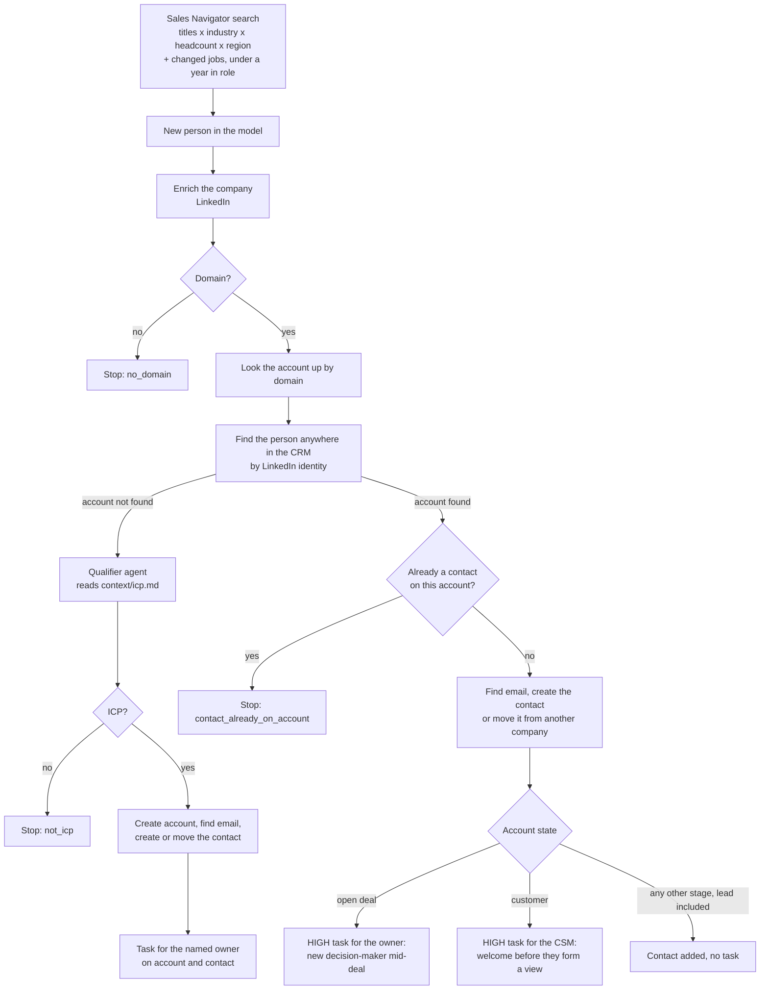

# New-hire detection

A Sales Navigator job-change search over your market, and one play that routes every new person
into the CRM by what the CRM already holds. This file explains why the design is the way it is;
[`SKILL.md`](SKILL.md) is the procedure.

## Resources

| Resource                 | Kind      | Purpose                                                                  |
| ------------------------ | --------- | ------------------------------------------------------------------------ |
| `new_hires`              | Model     | The Sales Navigator job-change search, one row per person                |
| `new-hire-icp-qualifier` | Agent     | Judges a company not in the CRM against `context/icp.md`                 |
| `route-new-hires`        | Play      | Routes each added person into the CRM and tells the right person |
| `crm`, `linkedin`, `sales_navigator`, `anthropic` | Connectors | Bound to the workspace defaults; nothing is created          |
| Find Email               | Native tool | Cargo's email lookup, referenced by UUID after it is instantiated      |

## Why it is built this way

**The market, not the book.** The model starts from everyone who just took a target role in a
market slice, not from contacts you already hold. That is the difference from `track-job-changes`,
which asks whether your own people moved. Here most people are strangers to the CRM, which is why
the first question is always what the CRM knows about their company.

**The routes are the play.** One job-change event means different things. A company you have
never heard of needs qualifying before anything is written. A company with an open deal needs its
owner told today. A customer needs its CSM to welcome the new leader before they decide the tool
they inherited is the problem. Any other known account, a lead included, already has whatever
motion owns it: the contact is added and nobody is allocated anything. Collapsing these into one
path either pollutes the CRM or loses the urgent cases among the routine ones.

**Enrich, guard, then match.** A Sales Navigator lead carries a company URL. The CRM is matched on a
domain, so the company is enriched first, and a company without a domain stops there rather than
matching nothing (and being created again) or matching everything.

**Qualification only where it is needed, and as a gate.** Customers and accounts with a deal are
qualified already. On the new-account route the qualifier returns a verdict and a branch acts on it,
so a company the ICP rejects never reaches the CRM. An agent rather than a headcount filter, because
it reads the description and specialties and can apply exclusions no number can: competitors,
agencies, holding companies. It reads the ICP from the workspace context, the same file the search
was shaped from, so the two cannot drift apart.

**One contact per person.** Before the routes split, the person is looked up across the whole CRM by
their LinkedIn identity. People who change jobs are often already in the CRM, attached to the
company they left. Searching only the new account would miss them and create a second record;
searching everywhere finds them, and the write moves that record to the new account (the task says
so, because a known person landing somewhere new is the strongest version of this signal). Already
a contact on this very account: not news, and the run stops before paying for an email. Some teams
want one contact per person per company instead, so it is asked at install.

**The contact key follows what was found.** A known person is matched on their record ID. Otherwise,
with an email the contact is matched on it, so it merges with one a rep created by hand; without
one, on the LinkedIn URL, so the person is still created, still reachable, and still deduped on the
next sync. A mover with no new email keeps the one on file rather than having it blanked.

**Every task has an owner and a place.** Tasks go to the account owner on open deals, to the CSM on
customers (the account owner when no CSM is set), and to the named owner on new accounts. They are
associated to both the account and the contact. HubSpot cannot associate a task
when it creates it, so explicit association nodes follow each task; they continue on failure, so a
missing ID never undoes a run that already wrote the contact and the task.

**It stops at the CRM.** Nothing is drafted or sent. A person reads the task and decides, and the
team's own sequencer does the sending.

**The schedule is a cost decision.** The extractor re-buys the whole search on every sync, and
`changeKinds: ["added"]` makes only the new people create runs. Every two weeks is the default
trade between spend and how fresh a new hire is when the owner hears about it.

## Adapting to another CRM

HubSpot is the checked example. Salesforce and Attio adapt the same play, following
[`references/crm-adaptation.md`](references/crm-adaptation.md). On Salesforce, lookups are
`findRecords` and `searchRecords` only, never `soqlQuery`, and the routing signal is the
opportunities rather than `Account.Type`.
