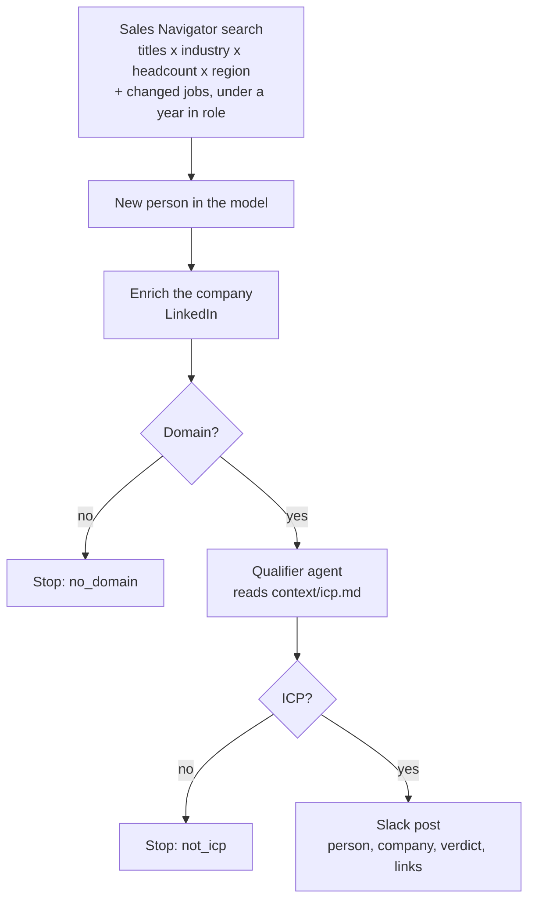

# New-hire detection

A Sales Navigator job-change search over your market, and one play that qualifies the company each
new person joined and posts the ones that fit to Slack. This file explains why the design is the way
it is; [`SKILL.md`](SKILL.md) is the procedure.



## Resources

| Resource                                            | Kind       | Purpose                                                   |
| --------------------------------------------------- | ---------- | --------------------------------------------------------- |
| `new_hires`                                         | Model      | The Sales Navigator job-change search, one row per person |
| `new-hire-icp-qualifier`                            | Agent      | Judges the company against `context/icp.md`               |
| `route-new-hires`                                   | Play       | Qualifies each added person and posts the ones that fit   |
| `linkedin`, `sales_navigator`, `anthropic`, `slack` | Connectors | Bound to the workspace defaults; nothing is created       |

## Placeholders (edit before deploy)

| Placeholder                    | File                             | Resolved from                                        |
| ------------------------------ | -------------------------------- | ---------------------------------------------------- |
| `PLACEHOLDER_SLACK_CHANNEL_ID` | `infra/plays/route-new-hires.ts` | The Slack connector's channel autocomplete           |
| the `search` object            | `infra/models/new-hires.ts`      | The ICP, and the Sales Navigator autocompletes       |
| `languageModel`                | `infra/agents/icp-qualifier.ts`  | The model the team runs its agents on                |
| `icp.md`                       | `infra/context/icp.md`           | The team's ICP, copied into the project's `context/` |

## Why it is built this way

**The market, not the book.** The model starts from everyone who just took a target role in a
market slice, not from contacts you already hold. That is the difference from `track-job-changes`,
which asks whether your own people moved.

**Slack, not the CRM, by default.** A Slack post needs one channel id. Writing into a CRM needs owner
IDs, a CSM field, association types, a LinkedIn field, a routing signal someone maintains, and a
dedupe policy for people who moved, and every mistake stays in the CRM. Most teams want the signal
first and decide what to do with it after reading it. The CRM is one step away when they want it:
a read-only "already in the CRM" line (`crm_context`), or the CRM as the destination with routed
tasks (`crm_routing`), both in [`references/crm-adaptation.md`](references/crm-adaptation.md).

**Enrich, guard, then judge.** A Sales Navigator lead carries a company URL. The company is enriched
first, so the qualifier judges a description, specialties and a headcount rather than a name, and a
company with no website stops there.

**Qualification as a gate.** The qualifier returns a verdict and a branch acts on it, so a company
the ICP rejects is never posted. An agent rather than a headcount filter, because it reads the
description and specialties and can apply exclusions no number can: competitors, agencies, holding
companies. It reads the ICP from the workspace context, the same file the search was shaped from, so
the two cannot drift apart.

**One locked channel.** The channel id is a constant in the play, not computed and not chosen by an
agent, so a prospect's name never lands in a channel shared with a customer.

**It stops at the post.** Nothing is drafted or sent to the person. Someone reads the post and
decides, and the team's own sequencer does the sending.

**The schedule is a cost decision.** The extractor re-buys the whole search on every sync, and
`changeKinds: ["added"]` makes only the new people create runs. The model ships with no schedule;
every two weeks is the default added when opening up, the trade between spend and how fresh a new
hire is when the team hears about it.

## Verify

From this skill's folder:

```sh
node --import tsx evals/contract.mjs
```

From the project root:

```sh
cargo-ai cdk types && cargo-ai cdk check && cargo-ai cdk plan
```
