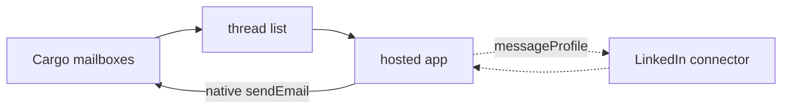

# Reply inbox

A hosted app the team can live in: every reply to a Cargo mailbox in one queue,
the conversation opened, a reply that stays on the thread. LinkedIn send sits
next to it when the workspace already has a LinkedIn connection.

## What it does

- **Lists mailbox threads.** Needs reply is the default — threads whose last
  event is `replied`. All is every conversation the workspace's mailboxes have
  started.
- **Opens the thread.** Outbound sends and inbound reply snippets in one pane.
- **Replies with native `sendEmail`.** `inReplyTo` and the full `references`
  chain, oldest first, so mail clients keep it as one conversation.
- **Sends a LinkedIn DM** when a LinkedIn connector exists. Inbound LinkedIn
  stays on LinkedIn — this app does not sync that inbox.

It does not provision mailboxes, start warm-up, or hold the thread with an
agent. Those are mailbox management and `agentic-engagement`.

## How it works

1. **Deploy.** `defineApp` uploads the Vite bundle. Cargo builds and promotes
   it. The URL is `https://<slug>.cargo.app`.
2. **Sign in.** The visitor authenticates with Cargo OAuth against the
   workspace that owns the mailboxes.
3. **Work the queue.** Needs reply, open, write, send. The send is a native
   action, not a play.
4. **LinkedIn, optionally.** Pick a connection and an identity, paste a
   profile URL, send. Empty if the workspace has no LinkedIn connector.

Adds 2 resource kinds.

| File | Resource | Role |
| ---- | -------- | ---- |
| `infra/folders/index.ts` | `defineFolder` | app folder named after the skill |
| `infra/apps/inbox.ts` | `defineApp` | hosted Vite app; monthly charge |
| `infra/apps/inbox/` | (bundle) | the UI; nested `package.json` so the CDK loader skips it |

## Placeholders (edit before deploy)

1. **App slug** — `infra/apps/inbox.ts`: the live subdomain. Change it if
   `plan` reports a collision.

## What it does not do

It does not create mailboxes, blast a list, auto-reply, or read LinkedIn
inbound. A human sits in this app. An agent that should sit in the thread
instead is `agentic-engagement`.
