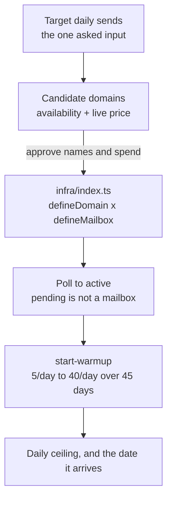

# Sending infrastructure

Stand up cold-email sending capacity: lookalike domains with DMARC and an apex
redirect, a uniform grid of mailboxes on real senders, and warm-up started on
every one.

## What it does

- **Sizes the fleet from one number.** Target daily volume in, domain and
  mailbox counts out. Nothing is picked by taste.
- **Keeps the primary domain out of it.** The fleet exists so a burned sending
  domain is a disposable one.
- **Registers with DMARC and a redirect.** Each domain publishes a `_dmarc`
  record with a reporting mailbox and forwards its apex to the real site, so a
  prospect who types it lands on the company instead of a parked page.
- **Generates the grid, never hand-writes it.** Domains times senders, one
  local-part shape throughout, slugs derived so a re-plan shows a diff instead
  of a teardown.
- **Starts warm-up, which deploy does not.** The CDK has no warm-up. This is the
  step that turns mailboxes into capacity.

## How it works

1. **Size and price.** Derive the existing fleet and the senders, ask for target
   volume, generate and check candidate names, present one-time and recurring
   cost, and stop for approval.
2. **Register and create.** Adapt `infra/index.ts`, plan, deploy, then poll every
   mailbox to `active`.
3. **Warm up and report.** Start the ramp on every active mailbox, verify by
   counting states, and report the ceiling and the calendar date it lands.

## Architecture

| Resource                           | Type    | Role                                                   |
| ---------------------------------- | ------- | ------------------------------------------------------ |
| `defineDomain` per name            | Domain  | Registration, DMARC record, apex redirect to the brand |
| `defineMailbox` per sender/domain  | Mailbox | The sending inbox, its From identity and signature     |
| `sending-infrastructure-mailboxes` | Folder  | Files the fleet so removing it is bounded, not a hunt  |

Domains and senders are two tables at the top of `infra/index.ts`; the grid is
generated from them. A fleet's job is to be uniform, and a hand-written list
drifts.

## Placeholders (edit before deploy)

1. **`PRIMARY_DOMAIN`** (`infra/index.ts`): the brand. It is the redirect target
   and must never appear in `DOMAINS`.
2. **`DOMAINS`** (`infra/index.ts`): sized from target volume, every name checked
   available before it lands here.
3. **`SENDERS`** (`infra/index.ts`): real people, real names, one local-part
   shape across the whole fleet.
4. **`signatureFor`** (`infra/index.ts`): a real signature with a real company
   identity behind it.
5. **`dmarcEmail`** (`infra/index.ts`): a mailbox that will actually receive the
   `rua=` reports.

## The three silent failures

- **Deploy does not start warm-up.** A fleet nobody warmed is pinned at 5 sends a
  day forever, with no error anywhere.
- **`start-warmup` no-ops on a `pending` mailbox.** Warm up after polling to
  `active`, and verify by counting states rather than by exit code.
- **Declaring `dnsRecords` replaces the whole zone**, including the MX and DKIM
  records the mailboxes need. Domain and mailboxes both stay `active` while mail
  stops arriving. Leave it undeclared.

## Cost

Two shapes. A domain is **one-time plus annual renewal**, quoted live by the
availability check. A mailbox is **recurring monthly, until removed** — there is
no pause — quoted live by `cargo-ai mailboxManagement pricing get`. Sends are
billed per message on top.

Present them as separate lines and multiply the recurring one out to a year.
Approving a fleet on the one-time number alone is how a fleet gets approved on
the wrong number.

## Done when

- Every registered name was checked available, and the primary domain is not
  among them
- Every domain carries DMARC and a redirect, and none declares `dnsRecords`
- Mailbox count equals domains times senders, each a real person with a signature
- Every mailbox reports `active`, confirmed by a count
- Warm-up is running on the whole fleet, confirmed by a count of warm-up states
- The report names the ceiling and the calendar date it arrives

## Composes into

`find-b2b-leads` and `build-tam-list` (the audience this fleet sends to),
`agentic-engagement` (the sequences that run on it), `verify-email-list`
(subtract suppressions before enrolling, never after).
