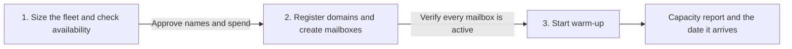

# Sending infrastructure

**State: to-be-approved.** Deploy-verified against a live workspace: not yet. Treat `Done when`
below as the acceptance test and review `cargo-ai cdk plan` before deploying. Make no outcome claim
for this skill until it is approved.

## The outcome

A fleet of sending domains and mailboxes exists, sized to a stated daily volume, and every mailbox
is ramping. Each domain carries a DMARC record and forwards its apex to the real site. Each mailbox
belongs to a real person and carries their signature. Nothing sends from the primary domain.

The fleet is generated from two tables in `infra/index.ts`, domains and senders, because a fleet's
job is to be uniform and a hand-written list drifts.

**Three failure modes worth knowing before you start, all of them silent.**

Deploy succeeds and the fleet still cannot send, because **the CDK does not model warm-up**. A
mailbox nobody warmed is pinned at 5 sends a day forever. There is no error and no warning; the
plan is clean and the capacity never arrives.

`start-warmup` against a mailbox the provider has not finished creating **returns success and starts
nothing**. A provisioning script that warms up immediately after deploying reports a clean exit
having warmed almost none of the fleet.

Declaring `dnsRecords` **replaces the entire live zone**, including the MX and DKIM records the
registrar wrote at purchase. The domain stays `active`, the mailboxes stay `active`, and mail stops
arriving.

The starting recommendation is three mailboxes per domain, `type: "google"`, DMARC at `p=none` with
a reporting mailbox, and the apex forwarded to the primary domain. The sizing arithmetic, the naming
rules, and the availability check live in [`references/plan.md`](references/plan.md). The post-deploy
warm-up procedure, which is where the capacity actually comes from, lives in
[`references/warmup.md`](references/warmup.md).

## Guide the operator through every phase



Every substantive message starts with the current phase and ends with a `Next step` section. Give
the operator one concrete decision or action, say what the agent will do after approval, and name
what remains blocked. Never end with a generic offer to help.

1. **Size and price.** Derive the existing fleet, the primary domain, and the senders. Ask for the
   target daily volume, derive the domain and mailbox count from it, generate candidate names,
   check each for availability and price, and present the full one-time and recurring cost. End by
   asking the operator to approve the exact domain list and that spend. No domain is registered and
   no mailbox is created in this phase.
2. **Register and create.** After that approval, adapt `infra/index.ts`, run the eval, then
   `cargo-ai cdk types && cargo-ai cdk check && cargo-ai cdk plan`. Show the diff. Deploy on a yes.
   Then poll every mailbox to `active`: a fresh mailbox returns `pending` and is not yet a mailbox.
   End by confirming the whole fleet is active, with counts.
3. **Warm up and report.** Start warm-up on every active mailbox, verify by counting warm-up states
   rather than by exit code, and report the fleet, the daily ceiling it reaches, and the calendar
   date it reaches it. End with the campaign-readiness date and the reminder that the ramp is a
   ceiling, not a target.

## Put it in your project

This folder is a **worked example**: real CDK resources written for some other company. The job is
to end up with the code your company would have written, in your project, and an agent does the
adapting.

**Install the required authoring skill first.** If `cargo-cdk` is absent, run:

```sh
npx skills add getcargohq/cargo-skills --skill cargo-cdk
```

Then read `.agents/skills/cargo-cdk/SKILL.md` directly; no session reload is needed. Complete its
bootstrap and use its authoring, state, plan, and deployment rules throughout. Stop before any
sizing or template work if the skill cannot be installed or read.

1. **Install it — the CLI does the copy.** From inside the CDK project,
   `cargo-ai cdk add cookbook/sending-infrastructure` writes this example to
   `infra/sending-infrastructure/` and this procedure to
   `.claude/skills/sending-infrastructure/`. No project yet?
   `cargo-ai cdk init <dir> --cookbook sending-infrastructure && cd <dir> && npm install` does both;
   this folder never ships a shell. **If you are reading this from the project's `.claude/skills/`,
   the install already happened — start at step 2.** On a CLI too old to have `add`, copy this
   folder in as a sibling of what is there by hand; everything below is unchanged.
2. **Reconcile it with what is already declared.** If the project already declares a mailbox folder
   or a domain this example would register, rewire to the existing one and drop the copy. Two
   resources with one slug is a collision at deploy. A domain the workspace already owns is
   `adopt: true`, never a second registration; the same goes for a mailbox created in the UI.
3. **Size and price.** Follow [`references/plan.md`](references/plan.md): derive the existing fleet
   and the senders, ask for the target daily volume, derive the counts, generate and check candidate
   names, and present one-time and recurring cost. Stop for approval of the exact domain list and
   that spend. Do not register a domain, create a mailbox, or edit CDK while approval is pending.
4. **Adapt and plan.** After approval, work the sections below in order: _What should not change_ is
   what you argue back about (say what breaks, then do it if they still want it); _What you can
   change_ is what you offer unprompted (nobody asks for a variant they do not know exists); _What
   you will be asked_ is the floor, and you derive before you ask. If you are asking more than about
   four questions you have skipped lookups. Record what you changed and why under a `## Decisions`
   section in your copy of this file. From the copied skill folder run
   `node --import tsx evals/contract.mjs`, then `cargo-ai cdk types && cargo-ai cdk check &&
   cargo-ai cdk plan`. Show the diff. Never run `cargo-ai cdk init --force` in a non-empty directory.
5. **Deploy, then confirm active.** Deploy under the phase-one authorization. Registration and
   provisioning are asynchronous: poll until every mailbox reports `active`. Report the counts.
6. **Warm up and report.** Run [`references/warmup.md`](references/warmup.md) and return its report.
   Walk _Done when_ line by line. Deployed cleanly and never warmed is the normal failure.

## What you will be asked

**Derive before you ask.** An input with a lookup is looked up, not asked. Only the ones marked
_asked_ genuinely live in the operator's head.

| Input                | Kind    | How it is answered                                                                                                    | Why it matters                                                                  |
| -------------------- | ------- | --------------------------------------------------------------------------------------------------------------------- | ------------------------------------------------------------------------------- |
| `existing_fleet`     | derived | `cargo-ai mailboxManagement mailbox list`, plus the project's declared domains                                         | A fleet is usually extended, not started; re-buying what exists is pure waste    |
| `primary_domain`     | derived | The signed-in address from `cargo-ai whoami`, confirmed in the plan, never a question                                  | It is the redirect target and the one domain that must never be in the fleet     |
| `senders`            | derived | Workspace members, presented for confirmation with their real first and last names                                     | Every From header is one of these humans; a fabricated sender is refused         |
| `target_daily_sends` | asked   | The operator states the steady-state daily cold volume this fleet has to carry                                         | It is the only input that sizes the fleet, and nothing can look it up            |
| `approved_domains`   | asked   | The agent generates candidates, checks availability and price, and the operator picks or supplies their own            | Naming is brand judgment, and an unavailable name is not a choice                |
| `local_part_shape`   | asked   | `jane@`, `jane.doe@`, or `j.doe@`, chosen once and applied to the whole fleet                                          | One shape across the fleet is what keeps the addresses reading as human          |
| `approved_spend`     | asked   | The operator approves the exact one-time registration and recurring monthly cost from a live quote                     | Domains are a one-time charge and mailboxes recur monthly until removed          |

Checked before moving on, not after the deploy:

- `existing_fleet`: every already-owned domain and mailbox is `adopt: true`, not a second purchase
- `target_daily_sends`: the derived domain and mailbox counts reproduce the ceiling arithmetic in
  [`references/plan.md`](references/plan.md)
- `approved_domains`: every name returned `available: true` from a live check, and the primary domain
  is not among them
- `approved_spend`: the quote came from a live availability check and a live
  `cargo-ai mailboxManagement pricing get`, and it names both the one-time and the recurring figure

The first operator question comes after the existing fleet and the senders are derived. Present the
candidate names with their availability and price in one table and ask which to register. Do not
treat silence as approval of the generated names.

Accepting a list the operator already holds is a supported path, not a fallback: a pasted list or a
CSV of domain names skips generation but not the availability check or the spend approval.

## What you can change

The code is a worked example. These reshapes are expected, and the agent offers them rather than
waiting to be asked. Every one costs something; that is what makes it a variation and not the default.

| Variation                | When it is right                                                              | How                                                                                                                                                                              | What it costs                                                                                     |
| ------------------------ | ----------------------------------------------------------------------------- | -------------------------------------------------------------------------------------------------------------------------------------------------------------------------------- | --------------------------------------------------------------------------------------------------- |
| `mailboxes_per_domain`   | The operator wants fewer domains for the same volume                          | Raise the `SENDERS` table in `infra/index.ts`. Three is the recommendation                                                                                                       | Blast radius: a domain that gets flagged takes every mailbox on it, so more per domain loses more at once |
| `mailbox_type`           | Cost matters more than the default trust of the `google` flavour              | Change `type` in `infra/index.ts` to `shared` or `private` and re-quote with `cargo-ai mailboxManagement pricing get`                                                             | A cheaper flavour is a different deliverability profile, unproven against this audience             |
| `external_registrar`     | The domains are already owned elsewhere and will be delegated, not bought     | Register nothing: point the nameservers at Cargo's mail provider and `adopt: true` the domain. Cargo never buys it, never renews it, and does not expose its zone                 | The zone stays the operator's problem, and DMARC and the redirect stop being one line               |
| `dmarc_policy`           | The reports are clean and the fleet has sending history                       | Move `dmarcPolicy` from `none` to `quarantine`, then `reject`, one step at a time in `infra/index.ts`                                                                             | Enforcing before the config is proven bounces your own mail, and the bounce is invisible in Cargo   |
| `sender_name_variants`   | There are fewer humans available than mailboxes wanted                        | Add a second `local` for the same person, e.g. `jane` and `jane.doe`. Keep each variant a real form of that person's real name                                                    | Every variant moves the fleet closer to fabricated identity; prefer adding a human over a variant   |

## What should not change

However far you adapt, these hold. Ask for one anyway and the agent tells you what breaks, then does
it if you still want it, and records why under `## Decisions` in your copy of this file.

- **Warm-up is started after deploy, every time.** (`references/warmup.md`) The CDK does not model
  warm-up, so a clean `cdk deploy` produces a fleet pinned at 5 sends a day forever. Nothing reports
  this. The plan is green and the capacity never arrives.
- **Warm-up is started only on a mailbox that reports `active`.** (`references/warmup.md`) A newly
  created mailbox returns `pending` until the provider issues credentials, and `start-warmup`
  against it returns success and starts nothing. Refresh to `active` first, and verify by counting
  warm-up states, never by exit code.
- **The primary domain is never in the fleet.** (`infra/index.ts` `PRIMARY_DOMAIN` is excluded from
  `DOMAINS`) The fleet exists so that a burned sending domain is a disposable one. Put the corporate
  domain in it and a bad campaign takes the company's real mail with it.
- **`dnsRecords` stays undeclared.** (`infra/index.ts`) Declaring it replaces the entire live zone,
  including the MX and DKIM records the registrar wrote at purchase and the mailboxes depend on. The
  domain and the mailboxes both keep reporting `active` while mail stops arriving. `redirectUrl`,
  `dmarcEmail`, and `dmarcPolicy` are additive and are the supported way to configure the zone.
- **Every mailbox is a real person with a real signature.** (`infra/index.ts` `SENDERS`,
  `signatureFor`) A fabricated sender is refused under acceptable use. It is also the fastest way to
  fail a recipient who searches the name.
- **One local-part shape across the whole fleet.** (`infra/index.ts` `SENDERS[].local`) Mixing
  `jane@` on one domain with `jane.doe@` on another is the pattern that makes generated addresses
  legible as generated.
- **Mailbox slugs are derived from sender and domain.** (`infra/index.ts`) A hand-written slug that
  changes between plans reads as a teardown and a rebuild, and the rebuild is a fresh mailbox with a
  fresh ramp.
- **The ramp is a ceiling, not a target.** (`references/warmup.md`) Sizing a fleet so that one
  campaign's volume can be spread across it to clear what a single mailbox's ramp would not allow is
  the evasion case in acceptable use, not a configuration question. Size for steady-state volume.
- **The fleet is bought before it is needed.** Warm-up takes 45 days. A fleet approved the week the
  campaign launches is a fleet that carries 5 sends a day when it launches.
- **No credentials, registrar logins, or customer data in this repository.**

## Done when

- the plan shows one `defineDomain` per approved name and no domain the workspace already owns
  without `adopt: true`
- the primary domain appears as `redirectUrl` and nowhere in the domain list
- every domain carries a `dmarcEmail` and a `dmarcPolicy`, and no domain declares `dnsRecords`
- the mailbox count equals domains times senders, and every mailbox resolves to a real person
- every mailbox carries a signature and the mailbox folder
- the local-part shape is identical across every domain in the fleet
- `node --import tsx evals/contract.mjs` passes against the adapted example
- `cargo-ai cdk plan` was reviewed and approved before deploy
- every mailbox reports `active`, confirmed by a count and not by the deploy's exit code
- warm-up reports `active` or `pending` on every mailbox in the fleet, confirmed by a count of
  warm-up states
- the report names the fleet size, the daily ceiling at full ramp, and the calendar date that ceiling
  arrives
- the operator was told the ramp is a ceiling and not a target

## What it costs

Two charges with different shapes, and conflating them is how a fleet gets approved on the wrong
number.

**A domain is one-time, plus renewal.** Quote each candidate live before presenting it, which is
also the availability check:

```sh
GET /v1/domainManagement/domains/search?name=<domain>
# -> { "name": "...", "available": true, "priceCredits": <live> }
```

There is no `cargo-ai domainManagement` command surface yet, so this is a direct API call. Say that
to the operator rather than guessing a price, and never present a name without having checked it.

**A mailbox is recurring, every month, until it is removed.** Read the live figures immediately
before every quote; the flavours are priced differently and the numbers move:

```sh
cargo-ai mailboxManagement pricing get
```

There is no pause. `cargo-ai mailboxManagement mailbox remove` is the only way the monthly charge
stops, and it deletes at the provider too.

**Sends are billed separately**, per message, through the `sendEmail` orchestration action. Read the
current figure from the provider playbook at quote time. Volume is the cheap part; the fleet is not.

Present one-time and recurring as two separate lines, multiply the recurring by twelve so the annual
shape is visible, and get an explicit yes before the first registration. The full spend rules are
`cargo-gtm/references/cost-discipline.md`.

## Composes into

`find-b2b-leads` and `build-tam-list` (the audience this fleet sends to), `agentic-engagement` (the
sequences that run on it), `verify-email-list` (subtract suppressions and unverifiable addresses
before enrolling, never after).
