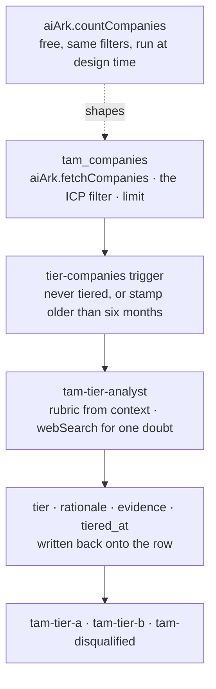

# TAM building

Source your account universe from AI Ark with a filter that encodes your ICP,
then have an agent tier every company in it against a rubric your team owns.

## What it does

- **Counts before it sources.** `aiArk.countCompanies` takes the same filter
  groups as the search, returns `{"count": N}`, and is free. The search bills
  per returned record, so this is the difference between a market you chose and
  one you discovered after paying for it.
- **Puts the ICP in the filter, not in a post-filter.** Every returned record is
  paid for. Narrowing happens where it costs nothing.
- **Tiers every row with an agent, not with point weights.** Whether a company
  is in the size band is a column; whether it already runs the motion you sell
  into is an open role, a changelog, or an engineering post. The agent reads the
  rubric out of the workspace context, judges on the sourced facts, and searches
  the web only to settle a doubt that would change the tier.
- **Writes the reason next to the tier.** `tier`, `tier_rationale`,
  `tier_evidence_url` and `tiered_at`, on the row that triggered the run.
- **Needs no key and no seat.** AI Ark and the LLM both run on adopted
  connections.

## How it works



1. **Write the ICP down** in `infra/context/icp.md`, and what A / B / C /
   disqualified mean in `infra/context/tiering-rubric.md`. Both live in the
   workspace context repo, so they are versioned and editable without a deploy.
2. **Translate the ICP into filter groups** in
   `infra/models/tam-companies.ts`. They are nested groups, not a flat map, and
   enum-backed values come from the integration's autocompletes.
3. **Count each candidate filter** with `aiArk.countCompanies`. It is free and
   takes the same groups:

   ```sh
   cargo-ai orchestration action execute --wait-until-finished \
     --action '{"kind":"connector","integrationSlug":"aiArk","actionSlug":"countCompanies","config":{}}' \
     --data '{"industry":{"industry_or":["software development"]},"employeeSize":{"min_employee_count":20,"max_employee_count":500}}'
   ```

   Counting is design-time work you do from your terminal, so it needs no
   deployed resource: a resource that only ever wraps one connector action is
   ceremony.

4. **Set `limit`** to what you are willing to spend on the first run. Sourcing
   bills per returned record.
5. **Sync, then tier.** Rows land in `tam_companies`. The play picks up
   everything with no `tiered_at` stamp, sends one agent call per row, and
   writes the judgment back.
6. **Work the segments.** `tam-tier-a` is the rep queue, `tam-tier-b` is the
   sequence, `tam-disqualified` is the suppression list with a written reason
   attached to every row in it.

Seven resources, all declared in the CDK.

| File                                | Resource          | Role                                                        |
| ----------------------------------- | ----------------- | ----------------------------------------------------------- |
| `infra/connectors/ai-ark.ts`        | `defineConnector` | AI Ark, adopted: no key, no seat, no cookie                 |
| `infra/connectors/anthropic.ts`     | `defineConnector` | the LLM behind the tiering agent, adopted                   |
| `infra/context.ts` + `context/*.md` | `defineContext`   | the ICP and the tier rubric, versioned in the context repo  |
| `infra/models/tam-companies.ts`     | `defineModel`     | the universe: the ICP filter, the budget, the tier columns  |
| `infra/agents/tier-analyst.ts`      | `defineAgent`     | one judgment per company, from the rubric plus web evidence |
| `infra/plays/tier-companies.ts`     | `definePlay`      | one agent call per row, and the only write                  |
| `infra/segments/tiers.ts`           | `defineSegment`   | the tier slices downstream work takes                       |

## Why the rubric is not in the prompt

Put it in the system prompt and three things stop being true: changing what tier
A means becomes a deploy, the reason for the change stops being reviewable, and
the rep who reads the tier can no longer read the file the agent read. In
`infra/context/tiering-rubric.md` it is a commit, with a diff and a history.

## Why the agent cannot write

`tam-tier-analyst` carries no model in `uses`. It hands back
`{tier, rationale, evidence_url}` and the play persists it. Give the agent a
writable model and an untiered row could be a failed run, a silent skip, or a
judgment it chose not to record, with no way to tell which. The play's write is
also the eligibility stamp, so a row can never be marked judged without carrying
the judgment.

## Placeholders (edit before deploy)

1. **The ICP and the rubric** in `infra/context/icp.md` and
   `infra/context/tiering-rubric.md`. The example is a technical B2B software
   ICP; nothing in it is yours.
2. **The filter groups** in `infra/models/tam-companies.ts` `config`. Nested
   groups, `_or` to include and `_not` to exclude, enum values from
   `listIndustries` / `listSeniorities` / `listDepartmentsAndFunctions` /
   `listFundingTypes`, numeric ranges as numbers.
3. **`config.limit`** in the same file: the per-sync record budget, and the only
   real cost control.
4. **`languageModel`** in `infra/agents/tier-analyst.ts`.

## Cost

Counting is free. Sourcing bills **per returned record**, so the estimate is
`limit` times the current per-record price: fetch it with
`cargo-ai connection integration get aiArk` immediately before any preview
rather than trusting a number written here. Tiering is one agent run per newly
sourced company, billed as LLM tokens plus its web searches, with `maxSteps` as
the ceiling.

The model carries **no schedule on purpose**. A cron re-runs the same search and
re-bills every returned record, including the rows already in the model: a
monthly refresh buys the handful of new companies at the price of the whole
pool. Sourcing is a deliberate spend. The play is the part that stands, and
because it runs on `changeKinds: ["added"]`, a tick that follows no sourcing run
is a no-op.

## Alternatives

For a LinkedIn-native source whose facet taxonomy may express your market
better, swap the extractor for `salesNavigator.fetchAccountSearch`. It returns
no domain, so you add a resolution step, and its extraction cap means splitting
one market search into counted sub-searches.

## Verification

```sh
node --import tsx evals/contract.mjs   # the graph boundaries, from the compiled registry
cargo-ai cdk types && cargo-ai cdk check && cargo-ai cdk plan
```

`evals/acceptance.md` is the line-by-line acceptance test.

## Composes into

`contact-sourcing` (the buyers at every tier A account), `account-scoring` (when
the book already exists somewhere else), `crm-enrichment` (fill the records these
accounts become), `signal-based-tam` (watch the universe you just built).
