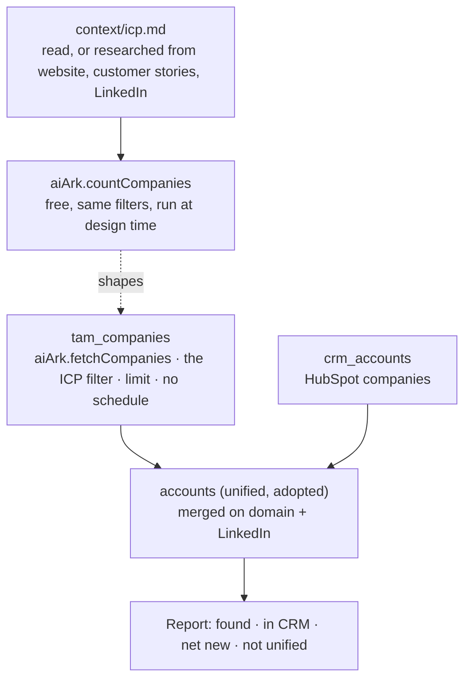

# TAM building

Source your account universe from AI Ark with a filter that encodes your ICP,
then unify it with your CRM's companies so you know how many companies your
market holds and which ones you already have.

## What it does

- **Starts from the ICP you already wrote, or writes one from evidence.** It
  reads the workspace context first. When nothing is there, it reads your
  website and customer stories and enriches your customers' LinkedIn pages, and
  drafts `context/icp.md` from what they share.
- **Counts before it sources.** `aiArk.countCompanies` takes the same filter
  groups as the search, returns `{"count": N}`, and is free. The search bills
  per returned record, so this is the difference between a market you chose and
  one you discovered after paying for it.
- **Puts the ICP in the filter, not in a post-filter.** Every returned record is
  paid for. Narrowing happens where it costs nothing.
- **Unifies instead of comparing lists.** The sourced companies and the CRM's
  companies both feed the workspace's unified `accounts` model, merged on domain
  and LinkedIn. Each unified account's `ids` says where it came from.
- **Writes nothing to the CRM.** The report ends on two decisions: create the
  net-new accounts in the CRM, and enrich them.
- **Needs no key and no seat.** AI Ark and the CRM both run on connections the
  workspace already holds, bound with `default: true`.

## How it works



1. **Write the ICP down** in the project's `context/icp.md`, or confirm the one
   that is there. `infra/context/icp.md` is the shape.
2. **Translate it into filter groups** in `infra/models/tam-companies.ts`. They
   are nested groups, not a flat map, and enum-backed values come from the
   integration's autocompletes.
3. **Count each candidate filter** with `aiArk.countCompanies`:

   ```sh
   cargo-ai orchestration action execute --wait-until-finished \
     --action '{"kind":"connector","integrationSlug":"aiArk","actionSlug":"countCompanies","config":{}}' \
     --data '{"industry":{"industry_or":["software development"]},"employeeSize":{"min_employee_count":20,"max_employee_count":500}}'
   ```

4. **Set `limit`** to what you are willing to spend on the first run.
5. **Deploy, sync once, refresh the unified model.** The report reads the
   unified model, so it has to run after both sources have synced.
6. **Read the report.** In CRM and net new, as counts and shares, plus the rows
   that carried neither a domain nor a LinkedIn URL and could not unify.

Adds two models, adopts the unified accounts model, and files what it creates
under one folder.

| File                            | Resource          | Role                                                                     |
| ------------------------------- | ----------------- | ------------------------------------------------------------------------ |
| `infra/connectors/ai-ark.ts`    | `defineConnector` | AI Ark, bound: no key, no seat, no cookie                                |
| `infra/connectors/crm.ts`       | `defineConnector` | the CRM, bound; read, never written                                      |
| `infra/folders/index.ts`        | `defineFolder`    | the model folder named after the skill                                   |
| `infra/models/tam-companies.ts` | `defineModel`     | the universe: the ICP filter, the budget, unified on domain and LinkedIn |
| `infra/models/crm-accounts.ts`  | `defineModel`     | the CRM's companies, unified as accounts                                 |
| `infra/models/accounts.ts`      | `defineModel`     | the workspace's unified accounts, adopted with no config                 |
| `infra/context/icp.md`          | (not a resource)  | example ICP to copy into the project's `context/`                        |

## Why the unified model carries no config

The unified `accounts` model is one per workspace, and every source merges into
it: the CRM, enrichment providers, anything the team adds later. Its reference
strengths decide what "the same company" means for all of them. A sourcing
skill that set them would change merges for the CRM as a side effect of
building a TAM. The platform defaults already merge on domain and LinkedIn ID,
which is what this skill needs; the skill reads the live config and reports a
gap rather than fixing it.

## Why there is no tiering here

Whether a company fits is decided once, in the filter, where it is free.
Whether a fitting company deserves a rep is a judgment that belongs to the
whole book, not to the rows one source produced. That is `account-scoring`,
reading the same `icp.md`.

## Placeholders (edit before deploy)

1. **The ICP**: copy `infra/context/icp.md` into the project's `context/`, or
   keep the one already there. The example is a technical B2B software ICP;
   nothing in it is yours.
2. **The filter groups** in `infra/models/tam-companies.ts` `config`. Nested
   groups, `_or` to include and `_not` to exclude, enum values from
   `listIndustries` / `listSeniorities` / `listDepartmentsAndFunctions` /
   `listFundingTypes`, numeric ranges as numbers.
3. **`config.limit`** in the same file: the per-sync record budget, and the only
   real cost control.
4. **The CRM** in `infra/connectors/crm.ts` and `infra/models/crm-accounts.ts`,
   or the project's existing companies model in their place.

## Cost

Counting is free. Research, when there is no ICP, bills per page read and per
customer enriched. Sourcing bills **per returned record**, so the estimate is
`limit` times the current per-record price: fetch it with
`cargo-ai connection integration get aiArk` immediately before any preview
rather than trusting a number written here.

The sourced model carries **no schedule on purpose**. A cron re-runs the same
search and re-bills every returned record, including the rows already in the
model: a monthly refresh buys the handful of new companies at the price of the
whole pool. Sourcing is a deliberate spend.

## Alternatives

For a LinkedIn-native source whose facet taxonomy may express your market
better, swap the extractor for `salesNavigator.fetchAccountSearch`. It returns
no domain, so accounts unify on LinkedIn alone, and its extraction cap means
splitting one market search into counted sub-searches.

## Verification

```sh
node --import tsx evals/contract.mjs   # the graph boundaries, from the compiled registry
cargo-ai cdk types && cargo-ai cdk check && cargo-ai cdk plan
```

`evals/acceptance.md` is the line-by-line acceptance test.

## Composes into

`account-scoring` (tier them against the same `icp.md` once they are in the CRM),
`crm-enrichment` (fill the records once they are in the CRM),
`crm-deduplication` (keep them single once they are there).
