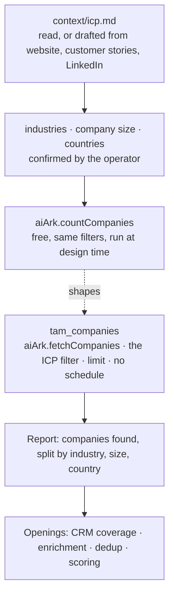

# TAM building

Source your account universe from AI Ark with a filter that encodes your ICP,
and keep it as one model in Cargo. Atomic by design: one connector, one model,
one folder.

## What it does

- **Starts from the ICP you already wrote, or drafts one from evidence.** It
  reads the workspace context first. When nothing is there, it offers to read
  your website and customer stories and enrich your customers' LinkedIn pages,
  and drafts `context/icp.md` from what they share.
- **Settles the minimum before any filter.** Industries, company size and
  countries, each guessed from `icp.md` with the line quoted, or suggested and
  labelled, then confirmed by the operator.
- **Counts before it sources.** `aiArk.countCompanies` takes the same filter
  groups as the search, returns `{"count": N}`, and is free. The search bills
  per returned record, so this is the difference between a market you chose and
  one you discovered after paying for it.
- **Puts the ICP in the filter, not in a post-filter.** Every returned record is
  paid for. Narrowing happens where it costs nothing.
- **Needs nothing else.** No CRM, no LLM, no play, no key, no seat. AI Ark runs
  on the connection the workspace already holds, bound with `default: true`.
- **Ends on openings, not on more infrastructure.** A CRM coverage analysis,
  enrichment, deduplication or scoring: each is a separate job the report
  offers, with its own dependencies.

## How it works


```mermaid
flowchart TD
    icp["context/icp.md<br/>read, or drafted from website, customer stories, LinkedIn"]
    minimum["industries · company size · countries<br/>confirmed by the operator"]
    count["aiArk.countCompanies<br/>free, same filters, run at design time"]
    tam["tam_companies<br/>aiArk.fetchCompanies · the ICP filter · limit · no schedule"]
    report["Report: companies found, split by industry, size, country"]
    next["Openings: CRM coverage · enrichment · dedup · scoring"]

    icp --> minimum --> count
    count -.->|"shapes"| tam
    tam --> report --> next
```

1. **Write the ICP down** in the project's `context/icp.md`, or confirm the one
   that is there. This skill's `context/icp.md` is the shape.
2. **Confirm industries, company size and countries.** They are the floor of
   the filter.
3. **Translate the ICP into filter groups** in `infra/models/tam-companies.ts`.
   They are nested groups, not a flat map, and enum-backed values come from the
   integration's autocompletes.
4. **Count each candidate filter** with `aiArk.countCompanies`:

   ```sh
   cargo-ai orchestration action execute --wait-until-finished \
     --action '{"kind":"connector","integrationSlug":"aiArk","actionSlug":"countCompanies","config":{}}' \
     --data '{"industry":{"industry_or":["software development"]},"employeeSize":{"min_employee_count":20,"max_employee_count":500},"companyLocation":{"location_or":["United States"]}}'
   ```

5. **Set `limit`** to what you are willing to spend on the first run.
6. **Deploy and sync once**, then read the report and pick an opening.

| File                            | Resource          | Role                                              |
| ------------------------------- | ----------------- | ------------------------------------------------- |
| `infra/connectors/ai-ark.ts`    | `defineConnector` | AI Ark, bound: no key, no seat, no cookie         |
| `infra/folders/index.ts`        | `defineFolder`    | the model folder named after the skill            |
| `infra/models/tam-companies.ts` | `defineModel`     | the universe: the ICP filter and the budget       |
| this skill's `context/icp.md`   | (not a resource)  | example ICP to copy into the project's `context/` |
| `references/sources.md`         | (not a resource)  | the other company sources, with pros and cons     |

## Why it is atomic

An agent installing a cookbook sets up every dependency the infra declares. If
the TAM model shipped with a CRM extract, a unified model or a tiering agent,
every install would wire a CRM connection or an LLM before it could source a
single company, including for a company that has neither. Building the TAM
needs AI Ark and a written ICP. Everything that acts on the TAM afterwards is a
next step with its own cookbook.

## Placeholders (edit before deploy)

1. **The ICP**: copy this skill's `context/icp.md` into the project's `context/`, or
   keep the one already there. The example is a technical B2B software ICP;
   nothing in it is yours.
2. **The filter groups** in `infra/models/tam-companies.ts` `config`, always
   including `industry`, `employeeSize` and `companyLocation`. Nested groups,
   `_or` to include and `_not` to exclude, enum values from `listIndustries` /
   `listSeniorities` / `listDepartmentsAndFunctions` / `listFundingTypes`,
   numeric ranges as numbers.
3. **`config.limit`** in the same file: the per-sync record budget, and the only
   real cost control.

## Cost

Counting is free. Research, when there is no ICP, bills per page read and per
customer enriched. Sourcing bills **per returned record**, so the estimate is
`limit` times the current per-record price: fetch it with
`cargo-ai connection integration get aiArk` immediately before any preview
rather than trusting a number written here.

The sourced model carries **no schedule on purpose**. A cron re-runs the same
search and re-bills every returned record, including the rows already in the
model: a monthly refresh buys the handful of new companies at the price of the
whole pool. Sourcing is a deliberate spend.

## Alternatives

AI Ark is the default because it is the only source that counts for free with
the filters it bills on. [`references/sources.md`](references/sources.md)
compares it with the other sources the contract accepts as a swap:

| Source          | Pick it when                               | Watch out for                                                       |
| --------------- | ------------------------------------------ | ------------------------------------------------------------------- |
| AI Ark          | You want the pool size before you commit   | Enum-backed filters; per-record billing; 10,000 per sync            |
| FullEnrich      | Budget matters, or you want a free refresh | No count; no persona, funding or lookalike filter                   |
| Apollo          | The market is defined by hiring or funding | No industry taxonomy (keyword tags only); no free count             |
| Sales Navigator | The market is defined by LinkedIn facets   | Needs a seat; highest per-record price; no domain; 5,000 per search |

People Data Labs, TheirStack, Ocean.io and CompanyEnrich are covered there too,
with the reason each one is not a default TAM source.

## Verification

```sh
node --import tsx evals/contract.mjs   # the graph boundaries, from the compiled registry
cargo-ai cdk types && cargo-ai cdk check && cargo-ai cdk plan
```

`evals/acceptance.md` is the line-by-line acceptance test.

## Composes into

A CRM coverage analysis (how much of the TAM the CRM already holds),
`crm-enrichment`, `crm-deduplication`, and scoring: `score-leads` on an export
before the CRM, `account-scoring` once the accounts are pushed there.
`references/run.md` lists them as the report's openings.
