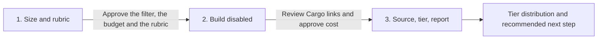

# Tam building

**State: to-be-approved.** Deploy-verified against a live workspace: not yet. Treat `Done when`
below as the acceptance test and review `cargo-ai cdk plan` before deploying. Make no outcome claim
for this skill until it is approved.

## The outcome

Your account universe, sourced from an AI Ark company search that encodes your ICP, and every row in
it carrying a tier a rep can act on and a written reason they can argue with. Not a list: a model
that keeps a standing judgment on every company in it.

Two halves, and they fail in different ways.

**Sourcing is arithmetic and it is where the money goes.** `aiArk.fetchCompanies` bills per returned
record, so the ICP filter in `infra/models/tam-companies.ts` is not a preference, it is the invoice.
`aiArk.countCompanies` takes the same filter groups, returns `{"count": N}`, and is free: run it for
every candidate filter before anything is deployed. A pool you counted is a market you chose; a pool
you did not is a market you discovered after paying for it.

**Tiering is judgment and it is where the value is.** Whether a company is in the size band is a
column. Whether it already runs the motion you sell into is an open role, a changelog, an
engineering post, and no column holds it. So each sourced row goes to one agent that reads your
rubric out of the workspace context repo, judges on the sourced facts, and web-searches only to
settle a doubt that would change the tier. It returns `{tier, rationale, evidence_url}`. The play
writes all three plus a stamp back onto the row, and the tier segments are what downstream work
takes.

**The rubric is a markdown file, not a prompt.** `context/icp.md` and
`context/tiering-rubric.md` live in the workspace context repo (the project's
root `context/` in a scaffolded project). The copies under `infra/context/` are
the example to put there. Changing what tier A means is a reviewed commit that
takes effect on the next run, with no deploy and a git history of why. That is
the difference between a scoring model your team owns and one only the person
who wrote the prompt can change.

**Two failure modes worth knowing before you start.** A flat filter map
(`{"industry": "Software"}` at the top level) is ignored silently, so you source the whole database
up to `limit` and pay for it. And a custom-column write that carries the `custom__` read-side prefix
reports "Record upserted" and drops the value, so the play runs perfectly over a book with no tiers
in it.

## Guide the operator through every phase



Every substantive message starts with the current phase and ends with a `Next step` section giving
the operator one concrete decision, what it unlocks, and what stays blocked. During an in-progress
operation, say `No action needed` and name the next checkpoint. Never end with a generic offer to
help.

1. **Size and rubric.** Derive the ICP from the workspace context, translate it into AI Ark filter
   groups, and run `countCompanies` on each candidate. Present the pool sizes, the proposed budget,
   and the draft tier rubric. End by asking the operator to approve the filter, the `limit`, and the
   rubric, and to authorize deploying the resources with the play disabled. Nothing bills in this
   phase.
2. **Build disabled.** Adapt, check, plan, and deploy with `isEnabled: false`. Run
   `node --import tsx evals/contract.mjs` against the adapted resources before the plan is reviewed.
   Send a direct Cargo UI link for the model, the agent, and the play. Show the counted pool, the
   `limit` that will actually be sourced, the current per-record sourcing price fetched live, and
   the per-company tiering cost. End by asking the operator to approve the first sourcing run at
   that stated maximum. Do not trigger a sync or enable the play without that second approval.
3. **Source, tier, report.** Trigger one sync while the play is still disabled, confirm the
   extractor's column names against the live model (adapt and redeploy if they differ), then enable
   the play and execute it once. Rows that landed while it was off are not `added` on the next cron
   tick. Report: rows landed against `limit`, the tier distribution, the disqualified share, the
   evaluator pass rate, actual credits against estimate, and direct Cargo links. End with one
   recommended next action: narrow the filter if the disqualified share is large, widen `limit` if
   it is small, or move to contact sourcing on tier A.

## Put it in your project

This folder is a **worked example**: real CDK resources written for some other company. The job
is to end up with the code your company would have written, in your project, and an agent does the
adapting.

**Install the required authoring skill first.** If `cargo-cdk` is absent, run:

```sh
npx skills add getcargohq/cargo-skills --skill cargo-cdk
```

Then read `.agents/skills/cargo-cdk/SKILL.md` directly; no session reload is needed. Complete its
bootstrap and use its authoring, state, plan, and deployment rules throughout. Stop before any
sizing or template work if the skill cannot be installed or read.

1. **Install it — the CLI does the copy.** From inside the CDK project,
   `cargo-ai cdk add cookbook/tam-building` writes this example to `infra/tam-building/` and this
   procedure to `.claude/skills/tam-building/`. No project yet?
   `cargo-ai cdk init <dir> --cookbook tam-building && cd <dir> && npm install` does both; this
   folder never ships a shell. **If you are reading this from the project's `.claude/skills/`, the
   install already happened — start at step 2.** On a CLI too old to have `add`, copy this folder
   in as a sibling of what is there by hand; everything below is unchanged.
2. **Reconcile it with what is already declared.** For every resource this example carries that the
   project already has (an AI Ark or LLM connector, a TAM-building folder), rewire the imports to
   the existing one and drop the copy. Two resources with one slug is a collision at deploy. This
   skill declares no `defineContext`: that resource is a per-workspace singleton owned by the
   project (a scaffolded repo points it at the root `context/`). Copy `infra/context/*.md` into that
   directory. If the project has an `accounts` model every other skill reads, see
   `promote-to-shared-accounts` below. This folder needs nothing in `.env`; append nothing and never
   overwrite it.
3. **Size it before you shape it.** Follow the count-first gate in
   [`references/configure.md`](references/configure.md): derive the filter groups from the ICP,
   resolve every enum-backed value through the integration's autocompletes, and count each candidate
   filter. Stop for approval of the filter, the `limit`, and the tier rubric. Do not deploy, sync,
   or bill anything while that approval is pending.
4. **Adapt and deploy disabled.** Work the sections below in order: _What should not change_ is what
   you argue back about (say what breaks, then do it if they still want it); _What you can change_
   is what you offer unprompted (nobody asks for a variant they do not know exists); _What you will
   be asked_ is the floor, and you derive before you ask. If you are asking more than about four
   questions you have skipped lookups. Record what you changed and why under a `## Decisions`
   section in your copy of this file. Then run `node --import tsx evals/contract.mjs`, followed by
   `cargo-ai cdk types && cargo-ai cdk check && cargo-ai cdk plan`. Show the diff and deploy with the
   play disabled. Never run `cargo-ai cdk init --force` in a non-empty directory.
5. **Hand off for cost approval.** Resolve the workspace and resource UUIDs, send the Cargo UI links
   from [`references/run.md`](references/run.md), and show the counted pool, the `limit`, the live
   per-record price, and the total estimate. Stop for explicit approval.
6. **Source, tier, verify.** Run only after that approval: sync once with the play still disabled,
   confirm columns, enable, then execute the play once so the landed rows are enrolled. Walk
   _Done when_ line by line and report each with evidence. Deployed cleanly and produced nothing is
   the normal failure.

## What you will be asked

**Derive before you ask.** An input with a lookup is looked up, not asked. Only the ones marked
_asked_ genuinely live in the operator's head.

| Input             | Kind    | How it is answered                                                                                                                                                                                             | Why it matters                                                                                                                                                  |
| ----------------- | ------- | -------------------------------------------------------------------------------------------------------------------------------------------------------------------------------------------------------------- | --------------------------------------------------------------------------------------------------------------------------------------------------------------- |
| `icp`             | derived | Read the workspace context repository first (`cargo-ai context …`, or the project's defineContext directory). Ask only when no ICP is written down anywhere, and then write it to the project's context/icp.md | It is the one thing that cannot be computed: it encodes who you sell to. Everything else here is arithmetic or judgment on top of it                            |
| `sourcing_filter` | derived | Translate the ICP into AI Ark filter groups (`industry`, `employeeSize`, `companyType`, `employeeRole`, `technologies`, `funding`, …), resolving enum-backed values through `listIndustries` and its siblings  | A flat map is ignored silently and a guessed enum member matches nothing. Either way you source a market nobody described                                       |
| `pool_size`       | derived | The JSON --action form in references/configure.md: aiArk.countCompanies with the same filter groups. It is free and returns {"count": N}                                                                       | It is the only number that turns "is this filter right" into a question with an answer, and it costs nothing to ask                                             |
| `limit`           | derived | Defaults to a fraction of the counted pool for the first run; widen once rows land correctly. Ask only to change it                                                                                            | `fetchCompanies` bills per returned record, so this is the invoice. Sourcing wide and filtering later means paying for every company the rubric will throw away |
| `tier_rubric`     | asked   | Propose A / B / C / disqualified from the ICP's own language, then have the operator correct it. It is written to the project's context/tiering-rubric.md, not into the agent prompt                           | It is what the whole book gets judged against, and the one thing the operator will want to change next month without a deploy                                   |
| `llm`             | derived | Inspect the authenticated LLM connectors and pick the one already in use, with its current model slug                                                                                                          | A second LLM connector is a collision at deploy, and a stale model slug fails at run time rather than at plan time                                              |

Checked before moving on, not after the deploy:

- `sourcing_filter`: every group is a nested object, every enum-backed value came from an
  autocomplete rather than from memory, and numeric ranges are numbers
- `pool_size`: counted for the filter actually being deployed, not for an earlier draft of it
- `limit`: at or below the counted pool, and the operator has seen what it will cost
- `tier_rubric`: every tier is decidable from the sourced row plus at most one search, and the
  disqualifiers are stated as disqualifiers rather than as low scores

## What you can change

The code is a worked example. These reshapes are expected, and the agent offers them rather than
waiting to be asked. Every one costs something; that is what makes it a variation and not the default.

| Variation                    | When it is right                                                                                                 | How                                                                                                                                                                   | What it costs                                                                                                                                                                                        |
| ---------------------------- | ---------------------------------------------------------------------------------------------------------------- | --------------------------------------------------------------------------------------------------------------------------------------------------------------------- | ---------------------------------------------------------------------------------------------------------------------------------------------------------------------------------------------------- |
| `lookalike-sourcing`         | Your best customers describe the ICP better than any facet does, which is usual before a segment is written down | Add `lookalikeDomains` (up to five domains or LinkedIn URLs) to the model config beside the filter groups (`infra/models/tam-companies.ts`)                           | The pool is shaped by the seeds rather than by anything written down, so it drifts from `icp.md` and `countCompanies` becomes the only way to see what you asked for                                 |
| `refresh-cadence`            | The market moves and a one-time source goes stale                                                                | Give the model a cron and widen `limit` (`infra/models/tam-companies.ts`), then read the deleting-a-schedule warning in that file before you ever remove it again     | Every run re-bills every returned record, including the rows you already have: a monthly refresh buys the handful of new companies at the price of the whole pool                                    |
| `promote-to-shared-accounts` | The project already has an `accounts` model that scoring, routing, and signals all read                          | Add a play that upserts tiered rows into that model keyed on its identity column, and leave `tam_companies` as the landing table                                      | One more resource and one more dedupe key to keep true; a row that cannot resolve to that key has to be dropped rather than written, or it forks into duplicates the first time it appears elsewhere |
| `sales-navigator-source`     | Your market is expressed better by LinkedIn's facet taxonomy than by AI Ark's filter groups                      | Swap the connector and the extractor for `salesNavigator.fetchAccountSearch` over a list of search URLs, keeping the agent, the play, and the tier segments unchanged | Sales Nav returns no domain, so you add a resolution step of two credited calls per company; and its extraction cap forces splitting one market search into sub-searches and recounting each         |
| `deterministic-tiering`      | The rubric turns out to be thresholds (headcount band, industry, funding stage) with no judgment in it           | Delete the agent and write the tier in the play from the sourced columns, or push the thresholds up into the sourcing filter where they cost nothing                  | You lose the rationale a rep reads and the web-verified evidence, which is most of what makes a tier trusted rather than obeyed                                                                      |

## What should not change

However far you adapt, these hold. Ask for one anyway and the agent tells you what breaks, then does
it if you still want it, and records why under `## Decisions` in your copy of this file.

- **Every filter is counted before it is sourced.** (`infra/models/tam-companies.ts`)
  `countCompanies` takes the same groups and is free. Sourcing blind is how a filter that reads
  right returns a market ten times the size you meant, already billed per record, with no signal
  that anything went wrong.
- **The ICP filter is the narrowing, and there is no post-filter.** (`infra/models/tam-companies.ts`)
  Every returned record is paid for, so a company the rubric will disqualify was bought before it was
  judged. A large disqualified segment is a filter that is too wide, not an agent that is too harsh.
- **Filter groups are nested, and enum values come from the autocompletes.**
  (`infra/models/tam-companies.ts`) A flat `{"industry": "Software"}` is ignored silently and sources
  the whole database up to `limit`. A guessed enum member matches nothing and returns an empty sync
  that looks like a broken connector.
- **The rubric lives in the workspace context, not in the system prompt and not in code.**
  (`context/tiering-rubric.md` in the project's knowledge layer; `infra/context/` is the example
  to copy there.) Put it in the prompt and changing what tier A means becomes a deploy, the reason
  for the change stops being reviewable, and the rep reading the tier can no longer read the same
  file the agent read.
- **The agent judges and the play writes.** (`infra/agents/tier-analyst.ts`,
  `infra/plays/tier-companies.ts`) The agent carries no model in `uses`. Give it one and it decides
  its own routing, at which point an untiered row could be a failed run, a silent skip, or a
  judgment it chose not to record, and you cannot tell which.
- **Custom columns are written with their bare slugs.** (`infra/plays/tier-companies.ts`) `custom__`
  is the read-side alias only. The write path nests the declared slug under `custom` itself, so a
  prefixed slug produces `custom.custom__tier`, the node reports "Record upserted", and the value is
  dropped. The failure looks like a play that ran perfectly over a book with no tiers in it.
- **Eligibility is the stamp, not the tier.** (`infra/plays/tier-companies.ts`) Filter on
  `tiered_at` being null or stale. Filter on the tier column instead and a run that failed looks
  identical to a row waiting its turn, while a legitimate `disqualified` verdict gets re-judged
  forever.
- **`changeKinds: ["added"]` stays.** (`infra/plays/tier-companies.ts`) Runs are created for rows
  entering the segment, so the LLM bill scales with how many companies you sourced. Drop it and it
  scales with how often the cron fires. After the first sync (play still disabled), enable and
  execute the play once: `added` does not backfill rows that landed while it was off.
- **A tier ships with its rationale, its evidence, and its stamp, on the same write.**
  (`infra/plays/tier-companies.ts`) A tier nobody can audit is a number a rep will not trust, and a
  row marked judged without a judgment is worse than one that was never judged.

## Done when

- `countCompanies` was run for the filter actually deployed, and its number is recorded before any
  sourcing run
- the sync landed rows, the row count is at or under `limit`, and the extractor's real column names
  match the workflow input
- every row carries a tier the rubric defines, a rationale naming the deciding lines, and a
  `tiered_at` stamp
- no row carries a stamp with an empty tier, and no row carries a tier with an empty stamp
- the tier segments (`tam-tier-a`, `tam-tier-b`, `tam-tier-c`, `tam-disqualified`) resolve, and
  their counts sum to the tiered row count
- the agent's evaluator pass rate is at or above its threshold, and a failing sample reads as a
  genuinely hard company rather than a missing rubric
- editing `tiering-rubric.md` in the context repo changes the next tier with no deploy
- `node --import tsx evals/contract.mjs` passes against the adapted resources

## What it costs

Read this before pointing the skill at a market-sized filter.

**Counting is free**, and it is the cheapest insurance in this skill: `aiArk.countCompanies` takes
the same filter groups as the search and returns the pool size without billing. Run it for every
candidate filter, every time you widen one.

**Sourcing is the spend, and it is per returned record, not per call.** Immediately before every
preview, run `cargo-ai connection integration get aiArk` and read the current entry under
`integration.actions.searchCompanies.credits.costs`; the `fetchCompanies` extractor bills on the same
per-record basis. Record the CLI version, the lookup time, and the unit price. The estimate is
`limit * unit price`, which is why `limit` is the only control that matters: **to spend less, source
less.** Start well under the counted pool, watch the rows land and the tiers come back sane, then
widen.

**Tiering is one agent run per newly sourced company**, billed as LLM tokens through the adopted
connector plus whatever web search steps it takes. `maxSteps` is the per-company ceiling and the
rubric's one-question-one-search rule is what keeps a normal row far below it. Because the play runs
on `changeKinds: ["added"]`, steady state is only the companies a sourcing run newly added, plus
whatever comes back when its six-month stamp expires. A tick that follows no sourcing run is a no-op.

The model deliberately carries **no schedule**, because a cron re-runs the same search and re-bills
every returned record, including the rows already sitting in the model. Sourcing is a deliberate
spend; the tiering play is the part that stands. See `refresh-cadence` above for what a recurring
source really costs.

## Composes into

`contact-sourcing` (the buyers at every tier A account), `crm-enrichment` (fill the records these
accounts become), `signal-based-tam` (watch the universe you just built). `account-scoring` is the
sibling for a book that already exists, not the next step after this skill has already tiered the
row.
