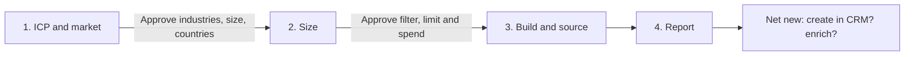

# Tam building

**State: to-be-approved.** Deploy-verified against a live workspace: not yet. Treat `Done when`
below as the acceptance test and review `cargo-ai cdk plan` before deploying. Make no outcome claim
for this skill until it is approved.

## The outcome

Your account universe as a model: every company that matches a written ICP, sourced from AI Ark
and unified with your CRM's companies, so two numbers are always one query away. How many
companies the market holds, and how many of them you already have.

Three parts, and each fails in a different way.

**The ICP is written from evidence, and it lives in the context repo.** If the workspace context
already holds an ICP or a scoring file, that is the definition. If not, the agent writes one from
the company's own website, its customer stories, and those customers' LinkedIn company pages, and
the operator corrects it. It lands in `context/icp.md`, where every later skill (scoring, routing,
enrichment) reads the same file.

**Sourcing is arithmetic and it is where the money goes.** `aiArk.fetchCompanies` bills per
returned record, so the ICP filter in `infra/models/tam-companies.ts` is the invoice.
`aiArk.countCompanies` takes the same filter groups, returns `{"count": N}`, and is free: run it for
every candidate filter before anything is deployed.

**Unification is what makes the count useful.** The sourced companies and the CRM's companies both
unify into the workspace's `accounts` model, merged on domain and LinkedIn. Each unified account's
`ids` column lists the models it came from, so a sourced account with a CRM key is one you have,
and one without is net new. The skill writes nothing to the CRM. What to do with the net-new
accounts (create them in the CRM, enrich them) is the decision the report ends on.

**Two failure modes worth knowing before you start.** A flat filter map (`{"industry": "Software"}`
at the top level) is ignored silently, so you source the whole database up to `limit` and pay for
it. And a report read before the unified model refreshes shows every sourced company as net new,
because the merge has not run yet.

## Guide the operator through every phase



Every substantive message starts with the current phase and ends with a `Next step` section giving
the operator one concrete decision, what it unlocks, and what stays blocked. During an in-progress
operation, say `No action needed` and name the next checkpoint. Never end with a generic offer to
help.

1. **ICP.** Look in the workspace context for an ICP or scoring file (`icp.md`, a scoring rubric,
   anything `account-scoring` reads). If one exists, show it. If none does, research the market:
   read the company's website and customer stories, enrich each named customer's LinkedIn company
   page, and draft `context/icp.md` from what they share. The research calls bill, so fetch their
   live prices and get a yes before running them. Then, **before any AI Ark filter is built**,
   propose the three criteria every TAM needs at the minimum: **industries, company size, and
   countries**. Guess each one from `icp.md` and quote the line it came from; for any the file does
   not state, suggest a value from the research or the customers' LinkedIn pages and mark it as a
   suggestion, or ask. End by asking the operator to approve the definition and those three
   criteria. Nothing is sourced in this phase.
2. **Size.** Translate the ICP, starting from the three confirmed criteria, into AI Ark filter groups and run `countCompanies` on each
   candidate. Read the live unification config of the workspace's `accounts` model. Present the
   pool sizes, the proposed `limit`, the live per-record price, and the estimate. End by asking the
   operator to approve the filter, the `limit`, and that maximum spend. That one approval covers the
   deploy and the first sync.
3. **Build and source.** Adapt, check, plan, and deploy. Run
   `node --import tsx evals/contract.mjs` against the adapted resources before the plan is
   reviewed. Sync `tam_companies` once, make sure the CRM model has synced, then refresh the
   unified `accounts` model so the merge runs.
4. **Report.** Companies sourced against `limit`, unified accounts, how many are already in the
   CRM, how many are net new, how many rows could not unify (no domain and no LinkedIn), actual
   credits against the estimate, and direct Cargo links. End with the two decisions on the net-new
   accounts: whether to create them in the CRM, and whether to enrich them in a dedicated play.

## Put it in your project

This folder is a **worked example**: real CDK resources written for some other company. The job
is to end up with the code your company would have written, in your project, and an agent does the
adapting.

**Install the required authoring skill first.** If `cargo-cdk` is absent, run:

```sh
npx skills add getcargohq/cargo-skills --skill cargo-cdk
```

Then read `.agents/skills/cargo-cdk/SKILL.md` directly; no session reload is needed. Complete its
bootstrap and use its authoring, state, plan, and deployment rules throughout. Stop before any
research or template work if the skill cannot be installed or read.

1. **Install it: the CLI does the copy.** From inside the CDK project,
   `cargo-ai cdk add cookbook/tam-building` writes this example to `infra/tam-building/` and this
   procedure to `.claude/skills/tam-building/`. No project yet?
   `cargo-ai cdk init <dir> --cookbook tam-building && cd <dir> && npm install` does both; this
   folder never ships a shell. **If you are reading this from the project's `.claude/skills/`, the
   install already happened: start at step 2.** On a CLI too old to have `add`, copy this folder
   in as a sibling of what is there by hand; everything below is unchanged.
2. **Reconcile it with what is already declared.** For every resource this example carries that the
   project already has (an AI Ark connector, a CRM connector, a `crm_accounts` model, the unified
   `accounts` model), rewire the imports to the existing one and drop the copy. Two resources with
   one slug is a collision at deploy, and two extracts of the same CRM object both unify, so every
   CRM company counts twice. An `accounts` model built on `defineAccount` (the one
   `account-scoring` ships) is a different model under the same slug: rename it, since the unified
   model's slug is fixed by Cargo. This skill declares no `defineContext`: that resource is a
   per-workspace singleton owned by the project (a scaffolded repo points it at the root
   `context/`). This folder needs nothing in `.env`; append nothing and never overwrite it.
3. **Write or confirm the ICP.** Follow [`references/configure.md`](references/configure.md): read
   the context first, research only when nothing is written down, and stop for approval of the
   definition.
4. **Size it before you shape it.** Follow the count-first gate in the same file: derive the filter
   groups from the approved ICP, resolve every enum-backed value through the integration's
   autocompletes, count each candidate filter, and read the unified model's live config. Stop for
   approval of the filter, the `limit`, and the spend. Do not deploy, sync, or bill anything while
   that approval is pending.
5. **Adapt and deploy.** Work the sections below in order: _What should not change_ is what you
   argue back about (say what breaks, then do it if they still want it); _What you can change_ is
   what you offer unprompted (nobody asks for a variant they do not know exists); _What you will be
   asked_ is the floor, and you derive before you ask. If you are asking more than about four
   questions you have skipped lookups. Record what you changed and why under a `## Decisions`
   section in your copy of this file. Then run `node --import tsx evals/contract.mjs`, followed by
   `cargo-ai cdk types && cargo-ai cdk check && cargo-ai cdk plan`. Show the diff and deploy. Never
   run `cargo-ai cdk init --force` in a non-empty directory.
6. **Source, unify, report.** Follow [`references/run.md`](references/run.md): sync once, refresh
   the unified model, run the report query, and walk _Done when_ line by line with evidence.
   Deployed cleanly and produced nothing is the normal failure.

## What you will be asked

**Derive before you ask.** An input with a lookup is looked up, not asked. Only the ones marked
_asked_ genuinely live in the operator's head.

| Input               | Kind    | How it is answered                                                                                                                                                                                                                                   | Why it matters                                                                                                                                                       |
| ------------------- | ------- | ---------------------------------------------------------------------------------------------------------------------------------------------------------------------------------------------------------------------------------------------------- | -------------------------------------------------------------------------------------------------------------------------------------------------------------------- |
| `icp`               | derived | Read the workspace context repository first (`cargo-ai context …`, or the project's defineContext directory) for an ICP or scoring file. None? Research the website, customer stories and customers' LinkedIn pages, then have it corrected          | It is the one thing that cannot be computed. Everything else here is arithmetic on top of it                                                                         |
| `market_minimum`    | derived | Industries, company size and countries, each guessed from `icp.md` with the line quoted. A criterion the file does not state is suggested from the research and marked as such, or asked. The operator confirms all three before any filter is built | These three are the floor of any TAM. Missing one sources a market with no edge in that dimension: every industry, every size, or the whole world, billed per record |
| `sourcing_filter`   | derived | Translate the ICP into AI Ark filter groups (`industry`, `employeeSize`, `companyType`, `employeeRole`, `technologies`, `funding`, …), resolving enum-backed values through `listIndustries` and its siblings                                        | A flat map is ignored silently and a guessed enum member matches nothing. Either way you source a market nobody described                                            |
| `pool_size`         | derived | `aiArk.countCompanies` with the same filter groups, in the JSON `--action` form in references/configure.md. It is free and returns `{"count": N}`                                                                                                    | It is the only number that turns "is this filter right" into a question with an answer, and it costs nothing to ask                                                  |
| `limit`             | derived | Defaults to a fraction of the counted pool for the first run; widen once the report reads right. Ask only to change it                                                                                                                               | `fetchCompanies` bills per returned record, so this is the invoice                                                                                                   |
| `crm`               | derived | `cargo-ai connection connector list` shows which CRM connection the workspace holds; `cargo-ai storage model list` shows whether a companies extract of it already exists                                                                            | No CRM model means nothing to compare against, and a second extract of the same object double-counts every CRM company                                               |
| `unification_rules` | derived | `cargo-ai storage model get <accountsUuid>` shows the live reference strengths. Read them; do not write them                                                                                                                                         | They decide what counts as the same company. If domain or LinkedIn ID is not strong, the in-CRM count is wrong in a way that looks like a real number                |

The two approvals (the ICP, then filter plus `limit` plus spend) are decisions, not inputs: they
are asked every time.

Checked before moving on, not after the deploy:

- `icp`: every firmographic line maps to a filter group, and each disqualifier is a `_not` filter
  wherever AI Ark has the field
- `market_minimum`: industries, company size and countries are all set and confirmed, and each
  shows whether it came from `icp.md` or was suggested
- `sourcing_filter`: every group is a nested object, every enum-backed value came from an
  autocomplete rather than from memory, and numeric ranges are numbers
- `pool_size`: counted for the filter actually being deployed, not for an earlier draft of it
- `limit`: at or below the counted pool, and the operator has seen what it will cost
- `unification_rules`: `domain` and `linkedinId` are `strong`, or the operator was told what the
  count will miss

## What you can change

The code is a worked example. These reshapes are expected, and the agent offers them rather than
waiting to be asked. Every one costs something; that is what makes it a variation and not the default.

| Variation                | When it is right                                                                              | How                                                                                                                                                             | What it costs                                                                                                                                                                        |
| ------------------------ | --------------------------------------------------------------------------------------------- | --------------------------------------------------------------------------------------------------------------------------------------------------------------- | ------------------------------------------------------------------------------------------------------------------------------------------------------------------------------------ |
| `lookalike-sourcing`     | The research found named customers that describe the market better than any facet does        | Add `lookalikeDomains` (up to five customer domains or LinkedIn URLs) to the model config beside the filter groups (`infra/models/tam-companies.ts`)            | The pool is shaped by the seeds rather than by `icp.md`, so the two drift, and `countCompanies` becomes the only way to see what you asked for                                       |
| `refresh-cadence`        | The market moves and a one-time source goes stale                                             | Give `tam_companies` a cron and widen `limit`, then read the deleting-a-schedule warning in that file before you ever remove it again                           | Every run re-bills every returned record, including the rows already there: a monthly refresh buys the handful of new companies at the price of the whole pool                       |
| `linkedin-handle-merges` | Many CRM companies carry a LinkedIn URL but no website, so they never meet their sourced twin | The workspace owner sets `linkedinHandle` to `strong` on the unified `accounts` model, with the complete reference map. Not from this skill's files             | It changes merges for every source in the workspace, and handles get renamed and reused: two different companies can merge and stay merged until someone notices                     |
| `sales-navigator-source` | Your market is expressed better by LinkedIn's facet taxonomy than by AI Ark's filter groups   | Swap the connector and the extractor for `salesNavigator.fetchAccountSearch` over a list of search URLs; the CRM model and the unified accounts stay            | Sales Nav returns no domain, so accounts unify on LinkedIn alone and the in-CRM count misses every CRM company without a LinkedIn URL; its extraction cap also forces split searches |
| `no-crm-yet`             | The company has no CRM, or this is a market study before one                                  | Drop `infra/connectors/crm.ts`, `infra/models/crm-accounts.ts`, and the CRM block in `evals/contract.mjs`; keep the unified model so a CRM added later joins it | The report is a count and a list, with no "already have" column until a CRM model unifies                                                                                            |

## What should not change

However far you adapt, these hold. Ask for one anyway and the agent tells you what breaks, then does
it if you still want it, and records why under `## Decisions` in your copy of this file.

- **Industries, company size and countries are always set.** (`infra/models/tam-companies.ts`:
  `industry`, `employeeSize`, `companyLocation`) Drop one and the TAM has no edge in that
  dimension: the count reads like a market, but it is every industry, every size, or every country
  up to `limit`. Narrow further with other groups; never go below these three.
- **Every filter is counted before it is sourced.** (`infra/models/tam-companies.ts`)
  `countCompanies` takes the same groups and is free. Sourcing blind is how a filter that reads
  right returns a market ten times the size you meant, already billed per record.
- **The ICP filter is the narrowing, and there is no post-filter.** (`infra/models/tam-companies.ts`)
  Every returned record is paid for. A company outside the ICP was bought before anyone looked at
  it, so the fix for a wide result is a narrower filter, not a cleanup step.
- **Filter groups are nested, and enum values come from the autocompletes.**
  (`infra/models/tam-companies.ts`) A flat `{"industry": "Software"}` is ignored silently and
  sources the whole database up to `limit`. A guessed enum member matches nothing and returns an
  empty sync that looks like a broken connector.
- **The sourced model carries no schedule.** (`infra/models/tam-companies.ts`) A cron re-bills
  every returned record on every run, including the ones already there.
- **Both models unify as accounts.** (`infra/models/tam-companies.ts`,
  `infra/models/crm-accounts.ts`) A source that stops unifying lands its rows nowhere the report
  reads: without the CRM, every sourced company reads as net new; without the sourced model, the
  TAM reads as empty.
- **The unified accounts model is adopted with no config.** (`infra/models/accounts.ts`) Its
  reference strengths decide merges for the CRM and every other source in the workspace. A sourcing
  skill that rewrites them changes what "the same company" means for everyone, silently.
- **One extract per CRM object.** (`infra/models/crm-accounts.ts`) Reuse the project's existing
  companies model. Two extracts of the same object both unify, and every CRM company counts twice.
- **This skill writes nothing to the CRM.** Creating the net-new accounts is a separate decision,
  taken on the report with the numbers in front of the operator, never a side effect of sourcing.
- **The ICP lives in the context repo, not in a prompt or a config comment.** (`context/icp.md` in
  the project's knowledge layer; `infra/context/icp.md` is the example.) It is the file every later
  skill reads; a copy anywhere else drifts from it.

## Done when

- the ICP came from the context repo, or was researched and approved, and is written to
  `context/icp.md`
- industries, company size and countries were proposed from `icp.md` (or suggested and marked),
  confirmed by the operator, and all three are in the deployed filter
- `countCompanies` was run for the filter actually deployed, and its number is recorded before any
  sourcing run
- the sync landed rows, and the row count is at or under `limit`
- the unified `accounts` model was refreshed after both source models synced, and no reference
  strength was changed by this skill
- the report's net-new and already-in-CRM counts sum to the unified TAM accounts, and the rows that
  could not unify are counted separately
- no CRM record was created or updated by this skill
- `node --import tsx evals/contract.mjs` passes against the adapted resources

## What it costs

Read this before pointing the skill at a market-sized filter.

**Counting is free**, and it is the cheapest insurance in this skill: `aiArk.countCompanies` takes
the same filter groups as the search and returns the pool size without billing. Run it for every
candidate filter, every time you widen one.

**Research bills per call**, and only runs when no ICP is written down. Reading the website and
customer stories is one extraction per batch of pages, and each customer's LinkedIn page is one
enrichment. Fetch the live prices with `cargo-ai connection integration get <slug>` for each
integration you use, and keep the customer list to the ones named on the site.

**Sourcing is the spend, and it is per returned record, not per call.** Immediately before every
preview, run `cargo-ai connection integration get aiArk` and read the current `fetchCompanies`
entry under `credits.costs`. Record the CLI version, the lookup time, and the unit price. The
estimate is `limit * unit price`, which is why `limit` is the only control that matters: **to spend
less, source less.**

**The CRM extract and the unification refresh are syncs, not provider calls.** Confirm with
`cargo-ai billing usage get-metrics` after the first run rather than assuming either is free.

The sourced model deliberately carries **no schedule**. See `refresh-cadence` above for what a
recurring source really costs.

## Composes into

`account-scoring` (tier them against the same `icp.md` once they are in the CRM), `crm-enrichment` (fill the
records once they are in the CRM), `crm-deduplication` (keep them single once they are there),
`contact-sourcing` (the buyers at the accounts you keep).
