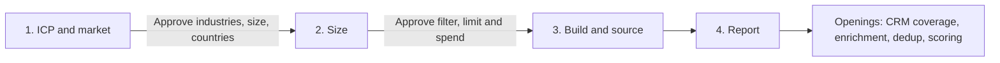

# Tam building

**State: to-be-approved.** Deploy-verified against a live workspace: yes, on 2026-10-03, with AI
Ark as the source: a filter counted at 7,251, synced at `limit: 500`, landed 500 rows for 5 credits
against a 5-credit estimate, and every row carried a domain or a LinkedIn URL. Treat `Done when`
below as the acceptance test and review `cargo-ai cdk plan` before deploying. Make no outcome claim
for this skill until it is approved.

## The outcome

Your account universe as one model in Cargo: every company that matches a written ICP, sourced from
AI Ark. The cookbook is atomic. It deploys one connector, one model and one folder, and needs
nothing else to work: no CRM, no LLM, no play.

Two parts, and each fails in a different way.

**The ICP comes from the context layer.** If the workspace context already holds an ICP or a
scoring file, that is the definition. If not, the agent drafts one from the company's website, its
customer stories and those customers' LinkedIn pages, and the operator corrects it. Either way,
before any filter is built, three criteria are settled: **industries, company size, and
countries**. They are the floor of every TAM.

**Sourcing is arithmetic and it is where the money goes.** `aiArk.fetchCompanies` bills per
returned record, so the ICP filter in `infra/models/tam-companies.ts` is the invoice.
`aiArk.countCompanies` takes the same filter groups, returns `{"count": N}`, and is free: run it for
every candidate filter before anything is deployed.

What happens to the companies next (a CRM coverage check, enrichment, deduplication, scoring) is a
separate job with its own dependencies. The report ends by offering those openings; none of them is
part of this cookbook.

**Two failure modes worth knowing before you start.** A flat filter map (`{"industry": "Software"}`
at the top level) is ignored silently, so you source the whole database up to `limit` and pay for
it. And a filter missing industries, size or countries reads like a market but has no edge in that
dimension, billed per record.

## Example

> Source every B2B software company in the US and the UK with 20 to 500 employees from AI Ark, using the ICP in our context repo.

Illustrative output, fictional records:

| Criterion    | Confirmed                                           | From                             |
| ------------ | --------------------------------------------------- | -------------------------------- |
| Industries   | software development, computer and network security | `icp.md`: "Industry: …"          |
| Company size | 20 to 500 employees                                 | `icp.md`: "Headcount: 20 to 500" |
| Countries    | United States, United Kingdom                       | the prompt                       |

| Result                    | Value                                 |
| ------------------------- | ------------------------------------- |
| Counted pool              | 4,812 companies                       |
| Landed in `tam_companies` | 500 of 500 (`limit`)                  |
| By country                | United States 71%, United Kingdom 29% |
| By size band              | 20-49: 38%, 50-199: 44%, 200-500: 18% |
| No domain and no LinkedIn | 6 rows                                |

The report closes on one recommended opening: a CRM coverage analysis, since the workspace already
holds HubSpot, to see how many of the 500 are already there.

## Guide the operator through every phase


```mermaid
flowchart LR
  icp["1. ICP and market"] -->|"Approve industries, size, countries"| size["2. Size"]
  size -->|"Approve filter, limit and spend"| build["3. Build and source"]
  build --> report["4. Report"]
  report --> next["Openings: CRM coverage, enrichment, dedup, scoring"]
```

Every substantive message starts with the current phase and ends with a `Next step` section giving
the operator one concrete decision, what it unlocks, and what stays blocked. During an in-progress
operation, say `No action needed` and name the next checkpoint. Never end with a generic offer to
help.

1. **ICP and market.** Look in the workspace context for an ICP or scoring file (`icp.md`, a
   scoring rubric, anything `account-scoring` reads). If one exists, show it. If none does, offer
   to research the market: read the company's website and customer stories, enrich each named
   customer's LinkedIn company page, and draft `context/icp.md` from what they share. The research
   calls bill, so fetch their live prices and get a yes before running them. Then, **before any AI
   Ark filter is built**, propose **industries, company size, and countries**. Guess each one from
   `icp.md` and quote the line it came from; for any the file does not state, suggest a value from
   the research and mark it as a suggestion, or ask. End by asking the operator to approve the
   definition and those three criteria. Nothing is sourced in this phase.
2. **Size.** Translate the ICP, starting from the three confirmed criteria, into AI Ark filter
   groups and run `countCompanies` on each candidate. Present the pool sizes, the proposed `limit`,
   the live per-record price, and the estimate. End by asking the operator to approve the filter,
   the `limit`, and that maximum spend. That one approval covers the deploy and the first sync.
3. **Build and source.** Adapt, check, plan, and deploy. Run
   `node --import tsx evals/contract.mjs` from this skill's folder against the adapted resources
   before the plan is reviewed. Sync `tam_companies` once.
4. **Report.** Companies sourced against `limit` and against the counted pool, their split by
   industry, size band and country, actual credits against the estimate, and a direct Cargo link to
   the model. End with the openings in [`references/run.md`](references/run.md#openings): recommend
   one based on what the workspace already has, and let the operator pick.

## Put it in your project

This folder is a **worked example**: real CDK resources written for some other company. The job
is to end up with the code your company would have written, in your project, and an agent does the
adapting.

**Install the required authoring skill first.** If `cargo-cdk` is absent, run:

```sh
npx skills add getcargohq/cargo-skills --skill cargo-cdk
```

Then read `.agents/skills/cargo-cdk/SKILL.md` directly; no session reload is needed. Complete its
bootstrap and use its authoring, state, plan, and deployment rules throughout. Stop before any
research or template work if the skill cannot be installed or read.

1. **Install it: the CLI does the copy.** From inside the CDK project,
   `cargo-ai cdk add cookbook/tam-building` writes this example to `infra/tam-building/` and this
   procedure to `.claude/skills/tam-building/`. No project yet?
   `cargo-ai cdk init <dir> --cookbook tam-building && cd <dir> && npm install` does both; this
   folder never ships a shell. **If you are reading this from the project's `.claude/skills/`, the
   install already happened: start at step 2.** On a CLI too old to have `add`, copy this folder
   in as a sibling of what is there by hand; everything below is unchanged.
2. **Reconcile it with what is already declared.** If the project already has an AI Ark connector
   or TAM-building folders, rewire the imports to the existing one and drop the copy: two resources
   with one slug is a collision at deploy. This skill declares no `defineContext`: that resource is
   a per-workspace singleton owned by the project (a scaffolded repo points it at the root
   `context/`). This folder needs nothing in `.env`; append nothing and never overwrite it.
3. **Write or confirm the ICP and the three criteria.** Follow
   [`references/configure.md`](references/configure.md): read the context first, research only when
   nothing is written down, settle industries, company size and countries, and stop for approval.
4. **Size it before you shape it.** Follow the count-first gate in the same file: derive the filter
   groups from the approved ICP, resolve every enum-backed value through the integration's
   autocompletes, and count each candidate filter. Stop for approval of the filter, the `limit`,
   and the spend. Do not deploy, sync, or bill anything while that approval is pending.
5. **Adapt and deploy.** Work the sections below in order: _What should not change_ is what you
   argue back about (say what breaks, then do it if they still want it); _What you can change_ is
   what you offer unprompted (nobody asks for a variant they do not know exists); _What you will be
   asked_ is the floor, and you derive before you ask. If you are asking more than about four
   questions you have skipped lookups. Record what you changed and why under a `## Decisions`
   section in your copy of this file. Then run `node --import tsx evals/contract.mjs` from this
   skill's folder, followed by `cargo-ai cdk types && cargo-ai cdk check && cargo-ai cdk plan` from
   the project root. Show the diff and deploy. Never run `cargo-ai cdk init --force` in a non-empty
   directory.
6. **Source and report.** Follow [`references/run.md`](references/run.md): sync once, run the
   report queries, walk _Done when_ line by line with evidence, and end on the openings. Deployed
   cleanly and produced nothing is the normal failure.

## What you will be asked

**Derive before you ask.** An input with a lookup is looked up, not asked. Only the ones marked
_asked_ genuinely live in the operator's head.

| Input             | Kind    | How it is answered                                                                                                                                                                                                                                   | Why it matters                                                                                                                                                       |
| ----------------- | ------- | ---------------------------------------------------------------------------------------------------------------------------------------------------------------------------------------------------------------------------------------------------- | -------------------------------------------------------------------------------------------------------------------------------------------------------------------- |
| `icp`             | derived | Read the workspace context repository first (`cargo-ai context …`, or the project's defineContext directory) for an ICP or scoring file. None? Offer to research the website, customer stories and customers' LinkedIn pages, then have it corrected | It is the one thing that cannot be computed. Everything else here is arithmetic on top of it                                                                         |
| `market_minimum`  | derived | Industries, company size and countries, each guessed from `icp.md` with the line quoted. A criterion the file does not state is suggested from the research and marked as such, or asked. The operator confirms all three before any filter is built | These three are the floor of any TAM. Missing one sources a market with no edge in that dimension: every industry, every size, or the whole world, billed per record |
| `sourcing_filter` | derived | Translate the ICP into AI Ark filter groups (`industry`, `employeeSize`, `companyLocation`, then `companyType`, `employeeRole`, `technologies`, `funding`, …), resolving enum-backed values through `listIndustries` and its siblings                | A flat map is ignored silently and a guessed enum member matches nothing. Either way you source a market nobody described                                            |
| `pool_size`       | derived | `aiArk.countCompanies` with the same filter groups, in the JSON `--action` form in references/configure.md. It is free and returns `{"count": N}`                                                                                                    | It is the only number that turns "is this filter right" into a question with an answer, and it costs nothing to ask                                                  |
| `limit`           | derived | Defaults to a fraction of the counted pool for the first run; widen once the report reads right. Ask only to change it. A capped run is not a random sample: AI Ark returned the largest companies first in the verified run                         | `fetchCompanies` bills per returned record, so this is the invoice. Below the counted pool, `limit` also decides which slice you get                                 |

The two approvals (the ICP with its three criteria, then filter plus `limit` plus spend) are
decisions, not inputs: they are asked every time.

Checked before moving on, not after the deploy:

- `icp`: every firmographic line maps to a filter group, and each disqualifier is a `_not` filter
  wherever AI Ark has the field
- `market_minimum`: industries, company size and countries are all set and confirmed, and each
  shows whether it came from `icp.md` or was suggested
- `sourcing_filter`: every group is a nested object, every enum-backed value came from an
  autocomplete rather than from memory, and numeric ranges are numbers
- `pool_size`: counted for the filter actually being deployed, not for an earlier draft of it
- `limit`: at or below the counted pool, and the operator has seen what it will cost

## What you can change

The code is a worked example. These reshapes are expected, and the agent offers them rather than
waiting to be asked. Every one costs something; that is what makes it a variation and not the default.

| Variation            | When it is right                                                                                                 | How                                                                                                                                                                                   | What it costs                                                                                                                                                                                                                                                                                                                                    |
| -------------------- | ---------------------------------------------------------------------------------------------------------------- | ------------------------------------------------------------------------------------------------------------------------------------------------------------------------------------- | ------------------------------------------------------------------------------------------------------------------------------------------------------------------------------------------------------------------------------------------------------------------------------------------------------------------------------------------------ |
| `lookalike-sourcing` | The research found named customers that describe the market better than any facet does                           | Add `lookalikeDomains` (up to five customer domains or LinkedIn URLs) to the model config beside the filter groups (`infra/models/tam-companies.ts`)                                  | The pool is shaped by the seeds rather than by `icp.md`, so the two drift, and `countCompanies` becomes the only way to see what you asked for                                                                                                                                                                                                   |
| `refresh-cadence`    | The market moves and a one-time source goes stale                                                                | Give `tam_companies` a cron and widen `limit`, then read the deleting-a-schedule warning in that file before you ever remove it again                                                 | Every run re-bills every returned record, including the rows already there: a monthly refresh buys the handful of new companies at the price of the whole pool. On a free source (FullEnrich) a re-run costs no credits, and the contract allows the schedule; on a paid one, record the decision and edit the contract check in the same change |
| `swap-source`        | Your market is better described by another source's filters: hiring, LinkedIn facets, or a free per-record price | Replace the AI Ark connector and the extractor with one of the sources in [`references/sources.md`](references/sources.md); the contract knows FullEnrich, Apollo and Sales Navigator | Only AI Ark counts for free with the same filters, so on any other source the pool is sized with a small sample pull. Each source has its own gaps, listed in that file                                                                                                                                                                          |

## What should not change

However far you adapt, these hold. Ask for one anyway and the agent tells you what breaks, then does
it if you still want it, and records why under `## Decisions` in your copy of this file.

- **Industries, company size and countries are always set.** (`infra/models/tam-companies.ts`:
  `industry`, `employeeSize`, `companyLocation` on AI Ark; each swapped source's paths are in
  `references/sources.md`) Drop one and the TAM has no edge in that
  dimension: the count reads like a market, but it is every industry, every size, or every country
  up to `limit`. Narrow further with other groups; never go below these three.
- **Every filter is counted before it is sourced.** (`infra/models/tam-companies.ts`)
  `countCompanies` takes the same groups and is free; a swapped source without a count is sized
  with a small sample pull instead. Sourcing blind is how a filter that reads
  right returns a market ten times the size you meant, already billed per record.
- **The ICP filter is the narrowing, and there is no post-filter.** (`infra/models/tam-companies.ts`)
  Every returned record is paid for. A company outside the ICP was bought before anyone looked at
  it, so the fix for a wide result is a narrower filter, not a cleanup step.
- **Filter groups are nested, and enum values come from the autocompletes.**
  (`infra/models/tam-companies.ts`) A flat `{"industry": "Software"}` is ignored silently and
  sources the whole database up to `limit`. A guessed enum member matches nothing and returns an
  empty sync that looks like a broken connector.
- **The sourced model carries no schedule on a paid source.** (`infra/models/tam-companies.ts`) A
  cron re-bills every returned record on every run, including the ones already there. A free
  source (FullEnrich today) is the exception, and the contract allows it.
- **The cookbook stays atomic.** One company source connector (AI Ark unless swapped), one model,
  one folder. A CRM, an LLM, a
  play or a segment is a dependency of a next step, and adding it here makes every install set up
  an integration it does not need to build a TAM. The openings in the report are where those
  belong.
- **The ICP lives in the context repo, not in a prompt or a config comment.** (`context/icp.md` in
  the project's knowledge layer; this skill's `context/icp.md` is the example.) It is the file every later
  skill reads; a copy anywhere else drifts from it.

## Done when

- the ICP came from the context repo, or was researched and approved, and is written to
  `context/icp.md`
- industries, company size and countries were proposed from `icp.md` (or suggested and marked),
  confirmed by the operator, and all three are in the deployed filter
- `countCompanies` was run for the filter actually deployed, and its number is recorded before any
  sourcing run
- the sync landed rows, and the row count is at or under `limit`
- the report splits the landed rows by industry, size band and country, and states actual credits
  against the estimate
- the report ended on the openings, with one recommended
- `node --import tsx evals/contract.mjs` passes against the adapted resources

## What it costs

Read this before pointing the skill at a market-sized filter.

**Counting is free**, and it is the cheapest insurance in this skill: `aiArk.countCompanies` takes
the same filter groups as the search and returns the pool size without billing. Run it for every
candidate filter, every time you widen one.

**Research bills per call**, and only runs when no ICP is written down. Reading the website and
customer stories is one extraction per batch of pages, and each customer's LinkedIn page is one
enrichment. Fetch the live prices with `cargo-ai connection integration get <slug>` for each
integration you use, and keep the customer list to the ones named on the site.

**Sourcing is the spend, and it is per returned record, not per call.** Immediately before every
preview, run `cargo-ai connection integration get aiArk` and read the current `fetchCompanies`
entry under `credits.costs`. Record the CLI version, the lookup time, and the unit price. The
estimate is `limit * unit price`, which is why `limit` is the only control that matters: **to spend
less, source less.**

The sourced model deliberately carries **no schedule**. See `refresh-cadence` above for what a
recurring source really costs.

## Composes into

`crm-enrichment` (fill the records once they are in the CRM), `crm-deduplication` (keep them single
once they are there), `contact-sourcing` (the buyers at the accounts you keep). A CRM coverage
analysis (how much of the TAM the CRM already holds) is the usual first opening;
`references/run.md` describes it. To tier the TAM before it reaches a CRM, use `score-leads` on an
export of the model. `account-scoring` only reads CRM accounts today, so it tiers the TAM once the
accounts have been pushed there, not before.
