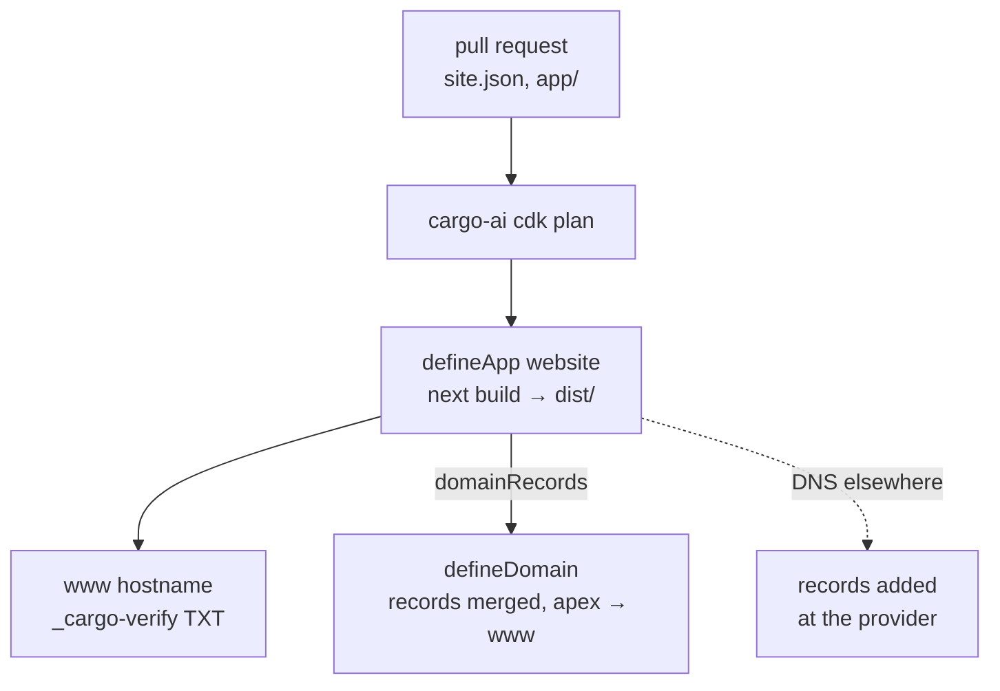

# Website building

The company website, hosted by Cargo and served on the company's own domain. A statically
exported Next.js app, the `www` hostname on it, and a domain that publishes its records and
forwards the apex. Every change is a pull request your coding agent writes and someone reviews;
nothing else is deployed.

## What it does

- **Hosts the site.** `defineApp` uploads the Next.js package; Cargo runs its build and serves
  every page as prerendered HTML at its own URL.
- **Serves it on the company's name.** `domains: ["www.…"]` attaches the hostname. Cargo's own
  URL stays `noindex`; the company domain is the one search engines index.
- **Publishes the records, or tells you what to add.** With Cargo holding the DNS,
  `defineDomain` publishes the app's `domainRecords` and forwards the apex to `www`. With the DNS
  at another provider, the domain file is deleted and the records are added there.
- **Stays reviewable.** Content lives in `site.json` and the pages in `app/`. A change is a diff,
  a preview and a plan before it is a deploy.

## How it works

1. **A pull request** changes the content or the pages; the app builds locally to `dist/`.
2. **The plan** shows the app's new content hash; the deploy uploads the package and Cargo
   builds it, routing statically because pages are exported as `<route>/index.html`.
3. **The hostname** is attached on deploy and verified once its `_cargo-verify` TXT resolves.
4. **The domain** publishes the TXT, the certificate-validation CNAME and the `www` CNAME, and
   forwards the apex to `www`.

Adds 2 resource kinds plus the folder they file into.

| File                       | Resource         | Role                                                             |
| -------------------------- | ---------------- | ---------------------------------------------------------------- |
| `infra/apps/website.ts`    | `defineApp`      | the website and its `www` hostname                               |
| `infra/apps/website/`      | (not a resource) | the Next.js package Cargo builds: pages, `site.json`, tokens     |
| `infra/domains/website.ts` | `defineDomain`   | the zone and the apex redirect; deleted when DNS lives elsewhere |
| `infra/folders/index.ts`   | `defineFolder`   | the app folder named after the skill                             |
| `references/`              | (not a resource) | how to brief, build, capture the design and serve the domain     |

## Why a static export

Cargo Hosting serves files. A static export gives every page real HTML, its own metadata and a
URL that works when entered directly, with no server to run. `trailingSlash: true` writes each
page as `<route>/index.html`, which is what Cargo's build detects to route statically; without it,
`/about` serves the home page. What needs a server (route handlers, middleware, image
optimization, a form that delivers) lives somewhere else and is called from the page.

## Why a domain file you might delete

When Cargo holds the DNS, the file lets one deploy publish everything the hostname needs:
`dnsRecords` is merged into the live zone, so mail and every other record the deploy did not write
stay put, and the plan prints the diff record by record. Most existing company domains keep their
DNS at a provider, so for them the file goes and the three records are added by hand.

## Placeholders (edit before deploy)

1. **Hostname** — `infra/apps/website.ts`: `domains`, always the `www` host.
2. **Domain** — `infra/domains/website.ts`: the name and the redirect, or delete the file.
3. **Content** — `infra/apps/website/site.json`: approved company facts, `canonicalUrl` set to
   `https://www.<domain>/`, `status: "ready"` only after review.

## What it does not do

It does not deploy without a reviewed plan, buy a domain without an approved plan line, touch a
zone that carries mail, connect a form to a backend nobody chose, or publish a draft.
